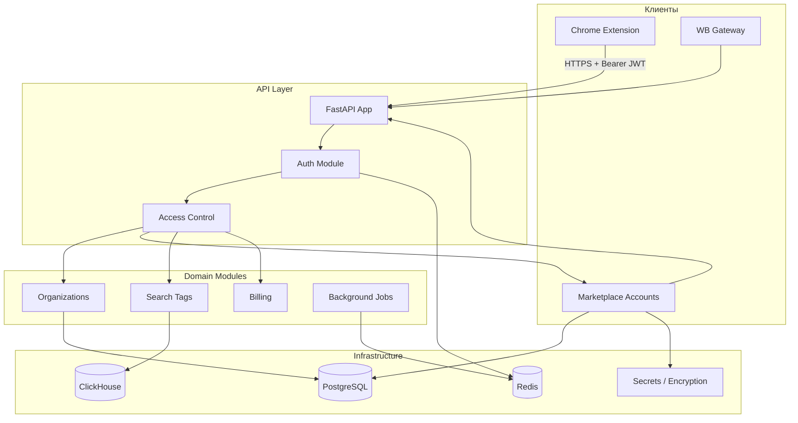

# Архитектура бекенда MarketHacker

## Контекст

MarketHacker на первом этапе — **Chromium-расширение** для продавцов на маркетплейсах. Бекенд обеспечивает:

- аутентификацию и управление пользователями;
- мультиарендность (команды, организации);
- привязку и хранение аккаунтов маркетплейсов;
- аналитику поисковых запросов WB (данные парсера);
- биллинг и лимиты по тарифам (включая фичу `browser_extension` для Chromium-расширения).

Расширение работает с доменами `wildberries.ru` и `ozon.ru` (см. `host_permissions` в manifest расширения).

## Цели и ограничения

| Фактор | Влияние на архитектуру |
|--------|------------------------|
| Browser extension (MV3) | Нет классических httpOnly-cookie; нужен token-based auth |
| B2B SaaS для продавцов | Мультиарендность (организации), команды, биллинг |
| Несколько маркетплейсов | Привязка аккаунтов MP, изоляция данных по MP |
| Чувствительные данные | Шифрование credentials, audit log, строгий контроль доступа |
| MVP → рост | Модульный монолит, а не микросервисы с первого дня |

## Высокоуровневая схема

## Архитектурный паттерн

**Модульный монолит** с элементами **Clean / Hexagonal Architecture**:

- один deployable unit на старте;
- чёткие bounded contexts внутри кодовой базы;
- разделение на слои: `api` → `application` → `domain` → `infrastructure`;
- возможность выделения модулей в отдельные сервисы при необходимости.

## Ключевые решения

| Вопрос | Решение |
|--------|---------|
| Язык / фреймворк | Python 3.11+ / FastAPI |
| Архитектура | Модульный монолит, Clean / Hexagonal |
| БД | PostgreSQL + Redis |
| Контроль доступа | Owner-based org + explicit member-access гранты (без ролей) + billing-фичи |
| Auth для extension | JWT access + refresh token rotation |
| Multi-tenancy | Organization-centric, RLS в PostgreSQL |
| Credentials маркетплейсов | AES-256-GCM at rest |
| API-контракт | OpenAPI → типы для extension; JSON в camelCase |

## Разделы документации

| Документ | Описание |
|----------|----------|
| [Технологический стек](./tech-stack.md) | Выбор технологий и обоснование |
| [Структура проекта](./structure.md) | Дерево каталогов и организация модулей |
| [Модель данных](./data-model.md) | Сущности, связи, ER-диаграмма |
| [Контроль доступа](./access-control.md) | Владение org, member-access гранты, billing-гейты |
| [Доступ к кабинетам MP](./marketplace-access-model.md) | Гранты на кабинеты/разделы, proxy, extension |
| [Аутентификация](./authentication.md) | Потоки auth для extension, токены |
| [Безопасность](./security.md) | Шифрование, изоляция, audit |
| [Дизайн API](./api-design.md) | Версионирование, эндпоинты, ошибки |
| [Кэширование](./caching.md) | Redis response cache, `@cached_read`, области данных, инвалидация |
| [Биллинг и оплата](./billing.md) | Подписки, промокоды, докупка лимитов, ЮKassa, webhook, фоновая сверка |
| [Фоновые задачи](./background-jobs.md) | Синхронизация с маркетплейсами |
| [Parser Service](./parser.md) | Платформа фоновых задач, Kafka → ClickHouse |
| [Разработка парсеров](./parser-development.md) | Новые парсеры, включение Kafka |
| [Инфраструктура](./infrastructure.md) | Docker, CI/CD, production |
| [Дорожная карта](./roadmap.md) | Этапы реализации |
