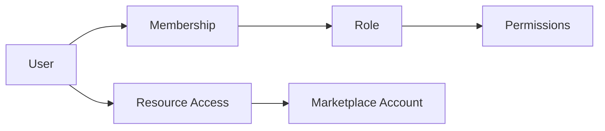

# Контроль доступа

## Почему не чистый RBAC

Для MarketHacker недостаточно ролей вида `admin / user`. Необходимо учитывать:

1. **Организационный контекст** — пользователь в разных командах с разными ролями.
2. **Ресурсный контекст** — доступ к конкретным кабинетам WB/Ozon.
3. **Функциональный контекст** — аналитика, реклама, финансы, настройки.

## Решение: RBAC + ReBAC (гибрид)

| Слой | Что контролирует | Пример |
|------|------------------|--------|
| **RBAC** | Роль в организации | `owner`, `admin`, `manager`, `viewer` |
| **Permission** | Атомарное действие | `analytics:read`, `ads:write`, `billing:manage` |
| **ReBAC** | Связь user ↔ resource | `user:123 → can_view → marketplace_account:456` |
| **ABAC** (опционально) | Условия | `plan == pro`, `marketplace == ozon` |



## Роли (стартовый набор)

| Роль | Описание | Типичный пользователь |
|------|----------|----------------------|
| `owner` | Полный доступ, биллинг, удаление org | Владелец бизнеса |
| `admin` | Управление командой, MP-аккаунтами | Руководитель |
| `manager` | Работа с аналитикой и рекламой | Менеджер по продажам |
| `viewer` | Только чтение | Аналитик, стажёр |

### Матрица permissions по ролям

| Permission | owner | admin | manager | viewer |
|------------|:-----:|:-----:|:-------:|:------:|
| `org:manage` | ✓ | — | — | — |
| `org:billing` | ✓ | — | — | — |
| `members:invite` | ✓ | ✓ | — | — |
| `members:manage` | ✓ | ✓ | — | — |
| `marketplace:link` | ✓ | ✓ | — | — |
| `marketplace:unlink` | ✓ | ✓ | — | — |
| `analytics:read` | ✓ | ✓ | ✓ | ✓ |
| `analytics:export` | ✓ | ✓ | ✓ | — |
| `ads:read` | ✓ | ✓ | ✓ | ✓ |
| `ads:write` | ✓ | ✓ | ✓ | — |
| `credentials:view` | ✓ | ✓ | — | — |

## Permissions

Формат: `{resource}:{action}`.

```
org:manage
org:billing
members:invite
members:manage
marketplace:link
marketplace:unlink
analytics:read
analytics:export
ads:read
ads:write
credentials:view
```

Permissions хранятся в БД (`role_permissions`), не хардкодятся в коде. Это позволяет менять права без деплоя.

## ReBAC — доступ к ресурсам

Помимо роли, пользователь может иметь **явный доступ** к конкретным marketplace accounts:

```sql
CREATE TABLE resource_access (
    id          UUID PRIMARY KEY,
    user_id     UUID NOT NULL REFERENCES users(id),
    resource_type VARCHAR(50) NOT NULL,  -- 'marketplace_account'
    resource_id UUID NOT NULL,
    access_level VARCHAR(20) NOT NULL,   -- 'view', 'manage'
    granted_by  UUID REFERENCES users(id),
    created_at  TIMESTAMPTZ NOT NULL DEFAULT now()
);
```

**Сценарий:** менеджер видит только 2 из 10 кабинетов организации.

## Алгоритм проверки доступа

```python
async def authorize(
    user: User,
    org_id: UUID,
    permission: str,
    resource_id: UUID | None = None,
) -> bool:
    # 1. Проверить membership
    membership = await get_membership(user.id, org_id)
    if not membership or not membership.is_active:
        return False

    # 2. Проверить permission по роли
    if not role_has_permission(membership.role, permission):
        return False

    # 3. Если запрошен конкретный ресурс — проверить ReBAC
    if resource_id:
        # owner/admin имеют доступ ко всем ресурсам org
        if membership.role.name in ("owner", "admin"):
            return resource_belongs_to_org(resource_id, org_id)
        return await has_resource_access(user.id, resource_id)

    return True
```

## Контекст организации

- JWT содержит `org_id` — текущая активная организация.
- Пользователь может переключать org через `POST /auth/switch-org`.
- Все запросы к данным фильтруются по `org_id` из JWT.
- Middleware устанавливает `current_org_id` — нельзя подменить org через query-параметр.

## Расширение в будущем

| Этап | Что добавляем |
|------|---------------|
| MVP | RBAC + базовый ReBAC для marketplace accounts |
| v2 | ABAC-условия по тарифу (`plan == pro`) |
| v3 | Custom roles (org создаёт свои роли из permissions) |
