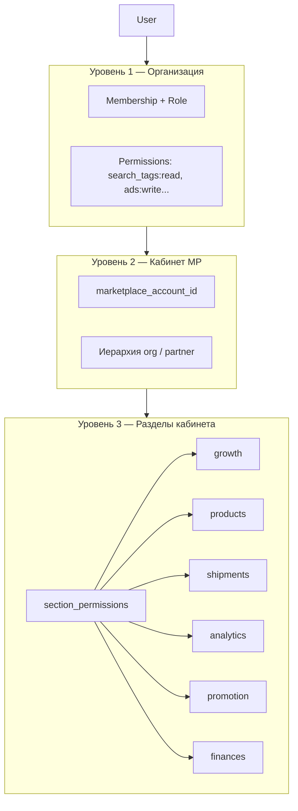

# Контроль доступа

## Обзор

MarketHacker использует **трёхуровневую** модель доступа. Подробный разбор механизма proxy и section permissions — в [Модели доступа к кабинетам MP](./marketplace-access-model.md).



| Уровень | Вопрос | Пример |
|---------|--------|--------|
| **1. Org RBAC** | Что может делать в MarketHacker? | Пригласить участника, смотреть биллинг |
| **2. Account binding** | К какому кабинету MP привязан? | WB «ООО Звезда», Ozon «Магазин 1» |
| **3. Section permissions** | Какие группы меню кабинета MP видит? | Только «Аналитика» и «Продвижение», без «Финансов» |

---

## Уровень 1: RBAC в организации

### Роли (стартовый набор)

| Роль | Описание | Типичный пользователь |
|------|----------|----------------------|
| `owner` | Полный доступ, биллинг, удаление org | Владелец бизнеса |
| `admin` | Управление командой, MP-аккаунтами | Руководитель |
| `manager` | Работа с аналитикой и рекламой | Менеджер по продажам |
| `viewer` | Только чтение | Аналитик, стажёр |

### Permissions

Формат: `{resource}:{action}`.

| Permission | owner | admin | manager | viewer |
|------------|:-----:|:-----:|:-------:|:------:|
| `org:manage` | ✓ | — | — | — |
| `org:billing` | ✓ | — | — | — |
| `members:invite` | ✓ | ✓ | — | — |
| `members:manage` | ✓ | ✓ | — | — |
| `marketplace:link` | ✓ | ✓ | — | — |
| `marketplace:unlink` | ✓ | ✓ | — | — |
| `section_permissions:manage` | ✓ | ✓ | — | — |
| `search_tags:read` | ✓ | ✓ | ✓ | ✓ |
| `ads:read` | ✓ | ✓ | ✓ | ✓ |
| `ads:write` | ✓ | ✓ | ✓ | — |
| `credentials:view` | ✓ | ✓ | — | — |

Permissions хранятся в БД (`role_permissions`), не хардкодятся в коде.

> **Не путать:** `search_tags:read` — доступ к API MarketHacker (`/search-tags/*`). Ключ `analytics` в `section_permissions` — раздел меню WB Portal (`seller.wildberries.ru`), это отдельный уровень доступа.

---

## Уровень 2: Привязка к кабинету маркетплейса

Пользователь в организации может быть привязан к одному или нескольким кабинетам MP (ReBAC).

```sql
CREATE TABLE user_marketplace_accounts (
    id                      UUID PRIMARY KEY,
    user_id                 UUID NOT NULL REFERENCES users(id),
    marketplace_account_id  UUID NOT NULL REFERENCES marketplace_accounts(id),
    is_default              BOOLEAN NOT NULL DEFAULT false,
    granted_by              UUID REFERENCES users(id),
    created_at              TIMESTAMPTZ NOT NULL DEFAULT now(),
    UNIQUE (user_id, marketplace_account_id)
);
```

**Сценарии:**

- Владелец (`owner`) видит все кабинеты org без явной привязки.
- Менеджер привязан к 2 из 10 кабинетов — видит только их.
- JWT содержит `marketplace_account_id` активного кабинета.

### Иерархия партнёров / агентств

Для модели «агентство управляет клиентами»:

- **Parent org** — агентство; видит sub-orgs или linked accounts.
- **Sub-org / linked account** — клиент агентства.
- Admin агентства назначает менеджеров на конкретные кабинеты клиентов.

---

## Уровень 3: Section permissions (разделы кабинета MP)

Гранулярные права **внутри** кабинета Wildberries/Ozon. Для WB — **6 групп бокового меню** `seller.wildberries.ru` (см. `wb_menu_groups.py`).

| section_key | Раздел |
|-------------|--------|
| `growth` | Рост продаж |
| `products` | Товары и цены |
| `shipments` | Поставки и заказы |
| `analytics` | Аналитика |
| `promotion` | Продвижение |
| `finances` | Финансы |

Каждая запись в `user_marketplace_section_access` содержит `can_read` и `can_write`. Полный список и mapping для Ozon — см. [Модель доступа к кабинетам MP](./marketplace-access-model.md).

### Enforcement

| Слой | Как применяется |
|------|-----------------|
| **WB Portal Proxy** ✅ | Server-side проверка `/ns/*` путей + JS guard (скрытие chip-меню, блокировка fetch/навигации) |
| **Extension** | Content script скрывает UI, блокирует URL и XHR по `section_permissions` |
| **Backend API** | Проверка при выдаче данных MarketHacker |

Пустой список `section_permissions` → полный доступ к назначенному кабинету (policy по умолчанию для owner/admin).

---

## Алгоритм проверки доступа

```python
async def authorize_marketplace_access(
    user: User,
    org_id: UUID,
    marketplace_account_id: UUID,
    org_permission: str | None = None,
    section: str | None = None,
) -> bool:
    membership = await get_membership(user.id, org_id)
    if not membership or not membership.is_active:
        return False

    # Уровень 1: org permission (если запрошен)
    if org_permission and not role_has_permission(membership.role, org_permission):
        return False

    # Уровень 2: привязка к кабинету
    if membership.role.name not in ("owner", "admin"):
        if not await has_account_access(user.id, marketplace_account_id):
            return False

    # Уровень 3: section permission
    if section:
        if membership.role.name in ("owner", "admin"):
            return True
        sections = await get_section_permissions(user.id, marketplace_account_id)
        if sections and section not in sections:
            return False

    return True
```

---

## JWT payload

```json
{
  "sub": "user_uuid",
  "org_id": "org_uuid",
  "marketplace_account_id": "account_uuid",
  "marketplace": "wildberries",
  "permissions": ["search_tags:read", "ads:write"],
  "section_permissions": {
    "analytics": { "can_read": true, "can_write": false },
    "promotion": { "can_read": true, "can_write": true }
  }
}
```

---

## ReBAC — явный доступ к ресурсам

Дополнительно к ролям — явные grants (для нестандартных случаев):

```sql
CREATE TABLE resource_access (
    id            UUID PRIMARY KEY,
    user_id       UUID NOT NULL REFERENCES users(id),
    resource_type VARCHAR(50) NOT NULL,
    resource_id   UUID NOT NULL,
    access_level  VARCHAR(20) NOT NULL,
    granted_by    UUID REFERENCES users(id),
    created_at    TIMESTAMPTZ NOT NULL DEFAULT now()
);
```

---

## Контекст организации и кабинета

- JWT содержит `org_id` и `marketplace_account_id`.
- `POST /auth/switch-org` — смена организации.
- `POST /auth/switch-marketplace-account` — смена активного кабинета MP.
- Middleware injects `current_org_id` и `current_marketplace_account_id`.
- PostgreSQL RLS фильтрует по `org_id`.

---

## API управления доступами

| Метод | Путь | Permission |
|-------|------|------------|
| PUT | `/api/v1/organizations/{org_id}/marketplace-accounts/{id}/access/{user_id}` | `members:manage` |
| DELETE | `/api/v1/organizations/{org_id}/marketplace-accounts/{id}/access/{user_id}` | `members:manage` |
| GET/PUT | `/api/v1/organizations/{org_id}/marketplace-accounts/{id}/section-access` | `section_permissions:manage` |
| POST/GET/DELETE | `/api/v1/organizations/{org_id}/invitations` | `members:invite` / `members:manage` |
| GET | `/api/v1/invitations/preview/{token}` | — (публично) |

---

## Этапы внедрения

| Этап | Что реализуем | Статус |
|------|---------------|--------|
| MVP | Org RBAC + account binding | ✅ |
| v1.1 | Section permissions (6 групп WB) + manager-portal UI | ✅ |
| v1.2 | WB Portal Proxy + JS guard + profile lock | ✅ |
| v2 | Proxy для Ozon, custom roles | Планируется |
