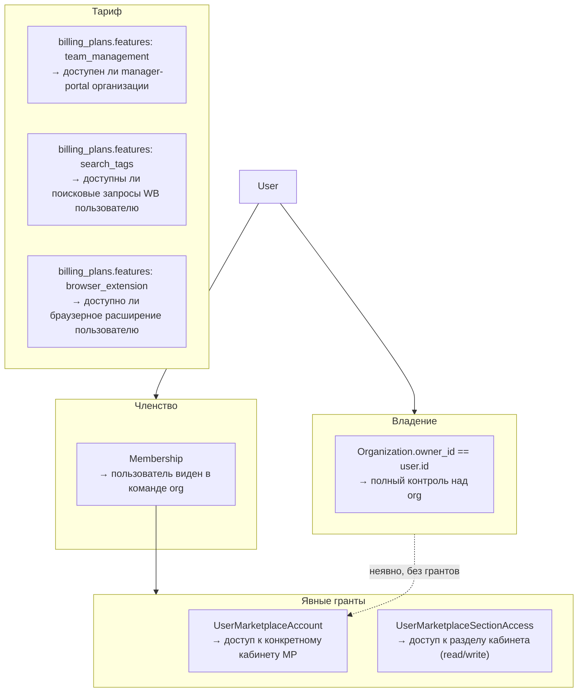

# Контроль доступа

## Принцип

Права принадлежат **пользователю**, а не организации. В системе нет ролей и нет
таблицы permissions — вместо этого три независимых источника прав:

1. **Владение организацией** (`Organization.owner_id`) — кто может управлять
   самой организацией, её кабинетами и командой.
2. **Явные гранты на кабинет/раздел** (`member_access`) — что конкретно видит
   участник, не являющийся владельцем.
3. **Тариф пользователя/организации** (billing features) — какие функции
   продукта вообще доступны, независимо от того, кто есть кто.

Организации не «переключаются» и не хранятся в сессии — это просто список
ресурсов, которыми владеет или в которых состоит пользователь. У одного
пользователя может быть сколько угодно организаций, в каждой — свои кабинеты
маркетплейсов; всё это разрешается на бэкенде по `org_id`/`account_id` из URL
при каждом запросе, а не по «текущему контексту» в токене.



---

## Владение организацией

`Organization.owner_id` — единственный источник истины о том, кто управляет
организацией. Владелец:

- создаёт, переименовывает и удаляет организацию;
- создаёт и удаляет кабинеты маркетплейсов;
- приглашает и удаляет участников;
- управляет доступом участников к кабинетам и разделам.

Это не «роль» и не запись в таблице прав — просто сравнение
`organization.owner_id == user.id`. Проверка централизована в
`OrganizationAccess` (`markethacker.modules.organizations.application.access`):

```python
class OrganizationAccess:
    async def is_owner(self, user_id: uuid.UUID, org_id: uuid.UUID) -> bool: ...
    async def is_member(self, user_id: uuid.UUID, org_id: uuid.UUID) -> bool: ...
    async def assert_owner(self, user_id: uuid.UUID, org_id: uuid.UUID) -> Organization: ...
    async def assert_member(self, user_id: uuid.UUID, org_id: uuid.UUID) -> None: ...
```

Никакого способа передать «владение» частично (например, только биллинг или
только команду) не предусмотрено намеренно — если нужен ограниченный доступ,
это делается через member-access гранты (см. ниже), а не через ослабление
владения.

### Членство (Membership)

`Membership` фиксирует факт, что пользователь состоит в команде организации —
он появляется в списке участников (`GET /organizations/{id}/members`) и может
принимать приглашения. Само по себе членство **не даёт никаких прав**: ни на
управление организацией, ни на доступ к кабинетам. Это сознательный
deny-by-default — фактические возможности участника задаются исключительно
явными грантами.

---

## Доступ к кабинетам маркетплейсов

Участник (не владелец) получает доступ к конкретному кабинету и его разделам
только через явные записи, которые выдаёт владелец. Подробности модели,
таблиц (`UserMarketplaceAccount`, `UserMarketplaceSectionAccess`) и enforcement
в WB Gateway — в [Модели доступа к кабинетам MP](./marketplace-access-model.md).

Важно: даже владелец организации получает доступ к своим кабинетам через те
же самые грант-таблицы — просто гранты выдаются ему автоматически в момент
создания кабинета (`MemberAccessService.grant_creator_access`), а не потому,
что владение org даёт какой-то отдельный «обход» в коде проверки доступа к
кабинетам. Единообразие модели важнее, чем экономия одной проверки.

---

## Тариф как гейт для функций (billing features)

Некоторые возможности продукта не являются правом конкретного пользователя —
это фича тарифа. Такие проверки живут в `web/billing_limits.py`, `web/manager_portal_features.py`
и `web/extension_features.py`, а не в системе прав:

| Фича (значение в БД) | Что открывает | Чей тариф проверяется | Зависимость |
|---|---|---|---|
| `team_management` (`MANAGER_PORTAL`) | Manager-portal целиком: команда, приглашения, кабинеты MP, WB Gateway | тариф **владельца организации** | `require_manager_portal` |
| `search_tags` (`SEARCH_TAGS`) | Поисковые запросы WB (`/search-tags/*`), данные парсинга из ClickHouse | **личный** тариф пользователя, без привязки к org | `require_search_tags_feature` |
| `browser_extension` (`BROWSER_EXTENSION`) | Браузерное расширение (`/extension/*`) | **личный** тариф пользователя | `require_browser_extension` |

```python
async def require_manager_portal(org_id: uuid.UUID, session: AsyncSession) -> None:
    if not await BillingService(session).org_has_feature(org_id, MANAGER_PORTAL):
        raise PermissionDeniedError(...)

async def require_search_tags_feature(session: AsyncSession, user_id: str) -> None:
    if not await BillingService(session).user_has_feature(uuid.UUID(user_id), SEARCH_TAGS):
        raise PermissionDeniedError(...)
```

Лимиты плана (`check_organizations_limit`, `check_members_limit`) устроены
аналогично — это проверки квоты по тарифу, а не проверки прав. Отдельного
лимита на количество кабинетов маркетплейсов нет: в одной org — не более
одного кабинета на маркетплейс (бизнес-правило `MarketplaceAccountService`,
409 при повторном подключении), поэтому реальный рычаг масштабирования —
`max_organizations`, а не число кабинетов.

> **Не путать:** `search_tags` — это фича тарифа для доступа к API
> MarketHacker. Раздел `analytics` в `section_permissions` — это группа меню
> кабинета WB (`seller.wildberries.ru`), совершенно другой уровень доступа
> (см. [Модель доступа к кабинетам MP](./marketplace-access-model.md)).

---

## JWT — только личность пользователя

Токен не хранит «текущую организацию» или «текущий кабинет» — у пользователя
может быть несколько организаций одновременно, и переключаться между ними
на бэкенде нечему: доступ к каждому конкретному ресурсу проверяется из БД по
`org_id`/`account_id` из URL при каждом запросе.

```json
{
  "sub": "user_uuid",
  "jti": "unique_token_id",
  "iat": 1780000000,
  "exp": 1780000900,
  "type": "access",
  "is_superadmin": false
}
```

`is_superadmin` присутствует в payload только если пользователь — платформенный
суперадмин (проверяется в БД при выдаче токена); используется исключительно
для доступа в admin-panel (`require_superuser`), к организациям пользователя
отношения не имеет.

Подробности выдачи/ротации токенов — в [Аутентификации](./authentication.md).

---

## Алгоритм проверки для эндпоинтов организации

Большинство эндпоинтов `/organizations/{org_id}/...` защищены зависимостью
`require_org_path_context`, которая проверяет членство и включает RLS-контекст
БД для этого запроса:

```python
async def require_org_path_context(
    org_id: Annotated[uuid.UUID, Path()],
    user_id: Annotated[str, Depends(get_current_user_id)],
    session: Annotated[AsyncSession, Depends(get_db)],
) -> uuid.UUID:
    authz = OrganizationAccess(OrganizationRepository(session), MembershipRepository(session))
    await authz.assert_member(uuid.UUID(user_id), org_id)
    _org_id_ctx.set(str(org_id))
    return org_id
```

Действия, требующие владения (создание/изменение/удаление org, приглашения,
управление грантами на кабинеты), дополнительно вызывают
`OrganizationAccess.assert_owner` внутри соответствующего сервиса — это не
дублирование, а разные уровни: «состоит в команде» vs «управляет».

---

## API управления доступом

| Метод | Путь | Кто может |
|---|---|---|
| `GET` | `/organizations` | Любой пользователь — свои org (владелец + член) |
| `POST` | `/organizations` | Любой пользователь (лимит по тарифу) |
| `PATCH` | `/organizations/{org_id}` | Только владелец |
| `DELETE` | `/organizations/{org_id}` | Только владелец |
| `GET` | `/organizations/{org_id}/members` | Член org (требует фичу `team_management`) |
| `DELETE` | `/organizations/{org_id}/members/{user_id}` | Только владелец |
| `GET`/`POST`/`DELETE` | `/organizations/{org_id}/invitations` | Только владелец |
| `GET` | `/invitations/preview/{token}` | Публично (по токену приглашения) |
| `POST`/`DELETE` | `/organizations/{org_id}/marketplace-accounts/{id}/access/{user_id}` | Только владелец |
| `GET`/`PUT` | `/organizations/{org_id}/marketplace-accounts/{id}/access/{user_id}/sections/{key}` | Владелец (сам участник — только чтение своих) |

---

## Приглашения

Приглашение (`OrganizationInvitation`) не несёт роли. Владелец при создании
приглашения сразу указывает `account_grants` — список кабинетов и разделов,
которые получит приглашённый после принятия. Гранты применяются атомарно в
момент `accept_invitation`/`accept_with_register` — участник не может
временно оказаться «в команде без единого доступа», но и не получает больше,
чем ему явно выдали.

---

## Суперадмины платформы

`is_superadmin` — атрибут пользователя на уровне платформы (не организации),
используется только в admin-panel для доступа к межорганизационным
инструментам поддержки. Проверяется зависимостью `require_superuser` и
полностью независим от `OrganizationAccess` — суперадмин не становится
автоматически владельцем чужих организаций, у него отдельный набор
административных эндпоинтов.

---

## Связанные документы

| Документ | Содержание |
|---|---|
| [Модель доступа к кабинетам MP](./marketplace-access-model.md) | Гранты на кабинеты/разделы, WB Gateway, приглашения |
| [Аутентификация](./authentication.md) | JWT, refresh tokens, MFA |
| [Модель данных](./data-model.md) | ER-диаграмма, таблицы |
| [Биллинг и оплата](./billing.md) | Тарифы, фичи, лимиты |
