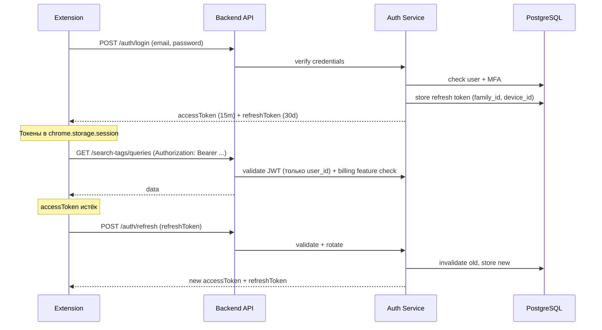
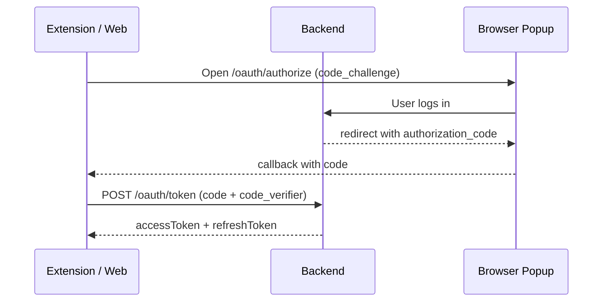

# Аутентификация и авторизация

## Особенности browser extension

Chromium-расширение (MV3) не может использовать httpOnly-cookie так же, как веб-приложение. Поэтому:

- **Token-based auth** — access + refresh JWT.
- Токены хранятся в `chrome.storage.session` (очищается при закрытии браузера) или `chrome.storage.local`.
- CORS настроен на `chrome-extension://<extension_id>`.

## Поток аутентификации



Токен не хранит "текущую организацию" — у пользователя может быть несколько
организаций, и доступ к каждой из них проверяется из БД по `org_id` из URL
при каждом запросе, а не по контексту токена. Подробнее — в
[Контроле доступа](./access-control.md).

## Токены

| Тип | TTL | Хранение (extension) |
|-----|-----|------------------------|
| Access JWT | 15 мин | `chrome.storage.session` |
| Refresh token | 30 дней | `chrome.storage.session` + привязка к `device_id` |
| Device fingerprint | — | Extension install ID |

### JWT payload (access token)

> JWT — отдельный контракт, не REST JSON. Стандартные claims (`sub`, `iat`, `exp`, `jti`) и кастомные поля (`is_superadmin`) остаются в snake_case.

```json
{
  "sub": "user_uuid",
  "jti": "unique_token_id",
  "iat": 1710000000,
  "exp": 1710000900,
  "type": "access",
  "is_superadmin": false
}
```

Минимальный payload — только личность пользователя. Никаких `org_id`,
`marketplace_account_id` или `permissions` в токене нет: все проверки прав на
конкретные организации/кабинеты выполняются из БД на каждый запрос по id из
URL (см. [Контроль доступа](./access-control.md)). `is_superadmin`
присутствует только для платформенных суперадминов.

### Refresh token

- Хранится в БД как **hash** (не plaintext).
- Привязан к `family_id` — все токены одной сессии/устройства.
- Привязан к `device_id` — ID устройства из extension.

## Refresh token rotation

При каждом `POST /auth/refresh`:

1. Старый refresh token **инвалидируется**.
2. Выдаётся новая пара access + refresh.
3. `family_id` сохраняется — все токены семейства связаны.

### Token family detection

Если использован уже отозванный refresh token (reuse):

1. Инвалидируется **всё семейство** токенов.
2. Пользователь разлогинивается на всех устройствах этой сессии.
3. Событие записывается в audit log.
4. Опционально — уведомление пользователю (подозрение на компрометацию).

## Эндпоинты auth

| Метод | Путь | Описание |
|-------|------|----------|
| POST | `/api/v1/auth/register` | Регистрация (+ опционально создание org, где регистрирующийся становится `owner_id`) |
| POST | `/api/v1/auth/login` | Вход, выдача токенов |
| POST | `/api/v1/auth/refresh` | Обновление access token |
| POST | `/api/v1/auth/logout` | Отзыв refresh token |
| POST | `/api/v1/auth/mfa/setup` | Настройка TOTP |
| POST | `/api/v1/auth/mfa/verify` | Подтверждение MFA при login |

Эндпоинтов "переключения" организации/кабинета намеренно нет — токен не
завязан на конкретную организацию, а список организаций пользователь получает
через `GET /organizations`.

## MFA (TOTP)

- Опциональна, настраивается пользователем самостоятельно через `/auth/mfa/setup`.
- Реализация: стандартный TOTP (Google Authenticator, Authy).
- Backup codes — 10 одноразовых кодов при настройке MFA.

## Регистрация

При `POST /auth/register`:

1. Создаётся `User`.
2. Если передан `orgName` — создаётся `Organization` с `owner_id = user.id`
   (владелец, а не "роль" — см. [Контроль доступа](./access-control.md)).
3. Выдаётся пара токенов.

## OAuth2 PKCE (будущее)

Для web-dashboard и SSO:



На MVP достаточно email/password + refresh. PKCE добавляется при появлении web-клиента.

## CORS

```python
ALLOWED_ORIGINS = [
    "chrome-extension://<extension_id>",
    # будущий web dashboard:
    # "https://app.markethacker.ru",
]
```

## Rate limiting

| Эндпоинт | Лимит |
|----------|-------|
| `POST /auth/login` | 5 req/min per IP + per email |
| `POST /auth/register` | 3 req/min per IP |
| `POST /auth/refresh` | 10 req/min per token |
| `POST /auth/mfa/verify` | 5 req/min per user |

Реализация: Redis sliding window.
