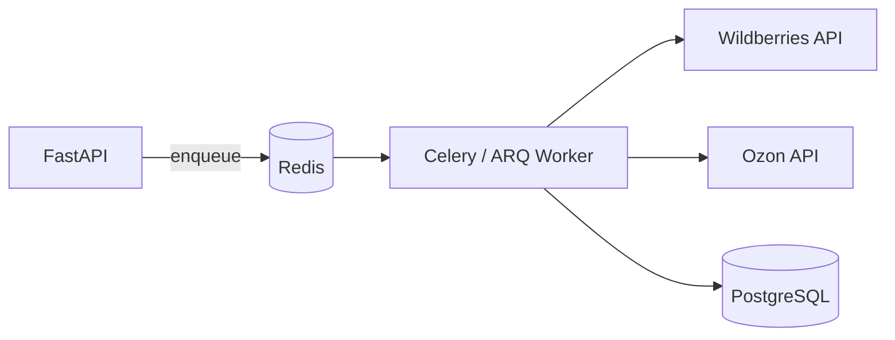

# Фоновые задачи

## Назначение

Синхронизация данных с API маркетплейсов — длительные, периодические операции, которые нельзя выполнять в HTTP-запросе:

- загрузка заказов и продаж;
- синхронизация рекламных кампаний;
- обновление токенов маркетплейсов;
- агрегация данных MP (планируется).

## Архитектура



## Типы задач

| Задача | Периодичность | Описание |
|--------|---------------|----------|
| `sync_marketplace_orders` | каждые 15 мин | Загрузка новых заказов |
| `sync_ad_campaigns` | каждые 30 мин | Синхронизация рекламных кампаний |
| `refresh_marketplace_tokens` | по событию / cron | Обновление OAuth/API токенов MP |
| `aggregate_analytics` | — | Планируется (не реализовано; Search Tags читает CH напрямую) |
| `reencrypt_credentials` | по событию | Ротация ключей шифрования |
| `sync_yookassa_payment` | defer (3 мин) | Сверка одного платежа ЮKassa после checkout |
| `process_pending_yookassa_payments` | каждые 5 мин | Сверка всех незавершённых платежей ЮKassa |
| `process_yookassa_renewals` | ежедневно 02:00 UTC | Автопродление подписок ЮKassa |

> Биллинг: [Биллинг и оплата](./billing.md)

## Привязка к ресурсам

Каждая задача привязана к `marketplace_account_id`:

```python
@celery_app.task(bind=True, max_retries=3)
def sync_marketplace_orders(self, account_id: str):
    account = get_marketplace_account(account_id)
    credentials = decrypt_credentials(account.credentials)
    orders = wildberries_client.fetch_orders(credentials, since=account.last_sync_at)
    save_orders(account.org_id, account_id, orders)
    update_last_sync(account_id)
```

## Retry и error handling

### Exponential backoff

```python
@celery_app.task(
    bind=True,
    autoretry_for=(MarketplaceApiError,),
    retry_backoff=True,        # 1s, 2s, 4s, 8s...
    retry_backoff_max=300,     # max 5 min
    max_retries=5,
)
```

### Классификация ошибок

| Тип | Поведение |
|-----|-----------|
| Rate limit (429) | Retry с backoff, уважая `Retry-After` |
| Auth error (401/403) | Не retry, пометить credentials как invalid, уведомить user |
| Server error (5xx) | Retry с backoff |
| Client error (4xx, кроме 429) | Не retry, записать в dead letter |
| Network timeout | Retry с backoff |

## Идемпотентность

- Каждая задача имеет `job_id` = `{task_name}:{account_id}:{date}`.
- Данные сохраняются по `external_id` (ID на маркетплейсе) — upsert, не insert.
- Повторный запуск задачи не создаёт дубликатов.

## Dead letter queue

Задачи, исчерпавшие retries, попадают в DLQ:

```python
@celery_app.task(on_failure=send_to_dlq)
```

DLQ обрабатывается вручную или через alerting. Метрики DLQ — в мониторинге.

## Планирование

### Celery Beat (расписание)

```python
beat_schedule = {
    "sync-orders-every-15min": {
        "task": "sync_marketplace_orders",
        "schedule": crontab(minute="*/15"),
    },
    "aggregate-analytics-hourly": {
        "task": "aggregate_analytics",
        "schedule": crontab(minute=0),
    },
}
```

### Динамическое планирование

Для MVP: cron-задача запускает sync для **всех активных** marketplace accounts. При росте — per-account scheduling через Redis sorted set.

## Мониторинг задач

| Метрика | Описание |
|---------|----------|
| `jobs.completed` | Успешно завершённые |
| `jobs.failed` | Проваленные (после всех retries) |
| `jobs.duration` | Время выполнения (histogram) |
| `jobs.queue_depth` | Глубина очереди |

Alerting: `jobs.failed > 10 за 5 мин` → уведомление в Slack/Telegram.

## Выбор: ARQ vs Celery

| Критерий | ARQ | Celery |
|----------|-----|--------|
| Сложность | Минимальная | Средняя |
| Async native | Да (asyncio) | Нет (sync, gevent) |
| Beat scheduler | Нет (внешний) | Встроенный |
| Мониторинг | Базовый | Flower, зрелый |
| **Рекомендация MVP** | **ARQ** | При росте |

На MVP — **ARQ** (asyncio-native, проще). Миграция на Celery при необходимости Beat, chains, и зрелого мониторинга.
