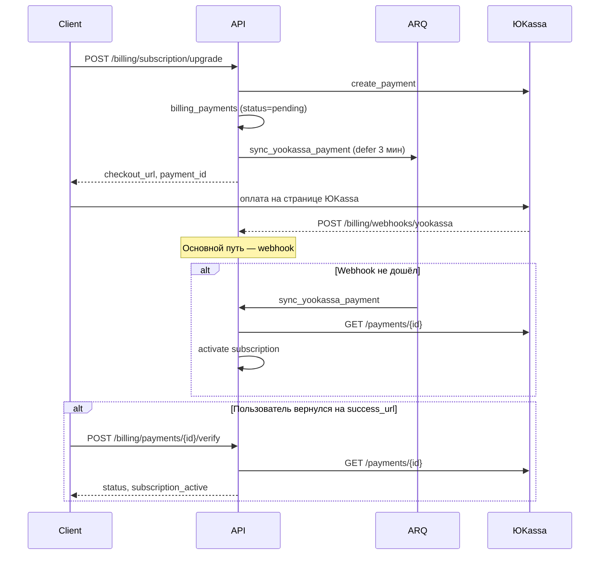
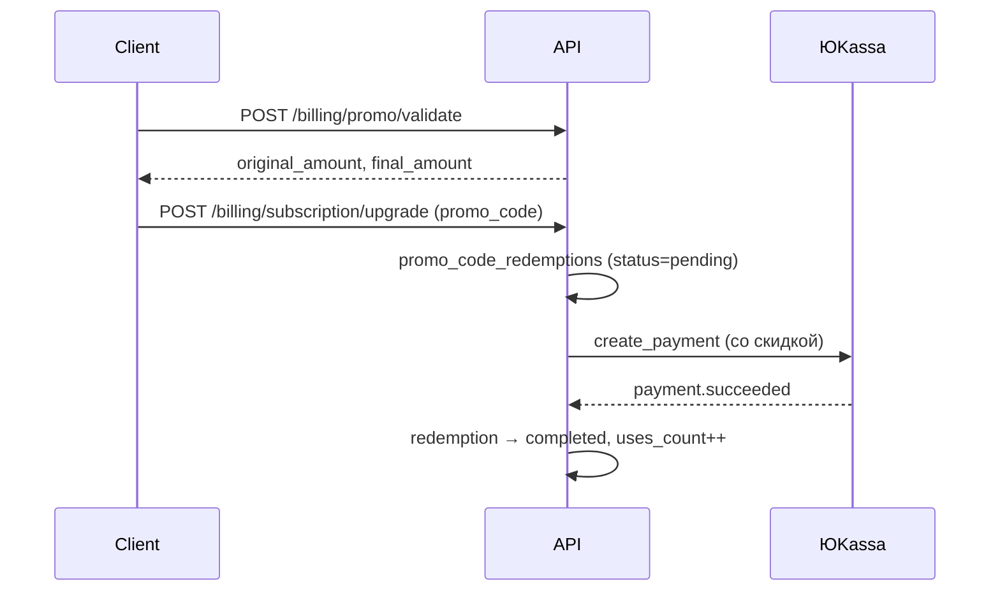

# Биллинг и оплата

## Назначение

Модуль `billing` управляет тарифами, подписками пользователей и лимитами платформы. Подписка привязана к **аккаунту пользователя** (не к организации); лимиты применяются к org, которыми владеет пользователь.

Поддерживаемые платёжные провайдеры:

| Провайдер | Валюта | Сценарий |
|-----------|--------|----------|
| **ЮKassa** | RUB | Основной провайдер для РФ, рекуррентные списания |
| **Stripe** | USD/EUR | Международные платежи (checkout + webhook) |

## Модель данных

| Сущность | Таблица | Описание |
|----------|---------|----------|
| `BillingPlan` | `billing_plans` | Каталог тарифов (`free`, `pro`, `enterprise`) |
| `BillingSubscription` | `billing_subscriptions` | Активная подписка пользователя (unique `user_id`) |
| `BillingPayment` | `billing_payments` | Запись платежа ЮKassa (идемпотентность, аудит) |
| `BillingSavedPaymentMethod` | `billing_saved_payment_methods` | Сохранённая карта для автопродления |
| `BillingUsageRecord` | `billing_usage_records` | Дневной учёт использования |
| `PromoCode` | `promo_codes` | Каталог промокодов |
| `PromoCodeRedemption` | `promo_code_redemptions` | Факт применения промокода пользователем |

## Поток оформления подписки (ЮKassa)



## Подтверждение оплаты — три уровня

| Уровень | Механизм | Когда срабатывает |
|---------|----------|-------------------|
| 1 | **Webhook** | ЮKassa отправляет `payment.succeeded` / `payment.canceled` |
| 2 | **Фоновая сверка** | ARQ-задача через N сек после checkout + cron каждые 5 мин |
| 3 | **Ручная проверка** | Пользователь вызывает `/payments/{id}/verify` после возврата с оплаты |

Все три пути используют общую логику `_reconcile_payment`: запрос статуса в API ЮKassa, обновление `billing_payments`, активация подписки при `succeeded` + `paid`.

### Фоновые задачи (ARQ)

| Задача | Тип | Описание |
|--------|-----|----------|
| `sync_yookassa_payment` | defer | Сверка одного платежа через `YOOKASSA_PAYMENT_SYNC_DELAY_SECONDS` (по умолчанию 180 с) после checkout |
| `process_pending_yookassa_payments` | cron (*/5 мин) | Сверка всех незавершённых платежей в окне возраста |
| `process_yookassa_renewals` | cron (02:00 UTC) | Автопродление с сохранённых карт |

Worker должен быть запущен:

```bash
arq markethacker.infrastructure.jobs.WorkerSettings
```

В Docker Compose сервис `worker` уже настроен в `backend/docker-compose.yml`.

## API эндпоинты

### Пользовательские (`/api/v1/billing/*`)

| Метод | Путь | Auth | Описание |
|-------|------|:----:|----------|
| GET | `/billing/plans` | — | Список активных тарифов |
| GET | `/billing/subscription` | ✓ | Текущая подписка или `null` (free) |
| POST | `/billing/subscription/upgrade` | ✓ | Оформление подписки → checkout URL |
| POST | `/billing/subscription/cancel` | ✓ | Отмена (доступ до конца периода) |
| GET | `/billing/usage` | ✓ | Отчёт об использовании лимитов |
| GET | `/billing/payment-methods` | ✓ | Сохранённые карты ЮKassa |
| DELETE | `/billing/payment-methods/{id}` | ✓ | Удаление сохранённой карты |
| POST | `/billing/payments/{payment_id}/verify` | ✓ | **Ручная сверка платежа** |
| POST | `/billing/promo/validate` | ✓ | Проверка промокода (без списания) |
| POST | `/billing/promo/redeem` | ✓ | Активация промокода (trial / free_period / limits_boost) |

`paymentId` — ID платежа ЮKassa из ответа `subscription/upgrade` (`CheckoutResponse.paymentId`).

#### POST /billing/subscription/upgrade

```json
{
  "planName": "pro",
  "provider": "yookassa",
  "billingPeriod": "monthly",
  "promoCode": "SUMMER20",
  "successUrl": "https://team.markethacker.ru/billing/success",
  "cancelUrl": "https://team.markethacker.ru/billing/cancel"
}
```

| Поле | Описание |
|------|----------|
| `billingPeriod` | `monthly` (30 дней) или `yearly` (365 дней). По умолчанию `monthly` |
| `promoCode` | Опционально. Только для типа `discount` — скидка на **первый** платёж |

Ответ:

```json
{
  "data": {
    "checkoutUrl": "https://yoomoney.ru/checkout/...",
    "provider": "yookassa",
    "paymentId": "2d7f3c8a-0001-5000-8000-1a2b3c4d5e6f"
  }
}
```

#### POST /billing/payments/{payment_id}/verify

Ответ:

```json
{
  "data": {
    "paymentId": "2d7f3c8a-0001-5000-8000-1a2b3c4d5e6f",
    "status": "succeeded",
    "isPaid": true,
    "processed": true,
    "subscriptionActive": true,
    "synced": true,
    "message": "Платёж обработан"
  }
}
```

Рекомендуется вызывать на странице `successUrl` сразу после возврата пользователя с оплаты.

#### POST /billing/promo/validate

Проверяет промокод без изменения состояния. Для `discount` возвращает расчёт суммы.

```json
{
  "code": "SUMMER20",
  "planName": "pro",
  "billingPeriod": "monthly"
}
```

Пример ответа (скидка):

```json
{
  "data": {
    "code": "SUMMER20",
    "promoType": "discount",
    "valid": true,
    "planName": "pro",
    "checkoutBillingPeriod": "monthly",
    "originalAmount": "2990.00",
    "discountApplied": "598.00",
    "finalAmount": "2392.00"
  }
}
```

#### POST /billing/promo/redeem

Активирует промокод типов `trial`, `free_period`, `limits_boost`. Промокоды `discount` применяются только через `subscription/upgrade`.

```json
{
  "code": "TRIAL14",
  "planName": "pro"
}
```

### Webhook (`/api/v1/billing/webhooks/*`)

| Метод | Путь | Auth | Описание |
|-------|------|:----:|----------|
| POST | `/billing/webhooks/yookassa` | IP whitelist | События ЮKassa |
| POST | `/billing/webhooks/stripe` | Stripe-Signature | События Stripe |

**Webhook URL для ЮKassa:**

```
POST https://api.markethacker.ru/api/v1/billing/webhooks/yookassa
```

Webhook проверяет IP отправителя (диапазоны ЮKassa + `YOOKASSA_ALLOWED_IPS_EXTRA`) и дополнительно сверяет payload с API ЮKassa (cross-check, timeout 8 с).

### Админские (`/api/v1/admin/*`)

| Метод | Путь | Описание |
|-------|------|----------|
| GET/PATCH | `/admin/billing/plans` | Управление тарифами |
| GET/PATCH | `/admin/billing/subscriptions` | Список и редактирование подписок |
| GET | `/admin/billing/finance/overview` | KPI, графики, воронка, разбивки |
| GET | `/admin/billing/payments` | Реестр платежей ЮKassa |
| POST | `/admin/billing/yookassa/test-payment` | Тестовый платёж 1 ₽ из админ-панели |
| GET/POST/PATCH | `/admin/billing/promo-codes` | CRUD промокодов |
| GET | `/admin/billing/promo-codes/{id}/redemptions` | История использований промокода |
| GET/PATCH | `/admin/platform-settings` | Настройки ЮKassa (shop_id, рекуррент, VAT и т.д.) |

## Промокоды

### Типы

| Тип | Описание | Как активируется |
|-----|----------|------------------|
| `discount` | Скидка % или фикс. сумма (₽) на первый платёж | `POST /billing/subscription/upgrade` с `promo_code` |
| `trial` | N дней pro/enterprise, статус `trialing` | `POST /billing/promo/redeem` |
| `free_period` | N дней активной подписки без оплаты | `POST /billing/promo/redeem` |
| `limits_boost` | Временное увеличение лимитов тарифа | `POST /billing/promo/redeem` |

### Ограничения промокода

| Поле | Описание |
|------|----------|
| `max_uses` | Общий лимит использований (`null` = безлимит) |
| `max_uses_per_user` | Лимит на пользователя (по умолчанию 1) |
| `new_users_only` | Только пользователи без платной подписки/оплат (по умолчанию `true`, отключается в админке) |
| `target_plan` | `pro`, `enterprise` или любой платный |
| `billing_period` | Для `discount`: `monthly`, `yearly` или любой |
| `valid_from` / `valid_until` | Окно действия |

### Поток скидки (discount)



- Скидка применяется **только к первому платежу**. Автопродление — по полной цене тарифа.
- Минимальная сумма checkout после скидки — **1 ₽**.
- Pending-redemption истекает через 24 ч, если checkout не завершён.

### Буст лимитов (limits_boost)

Активные бусты суммируются и применяются в `BillingService.get_effective_plan()` поверх лимитов текущего тарифа. Результат кэшируется в Redis (user scope, TTL 60 с, инвалидация при смене подписки) — см. [Кэширование](./caching.md).

- `boost_members`
- `boost_organizations`
- `boost_api_calls_per_day`

Буста на количество кабинетов маркетплейсов нет: их число в org и так ограничено количеством поддерживаемых маркетплейсов (не более одного кабинета на маркетплейс), а масштабирование агентства идёт через `boost_organizations`.

Срок действия задаётся полем `boost_duration_days`.

### Trial

При истечении `trial_ends_at` подписка переводится в `cancelled`, пользователь получает лимиты free-тарифа (с учётом активных бустов).

### Админ-панель

Управление промокодами: **Биллинг → Промокоды** (`/billing/promo-codes`).

## Рекуррентные платежи (автопродление)

При включённом `yookassa_recurrent_enabled`:

1. При первой оплате карта сохраняется (`save_payment_method`).
2. За `yookassa_autopay_days_before` дней до окончания периода cron-задача списывает оплату с сохранённой карты.
3. При неудаче подписка переводится в `past_due`.

## Переменные окружения

Секреты задаются только в `.env` (не в админ-панели):

| Переменная | Описание |
|------------|----------|
| `YOOKASSA_SHOP_ID` | ID боевого магазина |
| `YOOKASSA_SECRET_KEY` | Секрет боевого магазина |
| `YOOKASSA_TEST_SHOP_ID` | ID тестового магазина |
| `YOOKASSA_TEST_SECRET_KEY` | Секрет тестового магазина |
| `YOOKASSA_DEFAULT_RECEIPT_EMAIL` | Email для фискальных чеков (обязателен) |
| `YOOKASSA_RECURRENT_ENABLED` | Сохранение карт и автопродление |
| `YOOKASSA_AUTOPAY_DAYS_BEFORE` | За сколько дней до конца периода списывать |
| `YOOKASSA_TEST_MODE` | Принимать тестовые платежи в production |
| `YOOKASSA_ALLOWED_IPS_EXTRA` | Доп. CIDR для webhook IP validation |
| `YOOKASSA_TRUSTED_PROXY_NETWORKS` | Доверенные прокси для определения IP |

Фоновая сверка платежей:

| Переменная | По умолчанию | Описание |
|------------|--------------|----------|
| `YOOKASSA_PAYMENT_SYNC_DELAY_SECONDS` | 180 | Задержка перед первой ARQ-сверкой после checkout |
| `YOOKASSA_PAYMENT_SYNC_MIN_AGE_SECONDS` | 120 | Минимальный возраст платежа для cron-сверки |
| `YOOKASSA_PAYMENT_SYNC_MAX_AGE_HOURS` | 24 | Не проверять платежи старше |

Операционные настройки (shop_id, VAT, режим тестового магазина) редактируются в админ-панели → **Настройки → Оплата (ЮKassa)** без перезапуска API.

## Структура модуля

```
modules/billing/
├── api/                    # router, schemas
├── application/
│   ├── service.py          # BillingService (фасад)
│   ├── promo_service.py    # Валидация, redeem, скидки
│   ├── limit_boosts.py     # Применение бустов к лимитам
│   └── yookassa_service.py # Checkout, webhook, sync, renewals
├── domain/
│   ├── models.py           # BillingPlan, Subscription, Payment, PromoCode, ...
│   └── promo.py            # Константы, расчёт скидки
├── infrastructure/
│   ├── repository.py
│   ├── promo_repository.py
│   ├── yookassa_client.py  # Async HTTP-клиент API v3
│   ├── yookassa_credentials.py
│   └── yookassa_webhook.py # IP validation
└── jobs/
    ├── yookassa_renewals.py
    └── yookassa_payment_sync.py
```

## Идемпотентность

- Каждый платёж ЮKassa хранится в `billing_payments` с unique `yookassa_payment_id`.
- Поле `processed_at` предотвращает повторную активацию подписки при дублирующих webhook/sync.
- Webhook, cron и ручная verify безопасно вызываются многократно.

## Интеграция во фронтенде

**Manager Portal** — после редиректа на `successUrl`:

```typescript
const paymentId = searchParams.get("paymentId"); // передать из checkout flow
if (paymentId) {
  await api.post(`/billing/payments/${paymentId}/verify`);
  // обновить состояние подписки
}
```

**Admin Panel** — тестовый платёж: **Настройки → Оплата (ЮKassa) → Проверить интеграцию**. Промокоды: **Биллинг → Промокоды**.
