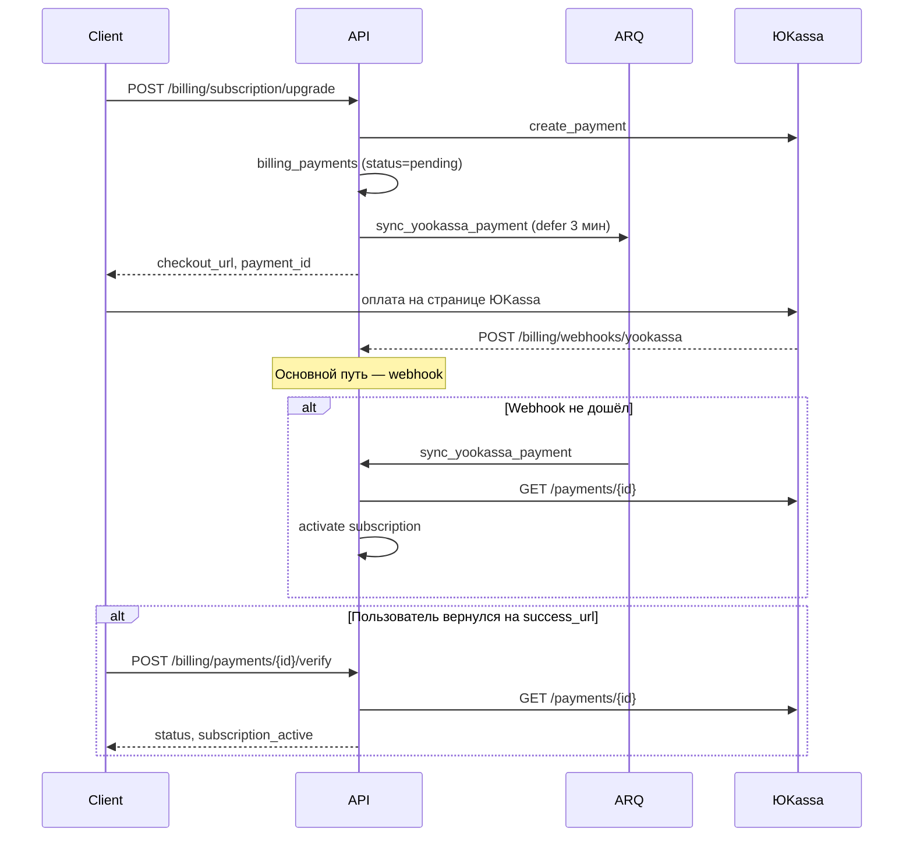

# Биллинг и оплата

## Назначение

Модуль `billing` управляет тарифами, подписками пользователей и лимитами платформы. Подписка привязана к **аккаунту пользователя** (не к организации); лимиты применяются к org, которыми владеет пользователь.

Поддерживаемые платёжные провайдеры:

| Провайдер | Валюта | Сценарий |
|-----------|--------|----------|
| **ЮKassa** | RUB | Основной провайдер для РФ, рекуррентные списания |
| **Stripe** | USD/EUR | Международные платежи (checkout + webhook) |

## Модель данных

| Сущность | Таблица | Описание |
|----------|---------|----------|
| `BillingPlan` | `billing_plans` | Каталог тарифов (`free`, `pro`, `enterprise`) |
| `BillingSubscription` | `billing_subscriptions` | Активная подписка пользователя (unique `user_id`) |
| `BillingPayment` | `billing_payments` | Запись платежа ЮKassa (идемпотентность, аудит) |
| `BillingSavedPaymentMethod` | `billing_saved_payment_methods` | Сохранённая карта для автопродления |
| `BillingUsageRecord` | `billing_usage_records` | Дневной учёт использования |

## Поток оформления подписки (ЮKassa)



## Подтверждение оплаты — три уровня

| Уровень | Механизм | Когда срабатывает |
|---------|----------|-------------------|
| 1 | **Webhook** | ЮKassa отправляет `payment.succeeded` / `payment.canceled` |
| 2 | **Фоновая сверка** | ARQ-задача через N сек после checkout + cron каждые 5 мин |
| 3 | **Ручная проверка** | Пользователь вызывает `/payments/{id}/verify` после возврата с оплаты |

Все три пути используют общую логику `_reconcile_payment`: запрос статуса в API ЮKassa, обновление `billing_payments`, активация подписки при `succeeded` + `paid`.

### Фоновые задачи (ARQ)

| Задача | Тип | Описание |
|--------|-----|----------|
| `sync_yookassa_payment` | defer | Сверка одного платежа через `YOOKASSA_PAYMENT_SYNC_DELAY_SECONDS` (по умолчанию 180 с) после checkout |
| `process_pending_yookassa_payments` | cron (*/5 мин) | Сверка всех незавершённых платежей в окне возраста |
| `process_yookassa_renewals` | cron (02:00 UTC) | Автопродление с сохранённых карт |

Worker должен быть запущен:

```bash
arq markethacker.infrastructure.jobs.WorkerSettings
```

В Docker Compose сервис `worker` уже настроен в `backend/docker-compose.yml`.

## API эндпоинты

### Пользовательские (`/api/v1/billing/*`)

| Метод | Путь | Auth | Описание |
|-------|------|:----:|----------|
| GET | `/billing/plans` | — | Список активных тарифов |
| GET | `/billing/subscription` | ✓ | Текущая подписка или `null` (free) |
| POST | `/billing/subscription/upgrade` | ✓ | Оформление подписки → checkout URL |
| POST | `/billing/subscription/cancel` | ✓ | Отмена (доступ до конца периода) |
| GET | `/billing/usage` | ✓ | Отчёт об использовании лимитов |
| GET | `/billing/payment-methods` | ✓ | Сохранённые карты ЮKassa |
| DELETE | `/billing/payment-methods/{id}` | ✓ | Удаление сохранённой карты |
| POST | `/billing/payments/{payment_id}/verify` | ✓ | **Ручная сверка платежа** |

`payment_id` — ID платежа ЮKassa из ответа `subscription/upgrade` (`CheckoutResponse.payment_id`).

#### POST /billing/subscription/upgrade

```json
{
  "plan_name": "pro",
  "provider": "yookassa",
  "success_url": "https://team.markethacker.ru/billing/success",
  "cancel_url": "https://team.markethacker.ru/billing/cancel"
}
```

Ответ:

```json
{
  "data": {
    "checkout_url": "https://yoomoney.ru/checkout/...",
    "provider": "yookassa",
    "payment_id": "2d7f3c8a-0001-5000-8000-1a2b3c4d5e6f"
  }
}
```

#### POST /billing/payments/{payment_id}/verify

Ответ:

```json
{
  "data": {
    "payment_id": "2d7f3c8a-0001-5000-8000-1a2b3c4d5e6f",
    "status": "succeeded",
    "is_paid": true,
    "processed": true,
    "subscription_active": true,
    "synced": true,
    "message": "Платёж обработан"
  }
}
```

Рекомендуется вызывать на странице `success_url` сразу после возврата пользователя с оплаты.

### Webhook (`/api/v1/billing/webhooks/*`)

| Метод | Путь | Auth | Описание |
|-------|------|:----:|----------|
| POST | `/billing/webhooks/yookassa` | IP whitelist | События ЮKassa |
| POST | `/billing/webhooks/stripe` | Stripe-Signature | События Stripe |

**Webhook URL для ЮKassa:**

```
POST https://api.markethacker.ru/api/v1/billing/webhooks/yookassa
```

Webhook проверяет IP отправителя (диапазоны ЮKassa + `YOOKASSA_ALLOWED_IPS_EXTRA`) и дополнительно сверяет payload с API ЮKassa (cross-check, timeout 8 с).

### Админские (`/api/v1/admin/*`)

| Метод | Путь | Описание |
|-------|------|----------|
| GET/PATCH | `/admin/billing/plans` | Управление тарифами |
| GET/PATCH | `/admin/billing/subscriptions` | Список и редактирование подписок |
| GET | `/admin/billing/finance/overview` | KPI, графики, воронка, разбивки |
| GET | `/admin/billing/payments` | Реестр платежей ЮKassa |
| POST | `/admin/billing/yookassa/test-payment` | Тестовый платёж 1 ₽ из админ-панели |
| GET/PATCH | `/admin/platform-settings` | Настройки ЮKassa (shop_id, рекуррент, VAT и т.д.) |

## Рекуррентные платежи (автопродление)

При включённом `yookassa_recurrent_enabled`:

1. При первой оплате карта сохраняется (`save_payment_method`).
2. За `yookassa_autopay_days_before` дней до окончания периода cron-задача списывает оплату с сохранённой карты.
3. При неудаче подписка переводится в `past_due`.

## Переменные окружения

Секреты задаются только в `.env` (не в админ-панели):

| Переменная | Описание |
|------------|----------|
| `YOOKASSA_SHOP_ID` | ID боевого магазина |
| `YOOKASSA_SECRET_KEY` | Секрет боевого магазина |
| `YOOKASSA_TEST_SHOP_ID` | ID тестового магазина |
| `YOOKASSA_TEST_SECRET_KEY` | Секрет тестового магазина |
| `YOOKASSA_DEFAULT_RECEIPT_EMAIL` | Email для фискальных чеков (обязателен) |
| `YOOKASSA_RECURRENT_ENABLED` | Сохранение карт и автопродление |
| `YOOKASSA_AUTOPAY_DAYS_BEFORE` | За сколько дней до конца периода списывать |
| `YOOKASSA_TEST_MODE` | Принимать тестовые платежи в production |
| `YOOKASSA_ALLOWED_IPS_EXTRA` | Доп. CIDR для webhook IP validation |
| `YOOKASSA_TRUSTED_PROXY_NETWORKS` | Доверенные прокси для определения IP |

Фоновая сверка платежей:

| Переменная | По умолчанию | Описание |
|------------|--------------|----------|
| `YOOKASSA_PAYMENT_SYNC_DELAY_SECONDS` | 180 | Задержка перед первой ARQ-сверкой после checkout |
| `YOOKASSA_PAYMENT_SYNC_MIN_AGE_SECONDS` | 120 | Минимальный возраст платежа для cron-сверки |
| `YOOKASSA_PAYMENT_SYNC_MAX_AGE_HOURS` | 24 | Не проверять платежи старше |

Операционные настройки (shop_id, VAT, режим тестового магазина) редактируются в админ-панели → **Настройки → Оплата (ЮKassa)** без перезапуска API.

## Структура модуля

```
modules/billing/
├── api/                    # router, schemas
├── application/
│   ├── service.py          # BillingService (фасад)
│   └── yookassa_service.py # Checkout, webhook, sync, renewals
├── domain/models.py        # BillingPlan, Subscription, Payment, ...
├── infrastructure/
│   ├── repository.py
│   ├── yookassa_client.py  # Async HTTP-клиент API v3
│   ├── yookassa_credentials.py
│   └── yookassa_webhook.py # IP validation
└── jobs/
    ├── yookassa_renewals.py
    └── yookassa_payment_sync.py
```

## Идемпотентность

- Каждый платёж ЮKassa хранится в `billing_payments` с unique `yookassa_payment_id`.
- Поле `processed_at` предотвращает повторную активацию подписки при дублирующих webhook/sync.
- Webhook, cron и ручная verify безопасно вызываются многократно.

## Интеграция во фронтенде

**Manager Portal** — после редиректа на `success_url`:

```typescript
const paymentId = searchParams.get("payment_id"); // передать из checkout flow
if (paymentId) {
  await api.post(`/billing/payments/${paymentId}/verify`);
  // обновить состояние подписки
}
```

**Admin Panel** — тестовый платёж доступен в **Настройки → Оплата (ЮKassa) → Проверить интеграцию**.
