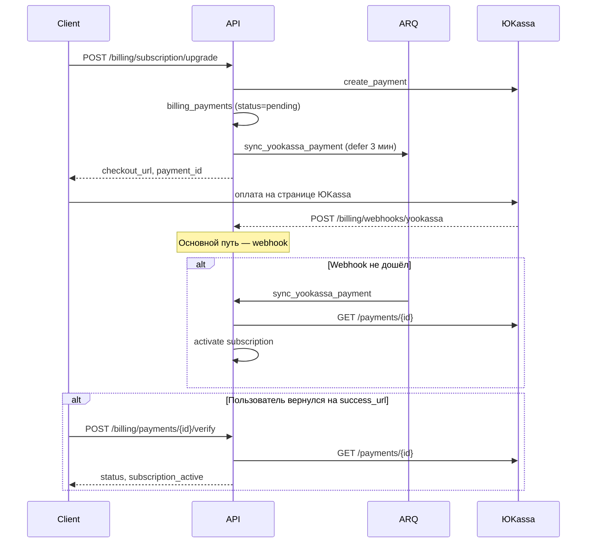
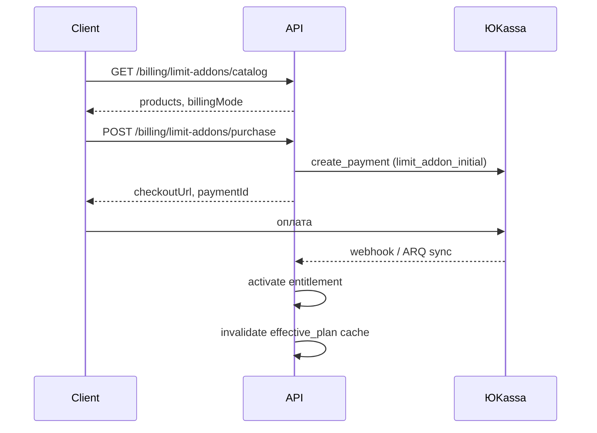
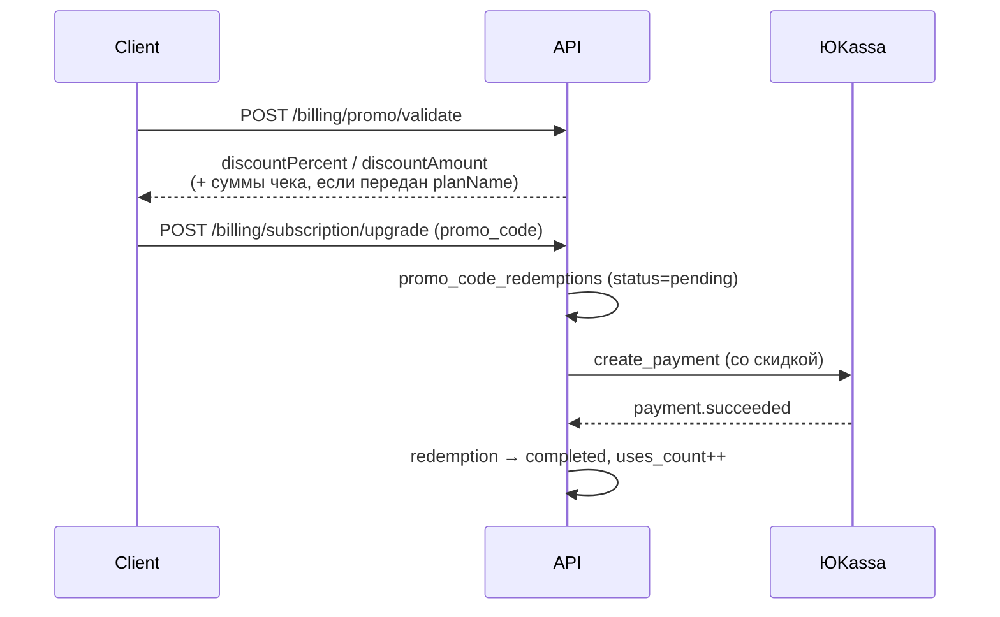

# Биллинг и оплата

## Назначение

Модуль `billing` управляет тарифами, подписками пользователей и лимитами платформы. Подписка привязана к **аккаунту пользователя** (не к организации); лимиты применяются к org, которыми владеет пользователь.

Поддерживаемые платёжные провайдеры:

| Провайдер | Валюта | Сценарий |
|-----------|--------|----------|
| **ЮKassa** | RUB | Основной провайдер для РФ, рекуррентные списания |
| **Stripe** | USD/EUR | Международные платежи (checkout + webhook) |

## Модель данных

| Сущность | Таблица | Описание |
|----------|---------|----------|
| `BillingPlan` | `billing_plans` | Каталог тарифов (`free`, `pro`, `enterprise`) |
| `BillingClient` | `billing_clients` | Справочник клиентов платформы (manager-portal, extension, …) |
| `BillingPlanClientVisibility` | `billing_plan_client_visibility` | M:N — в каких клиентах виден тариф |
| `BillingSubscription` | `billing_subscriptions` | Активная подписка пользователя (unique `user_id`) |
| `BillingPayment` | `billing_payments` | Запись платежа ЮKassa (идемпотентность, аудит) |
| `BillingSavedPaymentMethod` | `billing_saved_payment_methods` | Сохранённая карта для автопродления |
| `BillingUsageRecord` | `billing_usage_records` | Дневной учёт использования |
| `PromoCode` | `promo_codes` | Каталог промокодов |
| `PromoCodeRedemption` | `promo_code_redemptions` | Факт применения промокода пользователем |
| `BillingLimitAddonProduct` | `billing_limit_addon_products` | Каталог продуктов докупки лимитов |
| `BillingLimitAddonEntitlement` | `billing_limit_addon_entitlements` | Активная докупка пользователя |

## Поток оформления подписки (ЮKassa)



## Подтверждение оплаты — три уровня

| Уровень | Механизм | Когда срабатывает |
|---------|----------|-------------------|
| 1 | **Webhook** | ЮKassa отправляет `payment.succeeded` / `payment.canceled` |
| 2 | **Фоновая сверка** | ARQ-задача через N сек после checkout + cron каждые 5 мин |
| 3 | **Ручная проверка** | Пользователь вызывает `/payments/{id}/verify` после возврата с оплаты |

Все три пути используют общую логику `_reconcile_payment`: запрос статуса в API ЮKassa, обновление `billing_payments`, активация подписки при `succeeded` + `paid`.

### Фоновые задачи (ARQ)

| Задача | Тип | Описание |
|--------|-----|----------|
| `sync_yookassa_payment` | defer | Сверка одного платежа через `YOOKASSA_PAYMENT_SYNC_DELAY_SECONDS` (по умолчанию 180 с) после checkout |
| `process_pending_yookassa_payments` | cron (*/5 мин) | Сверка всех незавершённых платежей в окне возраста |
| `process_yookassa_renewals` | cron (02:00 UTC) | Автопродление с сохранённых карт |

Worker должен быть запущен:

```bash
arq markethacker.infrastructure.jobs.WorkerSettings
```

В Docker Compose сервис `worker` уже настроен в `backend/docker-compose.yml`.

## Видимость тарифов по клиентам

Каталог тарифов может отличаться для разных клиентов платформы (manager-portal,
браузерное расширение и будущие приложения). Это **отдельно** от фич тарифа
(`team_management`, `browser_extension`): видимость определяет, какие планы
показываются в UI и доступны для оформления, а не что пользователь может
делать после покупки.

### Идентификация клиента

Клиент передаёт контекст через заголовок (приоритет) или query-параметр:

```
X-MarketHacker-Client: manager_portal
GET /api/v1/billing/plans?client=manager_portal
```

| Контекст | Поведение |
|----------|-----------|
| Заголовок / query не передан | Все активные тарифы (обратная совместимость) |
| Неизвестный или отключённый клиент | `400 Bad Request` |
| Валидный клиент | Только тарифы, у которых клиент указан в `billing_plan_client_visibility` |
| Пустой список клиентов у тарифа + указан `client` | Тариф **не** попадает в каталог этого клиента |

Семантика «пустой список = виден везде» **не используется**. Без контекста клиента
фильтр не применяется; с контекстом — только явные связи M:N.

`GET /billing/subscription` **не фильтруется** — текущий план пользователя
возвращается всегда, даже если тариф скрыт в каталоге клиента.

`POST /billing/subscription/upgrade` и promo-эндпоинты проверяют видимость
тарифа для указанного клиента.

### Администрирование

| Метод | Путь | Описание |
|-------|------|----------|
| GET | `/admin/billing/clients` | Справочник клиентов |
| POST | `/admin/billing/clients` | Создать клиента (`planNames` — опционально) |
| PATCH | `/admin/billing/clients/{id}` | Обновить клиента |
| GET | `/admin/billing/clients/{id}/plans` | Список `planNames`, видимых для клиента |
| PUT | `/admin/billing/clients/{id}/plans` | Задать видимые тарифы клиента (`planNames`) |
| GET/PATCH | `/admin/billing/plans` | Каталог тарифов + поле `visibleClients` |

В admin-panel:

- **Биллинг → Клиенты** — настройка «какие тарифы видит этот клиент» (рекомендуется
  для сценария «в manager-portal только enterprise»).
- **Биллинг → Тарифы** — настройка «в каких клиентах виден этот тариф» (чекбоксы
  `visibleClients`).

При создании клиента без `planNames` он автоматически добавляется во видимость всех
активных тарифов; дальше список сужают на странице **Клиенты** или **Тарифы**.

**Manager-portal** уже передаёт `X-MarketHacker-Client: manager_portal` и
`?client=manager_portal` в `GET /billing/plans` и `POST /subscription/upgrade`.

Миграция `20260708_0023` создаёт клиентов `manager_portal` и `browser_extension`
и делает все существующие тарифы видимыми в обоих клиентах.

## API эндпоинты

### Пользовательские (`/api/v1/billing/*`)

| Метод | Путь | Auth | Описание |
|-------|------|:----:|----------|
| GET | `/billing/plans` | — | Список активных тарифов (опционально `X-MarketHacker-Client`) |
| GET | `/billing/subscription` | ✓ | Текущая подписка или `null` (free) |
| POST | `/billing/subscription/upgrade` | ✓ | Оформление подписки → checkout URL |
| POST | `/billing/subscription/cancel` | ✓ | Отмена (доступ до конца периода) |
| GET | `/billing/usage` | ✓ | Отчёт об использовании лимитов |
| GET | `/billing/payment-methods` | ✓ | Сохранённые карты ЮKassa |
| DELETE | `/billing/payment-methods/{id}` | ✓ | Удаление сохранённой карты |
| POST | `/billing/payments/{payment_id}/verify` | ✓ | **Ручная сверка платежа** |
| POST | `/billing/promo/validate` | ✓ | Проверка промокода (без списания) |
| POST | `/billing/promo/redeem` | ✓ | Активация промокода (trial / free_period / limits_boost) |
| GET | `/billing/limit-addons/catalog` | ✓ | Каталог доступных докупок + режим оплаты |
| GET | `/billing/limit-addons` | ✓ | Активные докупки пользователя |
| POST | `/billing/limit-addons/purchase` | ✓ | Checkout докупки → URL ЮKassa |
| POST | `/billing/limit-addons/{id}/cancel` | ✓ | Отмена автопродления докупки |

`paymentId` — ID платежа ЮKassa из ответа `subscription/upgrade` (`CheckoutResponse.paymentId`).

#### POST /billing/subscription/upgrade

```json
{
  "planName": "pro",
  "provider": "yookassa",
  "billingPeriod": "monthly",
  "promoCode": "SUMMER20",
  "successUrl": "https://team.markethacker.ru/billing/success",
  "cancelUrl": "https://team.markethacker.ru/billing/cancel"
}
```

| Поле | Описание |
|------|----------|
| `billingPeriod` | `monthly` (30 дней) или `yearly` (365 дней). По умолчанию `monthly` |
| `promoCode` | Опционально. Только для типа `discount` — скидка на **первый** платёж |

Ответ:

```json
{
  "data": {
    "checkoutUrl": "https://yoomoney.ru/checkout/...",
    "provider": "yookassa",
    "paymentId": "2d7f3c8a-0001-5000-8000-1a2b3c4d5e6f"
  }
}
```

#### POST /billing/payments/{payment_id}/verify

Ответ:

```json
{
  "data": {
    "paymentId": "2d7f3c8a-0001-5000-8000-1a2b3c4d5e6f",
    "status": "succeeded",
    "isPaid": true,
    "processed": true,
    "subscriptionActive": true,
    "synced": true,
    "message": "Платёж обработан"
  }
}
```

Рекомендуется вызывать на странице `successUrl` сразу после возврата пользователя с оплаты.

#### POST /billing/promo/validate

Проверяет промокод без изменения состояния.

Для `discount` всегда возвращаются `discountPercent` и/или `discountAmount`.
Суммы чека (`originalAmount`, `discountApplied`, `finalAmount`) считаются
**только если** в запросе передан конкретный `planName` — иначе UI показывает
процент/фикс без привязки к одному тарифу (разные планы стоят по-разному).

```json
{
  "code": "SUMMER20",
  "planName": "pro",
  "billingPeriod": "monthly"
}
```

Пример ответа (скидка % без `planName`):

```json
{
  "data": {
    "code": "SUMMER20",
    "promoType": "discount",
    "valid": true,
    "discountPercent": "20.00",
    "targetPlan": null
  }
}
```

Пример ответа (скидка с `planName=pro`):

```json
{
  "data": {
    "code": "SUMMER20",
    "promoType": "discount",
    "valid": true,
    "discountPercent": "20.00",
    "planName": "pro",
    "checkoutBillingPeriod": "monthly",
    "originalAmount": "2990.00",
    "discountApplied": "598.00",
    "finalAmount": "2392.00"
  }
}
```

Ошибки (`PromoCodeError`) уходят в стандартный `error.message` (например
«Промокод не найден», «Срок действия промокода истёк»).

#### POST /billing/promo/redeem

Активирует промокод типов `trial`, `free_period`, `limits_boost`. Промокоды `discount` применяются только через `subscription/upgrade`.

```json
{
  "code": "TRIAL14",
  "planName": "pro"
}
```

### Webhook (`/api/v1/billing/webhooks/*`)

| Метод | Путь | Auth | Описание |
|-------|------|:----:|----------|
| POST | `/billing/webhooks/yookassa` | IP whitelist | События ЮKassa |
| POST | `/billing/webhooks/stripe` | Stripe-Signature | События Stripe |

**Webhook URL для ЮKassa:**

```
POST https://api.markethacker.ru/api/v1/billing/webhooks/yookassa
```

Webhook проверяет IP отправителя (диапазоны ЮKassa + `YOOKASSA_ALLOWED_IPS_EXTRA`) и дополнительно сверяет payload с API ЮKassa (cross-check, timeout 8 с).

### Админские (`/api/v1/admin/*`)

| Метод | Путь | Описание |
|-------|------|----------|
| GET/PATCH | `/admin/billing/plans` | Управление тарифами |
| GET/PATCH | `/admin/billing/subscriptions` | Список и редактирование подписок |
| GET | `/admin/billing/finance/overview` | KPI, графики, воронка, разбивки |
| GET | `/admin/billing/payments` | Реестр платежей ЮKassa |
| POST | `/admin/billing/yookassa/test-payment` | Тестовый платёж 1 ₽ из админ-панели |
| GET/POST/PATCH | `/admin/billing/promo-codes` | CRUD промокодов |
| GET | `/admin/billing/promo-codes/{id}/redemptions` | История использований промокода |
| GET/PATCH | `/admin/platform-settings` | Настройки ЮKassa, режим докупки лимитов и др. |
| GET | `/admin/billing/limit-types` | Реестр типов лимитов |
| GET/POST/PATCH | `/admin/billing/limit-addon-products` | CRUD продуктов докупки |

## Докупка лимитов

Расширяемая система докупки лимитов поверх тарифа. Реестр типов — `domain/limit_catalog.py`; продукты настраиваются в админке (**Биллинг → Докупка лимитов**).

### Типы лимитов

| `limit_key` | Поле тарифа | Область | Описание |
|-------------|-------------|---------|----------|
| `organizations` | `max_organizations` | user | Дополнительные организации владельца |
| `members` | `max_members` | org | Участники команды (лимит org определяется подпиской владельца) |
| `api_calls_per_day` | `max_api_calls_per_day` | user | Дневной лимит API-запросов |

Seed-продукты (миграция `20260704_0019`):

| `code` | Лимит | Единиц в пакете | Цена/мес |
|--------|-------|-----------------|----------|
| `extra_org_1` | organizations | 1 | 990 ₽ |
| `extra_member_5` | members | 5 | 490 ₽ (только pro/enterprise) |
| `extra_api_10k` | api_calls_per_day | 10 000 | 290 ₽ |

### Применение лимитов

Активные докупки и промо-бусты объединяются в `limit_adjustments.py` и применяются в `BillingService.get_effective_plan()`:

```
effective_limit = plan_limit + promo_boosts + purchased_addons
```

Результат кэшируется в Redis (TTL 60 с, инвалидация при смене подписки или докупки).

`GET /billing/usage` возвращает расширенные метрики:

| Поле | Описание |
|------|----------|
| `limit` | Эффективный лимит (тариф + бусты + докупки) |
| `baseLimit` | Лимит только по тарифу и промо-бустам (без докупок) |
| `purchasedExtra` | Сумма единиц от активных докупок по ключу |
| `grandfathered` | `true`, если `current > limit` — ресурсы сохранены, но новые заблокированы |
| `purchasedAddons` | Сводка докупок по `limit_key` |
| `limitAddonBillingMode` | Текущий режим оплаты платформы |

### Режимы оплаты

Настраиваются в админке (**Биллинг → Докупка лимитов → Режим оплаты**) или через `PATCH /admin/platform-settings`:

| Ключ | По умолчанию | Описание |
|------|--------------|----------|
| `limit_addon_billing_mode` | `bundled` | Режим оплаты докупок |
| `limit_addon_separate_grace_days` | `7` | Льготный период (0–90) при неоплате в режиме `separate` |

| Режим | Поведение |
|-------|-----------|
| `one_time` | Разовая оплата докупки; entitlements **бессрочные** (`is_perpetual=true`); автопродление тарифа — только стоимость плана |
| `bundled` (default) | Стоимость активных докупок добавляется к сумме автопродления подписки; период entitlements синхронизируется с подпиской |
| `separate` | Отдельные платежи за докупки (`limit_addon_renewal`); при неоплате — льготный период, затем снижение лимита до базового |

Режим **фиксируется на entitlement** в поле `purchase_billing_mode` на момент покупки.

### Grandfathering (режим `separate`)

При истечении льготного периода лимит падает до базового тарифа. Если org или участников уже больше нового лимита:

- существующие ресурсы **не удаляются**;
- `grandfathered: true` в отчёте usage;
- создание новых org/участников блокируется проверками `current >= limit` в `BillingService`.

### Поток покупки докупки



#### POST /billing/limit-addons/purchase

```json
{
  "productId": "uuid",
  "quantityPacks": 1,
  "billingPeriod": "monthly",
  "successUrl": "https://team.markethacker.ru/billing?addon=success"
}
```

Ответ — `CheckoutResponse` (`checkoutUrl`, `paymentId`).

#### POST /billing/limit-addons/{id}/cancel

Отключает автопродление докупки (`autopay_enabled=false`). Недоступно для разовых (`one_time`) докупок.

### Типы платежей ЮKassa

| `payment_type` | Описание |
|----------------|----------|
| `limit_addon_initial` | Первая оплата докупки |
| `limit_addon_renewal` | Автопродление докупки (только `separate`) |

При verify/sync для докупок в ответе `PaymentStatusResponse` может быть `addonActivated: true`.

### Автопродление докупок

Cron `process_yookassa_renewals` (02:00 UTC):

1. **Перед продлениями** — `expire_stale_entitlements()`: истекают entitlements с прошедшим `grace_period_end`.
2. **Подписки** — списание с сохранённой карты; в режиме `bundled` к сумме добавляется `calculate_recurring_addon_total()`.
3. **Докупки (только `separate`)** — `_process_limit_addon_renewals()`: отдельное списание по каждому entitlement; при неудаче — `handle_separate_renewal_failure()` → льготный период.

Требуется `yookassa_recurrent_enabled` и сохранённая карта.

### Расширение системы

Чтобы добавить новый лимит:

1. Поле в `BillingPlan` + миграция Alembic.
2. Запись в `LIMIT_CATALOG` (`domain/limit_catalog.py`).
3. Продукт в админке или seed-миграция.
4. При необходимости — `check_*` в `BillingService`.

### Админка и UI

| Интерфейс | Путь | Описание |
|-----------|------|----------|
| Admin Panel | `/billing/limit-addons` | CRUD продуктов, переключение режима оплаты |
| Manager Portal | `/billing` | Каталог докупок, покупка, список активных entitlements |

### Тесты

| Файл | Покрытие |
|------|----------|
| `tests/integration/test_limit_addons.py` | API, checkout, effective plan, usage |
| `tests/unit/test_limit_addon_billing_modes.py` | Режимы, perpetual, grace period |

## Промокоды

### Типы

| Тип | Описание | Как активируется |
|-----|----------|------------------|
| `discount` | Скидка % или фикс. сумма (₽) на первый платёж | `POST /billing/subscription/upgrade` с `promo_code` |
| `trial` | N дней pro/enterprise, статус `trialing` | `POST /billing/promo/redeem` |
| `free_period` | N дней активной подписки без оплаты | `POST /billing/promo/redeem` |
| `limits_boost` | Временное увеличение лимитов тарифа | `POST /billing/promo/redeem` |

### Ограничения промокода

| Поле | Описание |
|------|----------|
| `max_uses` | Общий лимит использований (`null` = безлимит) |
| `max_uses_per_user` | Лимит на пользователя (по умолчанию 1) |
| `new_users_only` | Только пользователи без платной подписки/оплат (по умолчанию `true`, отключается в админке) |
| `target_plan` | `pro`, `enterprise` или любой платный |
| `billing_period` | Для `discount`: `monthly`, `yearly` или любой |
| `valid_from` / `valid_until` | Окно действия |

### Поток скидки (discount)



- Скидка применяется **только к первому платежу**. Автопродление — по полной цене тарифа.
- Минимальная сумма checkout после скидки — **1 ₽**.
- Pending-redemption истекает через 24 ч, если checkout не завершён.

### Партнёрские (managed) промокоды

Кампания типа `promo_code` создаёт запись в `promo_codes` с `origin=partner` и
`partner_campaign_id`. Описание: «Партнёрская кампания «…»». Такие коды
участвуют в `/billing/promo/*` и в attribution, но **скрыты** из админского
списка **Биллинг → Промокоды** (управляются из **Партнёры**). Подробнее:
[Партнёры](./partners.md).

### Буст лимитов (limits_boost)

Активные бусты суммируются и применяются в `BillingService.get_effective_plan()` поверх лимитов текущего тарифа. Результат кэшируется в Redis (user scope, TTL 60 с, инвалидация при смене подписки) — см. [Кэширование](./caching.md).

- `boost_members`
- `boost_organizations`
- `boost_api_calls_per_day`

Буста на количество кабинетов маркетплейсов нет: их число в org и так ограничено количеством поддерживаемых маркетплейсов (не более одного кабинета на маркетплейс), а масштабирование агентства идёт через `boost_organizations`.

Срок действия задаётся полем `boost_duration_days`.

### Trial

При истечении `trial_ends_at` подписка переводится в `cancelled`, пользователь получает лимиты free-тарифа (с учётом активных бустов).

### Отмена подписки

`POST /billing/subscription/cancel` переводит подписку в `status=cancelled` и отключает автопродление.
Платные фичи и лимиты **сохраняются до `current_period_end`** — после этой даты effective plan
переходит на free. Поле `cancelledAt` фиксирует момент отмены; `isInGracePeriod` в
`/extension/entitlements` показывает, что доступ ещё активен до конца периода.

### Фичи тарифа

| Ключ | Тарифы по умолчанию | Scope | Guard |
|------|---------------------|-------|-------|
| `team_management` | pro, enterprise | org (владелец) | `require_manager_portal` |
| `search_tags` | все | user ∪ org seat | `require_search_tags_feature` |
| `browser_extension` | pro, enterprise | user ∪ org seat | `require_browser_extension` |

`user ∪ org seat` означает: фича есть на личном effective plan **или**
пользователь — активный участник org, у владельца которой фича есть в плане.
Единый резолвер: `BillingService.resolve_user_feature_keys` /
`user_has_feature`.

Каталог для админ-панели: `GET /admin/billing/features` (`domain/features.py`).

### Админ-панель

Управление промокодами: **Биллинг → Промокоды** (`/billing/promo-codes`).

> **Не путать:** продуктовые баннеры Manager Portal — отдельный модуль
> [`promotions`](./product-promotions.md) (UI: **Продвижение → Баннеры**), не промокоды.

## Рекуррентные платежи (автопродление)

При включённом `yookassa_recurrent_enabled`:

1. При первой оплате карта сохраняется (`save_payment_method`).
2. За `yookassa_autopay_days_before` дней до окончания периода cron-задача списывает оплату с сохранённой карты.
3. В режиме `bundled` к сумме подписки добавляется стоимость активных докупок; период bundled-entitlements продлевается вместе с подпиской.
4. В режиме `separate` докупки продлеваются отдельными платежами в том же cron; при неудаче — льготный период (см. [Докупка лимитов](#докупка-лимитов)).
5. При неудаче оплаты подписки подписка переводится в `past_due`.

## Переменные окружения

Секреты задаются только в `.env` (не в админ-панели):

| Переменная | Описание |
|------------|----------|
| `YOOKASSA_SHOP_ID` | ID боевого магазина |
| `YOOKASSA_SECRET_KEY` | Секрет боевого магазина |
| `YOOKASSA_TEST_SHOP_ID` | ID тестового магазина |
| `YOOKASSA_TEST_SECRET_KEY` | Секрет тестового магазина |
| `YOOKASSA_DEFAULT_RECEIPT_EMAIL` | Email для фискальных чеков (обязателен) |
| `YOOKASSA_RECURRENT_ENABLED` | Сохранение карт и автопродление |
| `YOOKASSA_AUTOPAY_DAYS_BEFORE` | За сколько дней до конца периода списывать |
| `YOOKASSA_TEST_MODE` | Принимать тестовые платежи в production |
| `YOOKASSA_ALLOWED_IPS_EXTRA` | Доп. CIDR для webhook IP validation |
| `YOOKASSA_TRUSTED_PROXY_NETWORKS` | Доверенные прокси для определения IP |

Фоновая сверка платежей:

| Переменная | По умолчанию | Описание |
|------------|--------------|----------|
| `YOOKASSA_PAYMENT_SYNC_DELAY_SECONDS` | 180 | Задержка перед первой ARQ-сверкой после checkout |
| `YOOKASSA_PAYMENT_SYNC_MIN_AGE_SECONDS` | 120 | Минимальный возраст платежа для cron-сверки |
| `YOOKASSA_PAYMENT_SYNC_MAX_AGE_HOURS` | 24 | Не проверять платежи старше |

Операционные настройки (shop_id, VAT, режим тестового магазина, **режим докупки лимитов**) редактируются в админ-панели → **Настройки → Оплата (ЮKassa)** или **Биллинг → Докупка лимитов** без перезапуска API. Значения попадают в runtime-кэш (`platform_settings.application.cache`).

## Структура модуля

```
modules/billing/
├── api/                    # router, schemas
├── application/
│   ├── service.py          # BillingService (фасад, usage, effective plan)
│   ├── promo_service.py    # Валидация, redeem, скидки
│   ├── limit_addon_service.py  # Каталог, checkout, entitlements
│   ├── limit_adjustments.py    # Промо-бусты + докупки → effective limits
│   ├── limit_boosts.py     # Обратная совместимость (re-export)
│   └── yookassa_service.py # Checkout, webhook, sync, renewals
├── domain/
│   ├── models.py           # Plan, Subscription, Payment, PromoCode, LimitAddon*, ...
│   ├── limit_catalog.py    # Реестр типов лимитов
│   ├── limit_addon_billing.py  # Режимы оплаты докупок
│   └── promo.py            # Константы, расчёт скидки
├── infrastructure/
│   ├── repository.py
│   ├── promo_repository.py
│   ├── limit_addon_repository.py
│   ├── yookassa_client.py  # Async HTTP-клиент API v3
│   ├── yookassa_credentials.py
│   └── yookassa_webhook.py # IP validation
└── jobs/
    ├── yookassa_renewals.py
    └── yookassa_payment_sync.py
```

## Идемпотентность

- Каждый платёж ЮKassa хранится в `billing_payments` с unique `yookassa_payment_id`.
- Поле `processed_at` предотвращает повторную активацию подписки при дублирующих webhook/sync.
- Webhook, cron и ручная verify безопасно вызываются многократно.

## Интеграция во фронтенде

**Manager Portal** — страница `/billing` (компонент `BillingWorkspace`):

- доступна любому авторизованному пользователю (подписка per-user; организация
  не обязательна);
- текущая подписка и usage (включая `baseLimit`, `grandfathered`, `purchasedExtra`);
- единый блок: тарифы + промокод + докупка лимитов + отмена подписки;
- для `discount` на карточках планов — зачёркнутая старая цена и новая со скидкой;
- `POST /billing/subscription/upgrade` принимает optional `promoCode`.

После редиректа с оплаты подписки или докупки:

```typescript
const paymentId = searchParams.get("paymentId"); // передать из checkout flow
if (paymentId) {
  await api.post(`/billing/payments/${paymentId}/verify`);
  // обновить состояние подписки / докупки
}
```

**Admin Panel**:

- тестовый платёж: **Настройки → Оплата (ЮKassa) → Проверить интеграцию**;
- промокоды: **Биллинг → Промокоды**;
- докупка лимитов: **Биллинг → Докупка лимитов** (продукты + режим оплаты);
- партнёры: **Партнёры** (профили, кампании, аналитика). См. [Партнёры](./partners.md).
