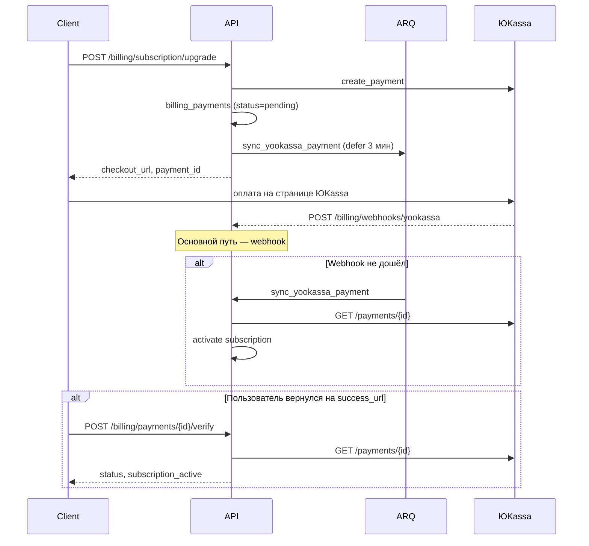
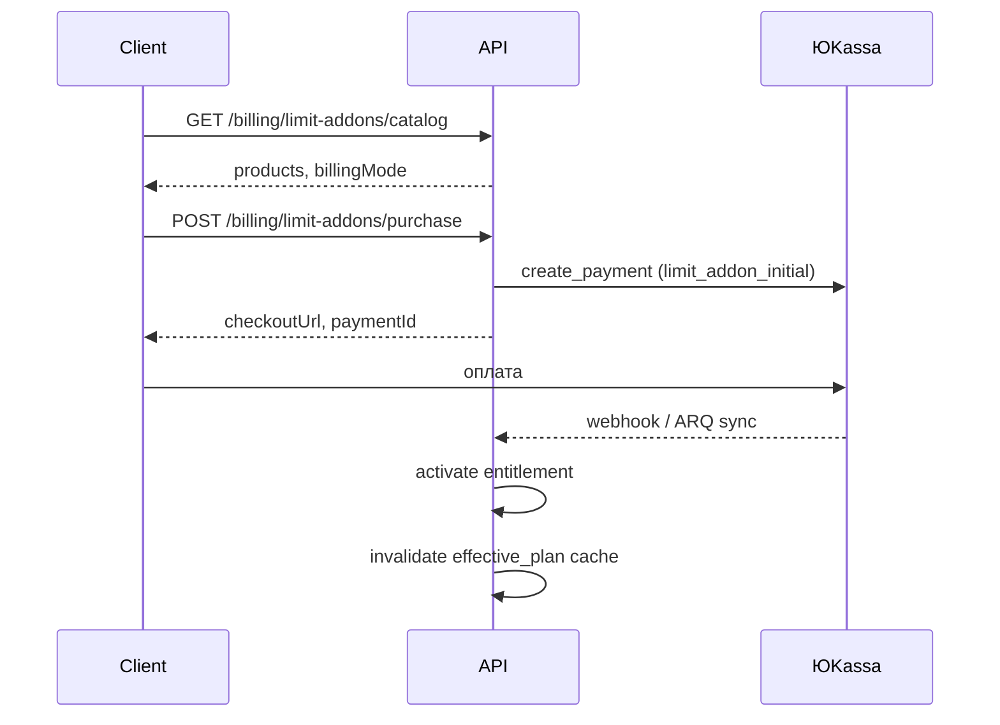
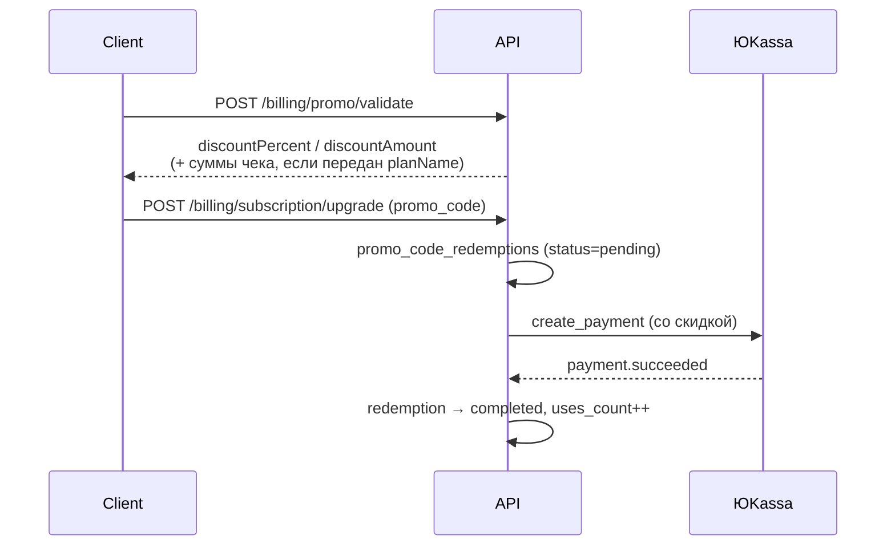

# Биллинг и оплата

## Назначение

Модуль `billing` управляет тарифами, подписками пользователей и лимитами платформы. Подписка привязана к **аккаунту пользователя** (не к организации); лимиты применяются к org, которыми владеет пользователь.

Поддерживаемые платёжные провайдеры:

| Провайдер | Валюта | Сценарий |
|-----------|--------|----------|
| **ЮKassa** | RUB | Основной провайдер для РФ, рекуррентные списания |
| **Stripe** | USD/EUR | Международные платежи (checkout + webhook) |

## Модель данных

| Сущность | Таблица | Описание |
|----------|---------|----------|
| `BillingPlan` | `billing_plans` | Каталог тарифов (`free`, `pro`, `enterprise`) |
| `BillingClient` | `billing_clients` | Справочник клиентов платформы (manager-portal, extension, …) |
| `BillingPlanClientVisibility` | `billing_plan_client_visibility` | M:N — в каких клиентах виден тариф |
| `BillingSubscription` | `billing_subscriptions` | Активная подписка пользователя (unique `user_id`) |
| `BillingPayment` | `billing_payments` | Запись платежа ЮKassa (идемпотентность, аудит) |
| `BillingSavedPaymentMethod` | `billing_saved_payment_methods` | Сохранённая карта для автопродления |
| `BillingUsageRecord` | `billing_usage_records` | Дневной учёт использования |
| `PromoCode` | `promo_codes` | Каталог промокодов |
| `PromoCodeRedemption` | `promo_code_redemptions` | Факт применения промокода пользователем |
| `BillingLimitAddonProduct` | `billing_limit_addon_products` | Каталог продуктов докупки лимитов |
| `BillingLimitAddonEntitlement` | `billing_limit_addon_entitlements` | Активная докупка пользователя |

## Поток оформления подписки (ЮKassa)


```mermaid
sequenceDiagram
    participant Client
    participant API
    participant ARQ
    participant YK as ЮKassa

    Client->>API: POST /billing/subscription/upgrade
    API->>YK: create_payment
    API->>API: billing_payments (status=pending)
    API->>ARQ: sync_yookassa_payment (defer 3 мин)
    API-->>Client: checkout_url, payment_id

    Client->>YK: оплата на странице ЮKassa
    YK-->>API: POST /billing/webhooks/yookassa
    Note over API: Основной путь — webhook

    alt Webhook не дошёл
        ARQ->>API: sync_yookassa_payment
        API->>YK: GET /payments/{id}
        API->>API: activate subscription
    end

    alt Пользователь вернулся на success_url
        Client->>API: POST /billing/payments/{id}/verify
        API->>YK: GET /payments/{id}
        API-->>Client: status, subscription_active
    end
```

## Подтверждение оплаты — три уровня

| Уровень | Механизм | Когда срабатывает |
|---------|----------|-------------------|
| 1 | **Webhook** | ЮKassa отправляет `payment.succeeded` / `payment.canceled` |
| 2 | **Фоновая сверка** | ARQ-задача через N сек после checkout + cron каждые 5 мин |
| 3 | **Ручная проверка** | Клиент вызывает `/payments/{id}/verify` после возврата с оплаты |

Все три пути используют общую логику `_reconcile_payment`: запрос статуса в API ЮKassa, обновление `billing_payments`, атомарная активация подписки при `succeeded` + `paid`.

### Активация подписки

Критический участок выполняется в одной DB-транзакции с `SELECT … FOR UPDATE`:

1. блокировка строки `billing_payments`;
2. если `processed_at` уже задан — выход (идемпотентность);
3. блокировка / upsert `billing_subscriptions`;
4. установка `processed_at` в той же транзакции.

Побочные эффекты (сохранение карты, promo, commission) выполняются после commit и не откатывают выдачу подписки.

Оплаченные платежи без `processed_at` cron подбирает **без ограничения max_age** (кроме terminal `processing_error`: `test_payment_rejected`, `missing_plan`, `unknown_plan`, `missing_product`).

Неизвестный webhook (нет локальной записи): попытка restore из metadata; при неудаче — HTTP 503 (повтор доставки ЮKassa).

### Фоновые задачи (ARQ)

| Задача | Тип | Описание |
|--------|-----|----------|
| `sync_yookassa_payment` | defer | Сверка одного платежа через `YOOKASSA_PAYMENT_SYNC_DELAY_SECONDS` (по умолчанию 180 с) после checkout |
| `process_pending_yookassa_payments` | cron (*/5 мин) | Сверка всех незавершённых платежей в окне возраста |
| `process_yookassa_renewals` | cron (02:00 UTC) | Истечение просроченных подписок (`expired`) + автопродление с сохранённых карт |

Worker должен быть запущен:

```bash
arq markethacker.infrastructure.jobs.WorkerSettings
```

В Docker Compose сервис `worker` уже настроен в `backend/docker-compose.yml`.

## Видимость тарифов по клиентам

Каталог тарифов может отличаться для разных клиентов платформы (manager-portal,
браузерное расширение и будущие приложения). Это **отдельно** от фич тарифа
(`team_management`, `browser_extension`): видимость определяет, какие планы
показываются в UI и доступны для оформления, а не что пользователь может
делать после покупки.

### Идентификация клиента

Клиент передаёт контекст через заголовок (приоритет) или query-параметр:

```
X-MarketHacker-Client: manager_portal
GET /api/v1/billing/plans?client=manager_portal
```

| Контекст | Поведение |
|----------|-----------|
| Заголовок / query не передан | Все активные тарифы (обратная совместимость) |
| Неизвестный или отключённый клиент | `400 Bad Request` |
| Валидный клиент | Только тарифы, у которых клиент указан в `billing_plan_client_visibility` |
| Пустой список клиентов у тарифа + указан `client` | Тариф **не** попадает в каталог этого клиента |

Семантика «пустой список = виден везде» **не используется**. Без контекста клиента
фильтр не применяется; с контекстом — только явные связи M:N.

`GET /billing/subscription` **не фильтруется** — текущий план пользователя
возвращается всегда, даже если тариф скрыт в каталоге клиента.

`POST /billing/subscription/upgrade` и promo-эндпоинты проверяют видимость
тарифа для указанного клиента.

### Администрирование

| Метод | Путь | Описание |
|-------|------|----------|
| GET | `/admin/billing/clients` | Справочник клиентов |
| POST | `/admin/billing/clients` | Создать клиента (`planNames` — опционально) |
| PATCH | `/admin/billing/clients/{id}` | Обновить клиента |
| GET | `/admin/billing/clients/{id}/plans` | Список `planNames`, видимых для клиента |
| PUT | `/admin/billing/clients/{id}/plans` | Задать видимые тарифы клиента (`planNames`) |
| GET/PATCH | `/admin/billing/plans` | Каталог тарифов + поле `visibleClients` |

В admin-panel:

- **Биллинг → Клиенты** — настройка «какие тарифы видит этот клиент» (рекомендуется
  для сценария «в manager-portal только enterprise»).
- **Биллинг → Тарифы** — настройка «в каких клиентах виден этот тариф» (чекбоксы
  `visibleClients`).

При создании клиента без `planNames` он автоматически добавляется во видимость всех
активных тарифов; дальше список сужают на странице **Клиенты** или **Тарифы**.

**Manager-portal** уже передаёт `X-MarketHacker-Client: manager_portal` и
`?client=manager_portal` в `GET /billing/plans` и `POST /subscription/upgrade`.

Миграция `20260708_0023` создаёт клиентов `manager_portal` и `browser_extension`
и делает все существующие тарифы видимыми в обоих клиентах.

## API эндпоинты

### Пользовательские (`/api/v1/billing/*`)

| Метод | Путь | Auth | Описание |
|-------|------|:----:|----------|
| GET | `/billing/plans` | — | Список активных тарифов (опционально `X-MarketHacker-Client`) |
| GET | `/billing/subscription` | ✓ | Текущая подписка или `null` (free) |
| POST | `/billing/subscription/upgrade` | ✓ | Оформление подписки → checkout URL |
| POST | `/billing/subscription/cancel` | ✓ | Отмена (доступ до конца периода) |
| GET | `/billing/usage` | ✓ | Отчёт об использовании лимитов |
| GET | `/billing/payment-methods` | ✓ | Сохранённые карты ЮKassa |
| DELETE | `/billing/payment-methods/{id}` | ✓ | Удаление сохранённой карты |
| POST | `/billing/payments/{payment_id}/verify` | ✓ | **Ручная сверка платежа** |
| POST | `/billing/promo/validate` | ✓ | Проверка промокода (без списания) |
| POST | `/billing/promo/redeem` | ✓ | Активация промокода (trial / free_period / limits_boost) |
| GET | `/billing/limit-addons/catalog` | ✓ | Каталог доступных докупок + режим оплаты |
| GET | `/billing/limit-addons` | ✓ | Активные докупки пользователя |
| POST | `/billing/limit-addons/purchase` | ✓ | Checkout докупки → URL ЮKassa |
| POST | `/billing/limit-addons/{id}/cancel` | ✓ | Отмена автопродления докупки |

`paymentId` — ID платежа ЮKassa из ответа `subscription/upgrade` (`CheckoutResponse.paymentId`).

#### POST /billing/subscription/upgrade

```json
{
  "planName": "pro",
  "provider": "yookassa",
  "billingPeriod": "monthly",
  "promoCode": "SUMMER20",
  "successUrl": "https://team.markethacker.ru/billing/success",
  "cancelUrl": "https://team.markethacker.ru/billing/cancel"
}
```

| Поле | Описание |
|------|----------|
| `billingPeriod` | `monthly` (30 дней) или `yearly` (365 дней). По умолчанию `monthly` |
| `promoCode` | Опционально. Только для типа `discount` — скидка на **первый** платёж |

Ответ:

```json
{
  "data": {
    "checkoutUrl": "https://yoomoney.ru/checkout/...",
    "provider": "yookassa",
    "paymentId": "2d7f3c8a-0001-5000-8000-1a2b3c4d5e6f"
  }
}
```

#### POST /billing/payments/{payment_id}/verify

Ответ:

```json
{
  "data": {
    "paymentId": "2d7f3c8a-0001-5000-8000-1a2b3c4d5e6f",
    "status": "succeeded",
    "isPaid": true,
    "processed": true,
    "subscriptionActive": true,
    "synced": true,
    "message": "Платёж обработан"
  }
}
```

Рекомендуется вызывать на странице `successUrl` сразу после возврата пользователя с оплаты.

#### POST /billing/promo/validate

Проверяет промокод без изменения состояния.

Для `discount` всегда возвращаются `discountPercent` и/или `discountAmount`.
Суммы чека (`originalAmount`, `discountApplied`, `finalAmount`) считаются
**только если** в запросе передан конкретный `planName` — иначе UI показывает
процент/фикс без привязки к одному тарифу (разные планы стоят по-разному).

```json
{
  "code": "SUMMER20",
  "planName": "pro",
  "billingPeriod": "monthly"
}
```

Пример ответа (скидка % без `planName`):

```json
{
  "data": {
    "code": "SUMMER20",
    "promoType": "discount",
    "valid": true,
    "discountPercent": "20.00",
    "targetPlan": null
  }
}
```

Пример ответа (скидка с `planName=pro`):

```json
{
  "data": {
    "code": "SUMMER20",
    "promoType": "discount",
    "valid": true,
    "discountPercent": "20.00",
    "planName": "pro",
    "checkoutBillingPeriod": "monthly",
    "originalAmount": "2990.00",
    "discountApplied": "598.00",
    "finalAmount": "2392.00"
  }
}
```

Ошибки (`PromoCodeError`) уходят в стандартный `error.message` (например
«Промокод не найден», «Срок действия промокода истёк»).

#### POST /billing/promo/redeem

Активирует промокод типов `trial`, `free_period`, `limits_boost`. Промокоды `discount` применяются только через `subscription/upgrade`.

```json
{
  "code": "TRIAL14",
  "planName": "pro"
}
```

### Webhook (`/api/v1/billing/webhooks/*`)

| Метод | Путь | Auth | Описание |
|-------|------|:----:|----------|
| POST | `/billing/webhooks/yookassa` | IP whitelist | События ЮKassa |
| POST | `/billing/webhooks/stripe` | Stripe-Signature | События Stripe |

**Webhook URL для ЮKassa:**

```
POST https://api.markethacker.ru/api/v1/billing/webhooks/yookassa
```

Webhook проверяет IP отправителя (диапазоны ЮKassa + `YOOKASSA_ALLOWED_IPS_EXTRA`) и дополнительно сверяет payload с API ЮKassa (cross-check, timeout 8 с).

### Админские (`/api/v1/admin/*`)

| Метод | Путь | Описание |
|-------|------|----------|
| GET/PATCH | `/admin/billing/plans` | Управление тарифами |
| GET/PATCH | `/admin/billing/subscriptions` | Список и редактирование подписок |
| GET | `/admin/billing/finance/overview` | KPI, графики, воронка, разбивки |
| GET | `/admin/billing/payments` | Реестр платежей ЮKassa |
| POST | `/admin/billing/yookassa/test-payment` | Тестовый платёж 1 ₽ из админ-панели |
| GET/POST/PATCH | `/admin/billing/promo-codes` | CRUD промокодов |
| GET | `/admin/billing/promo-codes/{id}/redemptions` | История использований промокода |
| GET/PATCH | `/admin/platform-settings` | Настройки ЮKassa, режим докупки лимитов и др. |
| GET | `/admin/billing/limit-types` | Реестр типов лимитов |
| GET/POST/PATCH | `/admin/billing/limit-addon-products` | CRUD продуктов докупки |

## Докупка лимитов

Расширяемая система докупки лимитов поверх тарифа. Реестр типов — `domain/limit_catalog.py`; продукты настраиваются в админке (**Биллинг → Докупка лимитов**).

### Типы лимитов

| `limit_key` | Поле тарифа | Область | Описание |
|-------------|-------------|---------|----------|
| `organizations` | `max_organizations` | user | Дополнительные организации владельца |
| `members` | `max_members` | org | Участники команды (лимит org определяется подпиской владельца) |
| `api_calls_per_day` | `max_api_calls_per_day` | user | Дневной лимит API-запросов |
| `reviews_products_per_period` | `max_reviews_products_per_period` | user | Товары для анализа отзывов за период подписки |

Seed-продукты (миграция `20260704_0019`):

| `code` | Лимит | Единиц в пакете | Цена/мес |
|--------|-------|-----------------|----------|
| `extra_org_1` | organizations | 1 | 990 ₽ |
| `extra_member_5` | members | 5 | 490 ₽ (только pro/enterprise) |
| `extra_api_10k` | api_calls_per_day | 10 000 | 290 ₽ |

### Применение лимитов

Активные докупки и промо-бусты объединяются в `limit_adjustments.py` и применяются в `BillingService.get_effective_plan()`:

```
effective_limit = plan_limit + promo_boosts + purchased_addons
```

Результат кэшируется в Redis (TTL 60 с, инвалидация при смене подписки или докупки).  
Сериализация плана (`plan_to_dict`) включает все числовые лимиты каталога, в том числе `max_reviews_products_per_period` — иначе кэш отдавал бы ложный безлимит для анализа отзывов.

`GET /billing/usage` возвращает расширенные метрики:

| Поле | Описание |
|------|----------|
| `limit` | Эффективный лимит (тариф + бусты + докупки) |
| `baseLimit` | Лимит только по тарифу и промо-бустам (без докупок) |
| `purchasedExtra` | Сумма единиц от активных докупок по ключу |
| `grandfathered` | `true`, если `current > limit` — ресурсы сохранены, но новые заблокированы |
| `purchasedAddons` | Сводка докупок по `limit_key` |
| `limitAddonBillingMode` | Текущий режим оплаты платформы |

### Режимы оплаты

Настраиваются в админке (**Биллинг → Докупка лимитов → Режим оплаты**) или через `PATCH /admin/platform-settings`:

| Ключ | По умолчанию | Описание |
|------|--------------|----------|
| `limit_addon_billing_mode` | `bundled` | Режим оплаты докупок |
| `limit_addon_separate_grace_days` | `7` | Льготный период (0–90) при неоплате в режиме `separate` |

| Режим | Поведение |
|-------|-----------|
| `one_time` | Разовая оплата докупки; entitlements **бессрочные** (`is_perpetual=true`); автопродление тарифа — только стоимость плана |
| `bundled` (default) | Стоимость активных докупок добавляется к сумме автопродления подписки; период entitlements синхронизируется с подпиской |
| `separate` | Отдельные платежи за докупки (`limit_addon_renewal`); при неоплате — льготный период, затем снижение лимита до базового |

Режим **фиксируется на entitlement** в поле `purchase_billing_mode` на момент покупки.

### Grandfathering (режим `separate`)

При истечении льготного периода лимит падает до базового тарифа. Если org или участников уже больше нового лимита:

- существующие ресурсы **не удаляются**;
- `grandfathered: true` в отчёте usage;
- создание новых org/участников блокируется проверками `current >= limit` в `BillingService`.

### Поток покупки докупки


```mermaid
sequenceDiagram
    participant Client
    participant API
    participant YK as ЮKassa

    Client->>API: GET /billing/limit-addons/catalog
    API-->>Client: products, billingMode

    Client->>API: POST /billing/limit-addons/purchase
    API->>YK: create_payment (limit_addon_initial)
    API-->>Client: checkoutUrl, paymentId

    Client->>YK: оплата
    YK-->>API: webhook / ARQ sync
    API->>API: activate entitlement
    API->>API: invalidate effective_plan cache
```

#### POST /billing/limit-addons/purchase

```json
{
  "productId": "uuid",
  "quantityPacks": 1,
  "billingPeriod": "monthly",
  "successUrl": "https://team.markethacker.ru/billing?addon=success"
}
```

Ответ — `CheckoutResponse` (`checkoutUrl`, `paymentId`).

#### POST /billing/limit-addons/{id}/cancel

Отключает автопродление докупки (`autopay_enabled=false`). Недоступно для разовых (`one_time`) докупок.

### Типы платежей ЮKassa

| `payment_type` | Описание |
|----------------|----------|
| `limit_addon_initial` | Первая оплата докупки |
| `limit_addon_renewal` | Автопродление докупки (только `separate`) |

При verify/sync для докупок в ответе `PaymentStatusResponse` может быть `addonActivated: true`.

### Автопродление докупок

Cron `process_yookassa_renewals` (02:00 UTC):

1. **Истечение подписок** — `expire_stale_subscriptions()`: `active`/`trialing`/`past_due`
   с прошедшим периодом (вне окна ретрая 48 ч или без автопродления ЮKassa) → `expired`.
2. **Перед продлениями** — `expire_stale_entitlements()`: истекают entitlements с прошедшим `grace_period_end`.
3. **Подписки** — списание с сохранённой карты; в режиме `bundled` к сумме добавляется `calculate_recurring_addon_total()`.
4. **Докупки (только `separate`)** — `_process_limit_addon_renewals()`: отдельное списание по каждому entitlement; при неудаче — `handle_separate_renewal_failure()` → льготный период.

Требуется `yookassa_recurrent_enabled` и сохранённая карта.

### Расширение системы

Чтобы добавить новый лимит:

1. Поле в `BillingPlan` + миграция Alembic.
2. Запись в `LIMIT_CATALOG` (`domain/limit_catalog.py`).
3. Продукт в админке или seed-миграция.
4. При необходимости — `check_*` в `BillingService`.

### Админка и UI

| Интерфейс | Путь | Описание |
|-----------|------|----------|
| Admin Panel | `/billing/limit-addons` | CRUD продуктов, переключение режима оплаты |
| Manager Portal | `/billing` | Каталог докупок, покупка, список активных entitlements |

### Тесты

| Файл | Покрытие |
|------|----------|
| `tests/integration/test_limit_addons.py` | API, checkout, effective plan, usage |
| `tests/unit/test_limit_addon_billing_modes.py` | Режимы, perpetual, grace period |

## Промокоды

### Типы

| Тип | Описание | Как активируется |
|-----|----------|------------------|
| `discount` | Скидка % или фикс. сумма (₽) на первый платёж | `POST /billing/subscription/upgrade` с `promo_code` |
| `trial` | N дней pro/enterprise, статус `trialing` | `POST /billing/promo/redeem` |
| `free_period` | N дней активной подписки без оплаты | `POST /billing/promo/redeem` |
| `limits_boost` | Временное увеличение лимитов тарифа | `POST /billing/promo/redeem` |

### Ограничения промокода

| Поле | Описание |
|------|----------|
| `max_uses` | Общий лимит использований (`null` = безлимит) |
| `max_uses_per_user` | Лимит на пользователя (по умолчанию 1) |
| `new_users_only` | Только пользователи без платной подписки/оплат (по умолчанию `true`, отключается в админке) |
| `target_plan` | `pro`, `enterprise` или любой платный |
| `billing_period` | Для `discount`: `monthly`, `yearly` или любой |
| `valid_from` / `valid_until` | Окно действия |

### Поток скидки (discount)


```mermaid
sequenceDiagram
    participant Client
    participant API
    participant YK as ЮKassa

    Client->>API: POST /billing/promo/validate
    API-->>Client: discountPercent / discountAmount<br/>(+ суммы чека, если передан planName)

    Client->>API: POST /billing/subscription/upgrade (promo_code)
    API->>API: promo_code_redemptions (status=pending)
    API->>YK: create_payment (со скидкой)
    YK-->>API: payment.succeeded
    API->>API: redemption → completed, uses_count++
```

- Скидка применяется **только к первому платежу**. Автопродление — по полной цене тарифа.
- Минимальная сумма checkout после скидки — **1 ₽**.
- Pending-redemption истекает через 24 ч, если checkout не завершён.

### Партнёрские (managed) промокоды

Кампания типа `promo_code` создаёт запись в `promo_codes` с `origin=partner` и
`partner_campaign_id`. Описание: «Партнёрская кампания «…»». Такие коды
участвуют в `/billing/promo/*` и в attribution, но **скрыты** из админского
списка **Биллинг → Промокоды** (управляются из **Партнёры**). Подробнее:
[Партнёры](./partners.md).

### Буст лимитов (limits_boost)

Активные бусты суммируются и применяются в `BillingService.get_effective_plan()` поверх лимитов текущего тарифа. Результат кэшируется в Redis (user scope, TTL 60 с, инвалидация при смене подписки) — см. [Кэширование](./caching.md).

- `boost_members`
- `boost_organizations`
- `boost_api_calls_per_day`

Буста на количество кабинетов маркетплейсов нет: их число в org и так ограничено количеством поддерживаемых маркетплейсов (не более одного кабинета на маркетплейс), а масштабирование агентства идёт через `boost_organizations`.

Срок действия задаётся полем `boost_duration_days`.

### Trial

При истечении `trial_ends_at` подписка переводится в `cancelled`, пользователь получает лимиты free-тарифа (с учётом активных бустов).

### Истечение периода (`expired`)

Подписки со статусом `active` / `trialing` / `past_due` и прошедшим `current_period_end`
переводятся в `status=expired` (автопродление отключается):

1. **Cron** `process_yookassa_renewals` — всегда в начале джобы (даже если recurrent выключен).
   Учитывается окно ретрая ЮKassa (48 ч после конца периода): пока подписка ещё может
   попасть в автопродление, статус не меняется.
2. **Лениво** при резолве effective plan — если период уже истёк и подписка не в grace
   отмены, статус обновляется до `expired` при следующем запросе доступа.

Админка (дашборд, аналитика, счётчики) считает активными только `active` и `trialing`
по полю `status` — после перевода в `expired` подписка больше не попадает в эти метрики.

`cancelled` после конца периода остаётся `cancelled` (не путать с `expired`: отмена
пользователем vs естественное окончание без продления).

### Отмена подписки

`POST /billing/subscription/cancel` переводит подписку в `status=cancelled` и отключает автопродление.
Платные фичи и лимиты **сохраняются до `current_period_end`** — после этой даты effective plan
переходит на free. Поле `cancelledAt` фиксирует момент отмены; `isInGracePeriod` в
`/extension/entitlements` показывает, что доступ ещё активен до конца периода.

### Фичи тарифа

| Ключ | Тарифы по умолчанию | Scope | Guard |
|------|---------------------|-------|-------|
| `team_management` | pro, enterprise | org (владелец) | `require_manager_portal` |
| `search_tags` | все | user ∪ org seat | `require_search_tags_feature` |
| `browser_extension` | pro, enterprise | user ∪ org seat | `require_browser_extension` |

`user ∪ org seat` означает: фича есть на личном effective plan **или**
пользователь — активный участник org, у владельца которой фича есть в плане.
Единый резолвер: `BillingService.resolve_user_feature_keys` /
`user_has_feature`.

Каталог для админ-панели: `GET /admin/billing/features` (`domain/features.py`).

### Визуальные фичи карточки (marketing)

Отдельно от entitlement-ключей. Поле `billing_plans.marketing` (JSONB) — бейдж,
подзаголовок, `sort_order` и упорядоченный список highlights (title / description / icon).

| Назначение | Entitlement `features` | Marketing |
|------------|------------------------|-----------|
| Влияет на доступ | да | нет |
| Редактируется в админке | «Возможности тарифа» | «Визуальные фичи карточки» |
| Публичный API | `features` | `marketing` на `GET /billing/plans` |
| Потребитель | guards / effective plan | карточки тарифов в Team (и при необходимости — extension) |

Если `highlights` пуст / `marketing` = `null`, Team собирает пункты из лимитов и
entitlement-ключей (fallback). Extension при подключении marketing должен делать
то же или скрывать блок.

Каталог тарифов кэшируется в Redis (`billing:plans`, TTL 1 ч, SWR 2 ч).
Мутации через админку инвалидируют кэш сами. После деплоя миграции
`marketing` на прод **обязательно** инвалидировать namespace
`billing:plans` (Admin → Cache → invalidate или
`POST /api/v1/admin/cache/invalidate`), иначе до истечения TTL клиенты
могут получать старый payload без поля `marketing`.

#### Форма `marketing` в API (camelCase)

Источник истины на бэкенде: `domain/plan_marketing.py`, схемы —
`billing/api/schemas.py` (`PlanMarketing`, `PlanMarketingHighlight`).

```json
{
  "badge": "Рекомендуем",
  "subtitle": "Для команд и активного роста",
  "sortOrder": 2,
  "highlights": [
    {
      "id": "a1b2c3d4-e5f6-7890-abcd-ef1234567890",
      "title": "Команда без ограничений",
      "description": "Приглашайте участников и раздавайте доступы",
      "icon": "users"
    }
  ]
}
```

| Поле | Тип | Обязательность | Описание |
|------|-----|----------------|----------|
| `badge` | `string \| null` | нет | Текст бейджа на карточке (например «Рекомендуем») |
| `subtitle` | `string \| null` | нет | Короткий подзаголовок под названием тарифа |
| `sortOrder` | `number` | нет (по умолчанию `0`) | Порядок карточки в каталоге (меньше — раньше) |
| `highlights` | `array` | нет (по умолчанию `[]`) | Упорядоченный список визуальных пунктов |
| `highlights[].id` | `string` | да (генерируется, если не передан) | Стабильный id пункта |
| `highlights[].title` | `string` | да | Заголовок пункта (1…120 символов) |
| `highlights[].description` | `string \| null` | нет | Пояснение (до 500 символов) |
| `highlights[].icon` | `string` | да | Ключ из каталога иконок (см. ниже) |

Публичный эндпоинт: `GET /api/v1/billing/plans` (опционально
`X-MarketHacker-Client` / `?client=`). Поле `marketing` приходит на каждом плане.

Админский справочник ключей (для UI редактора, не обязателен клиентам):
`GET /api/v1/admin/billing/marketing-icons`.

#### Каталог иконок (`highlights[].icon`)

Фиксированный whitelist. Новые ключи — только через изменение
`MARKETING_ICON_CATALOG` в `domain/plan_marketing.py` + обновление маппинга
на всех клиентах. Произвольные URL / emoji / неизвестные строки API отклоняет.

| Ключ | Смысл (админка) | Рекомендуемый UI |
|------|-----------------|------------------|
| `users` | Команда | иконка людей / команды |
| `building` | Организации | здание / офис |
| `chart` | Аналитика | график / барчарт |
| `tag` | Поиск / теги | тег / метка |
| `zap` | Скорость | молния |
| `sparkles` | Премиум | блёстки / sparkles |
| `crown` | Топ | корона |
| `shield` | Безопасность | щит |
| `search` | Поиск | лупа |
| `puzzle` | Расширение | пазл |
| `headphones` | Поддержка | наушники |
| `rocket` | Рост | ракета |

#### Как использовать на клиенте (Team / extension)

1. Запросить каталог: `GET /api/v1/billing/plans` (для extension —
   `X-MarketHacker-Client: browser_extension`, если нужна фильтрация видимости).
2. Для выбранного плана взять `plan.marketing`.
3. Отсортировать планы по `marketing.sortOrder` (бэкенд уже сортирует каталог;
   локально — при своей выборке).
4. Отрисовать `highlights` в порядке массива.
5. Маппить `icon` → компонент иконки своего UI-kit (в Team — lucide; в
   extension — свой набор). **Не** подставлять произвольный SVG с сервера.

Пример маппинга (TypeScript):

```ts
type MarketingIconKey =
  | "users"
  | "building"
  | "chart"
  | "tag"
  | "zap"
  | "sparkles"
  | "crown"
  | "shield"
  | "search"
  | "puzzle"
  | "headphones"
  | "rocket";

const ICON_BY_KEY: Record<MarketingIconKey, IconComponent> = {
  users: UsersIcon,
  building: BuildingIcon,
  chart: ChartIcon,
  tag: TagIcon,
  zap: ZapIcon,
  sparkles: SparklesIcon,
  crown: CrownIcon,
  shield: ShieldIcon,
  search: SearchIcon,
  puzzle: PuzzleIcon,
  headphones: HeadphonesIcon,
  rocket: RocketIcon,
};

function resolveMarketingIcon(icon: string): IconComponent {
  return ICON_BY_KEY[icon as MarketingIconKey] ?? ICON_BY_KEY.sparkles;
}
```

Правила для неизвестного ключа (на случай рассинхрона клиента со старым билдом):

- не падать;
- показать fallback-иконку (в Team — `sparkles` / check);
- заголовок и описание всё равно вывести.

Добавление новой иконки в продукт:

1. Ключ + label в `MARKETING_ICON_CATALOG` (`plan_marketing.py`).
2. Маппинг в admin-panel (`marketing-icons.tsx`), Team
   (`billing-workspace.tsx`) и extension.
3. Деплой бэкенда раньше или одновременно с клиентами (иначе старые клиенты
   уйдут в fallback).

### Админ-панель

Управление промокодами: **Биллинг → Промокоды** (`/billing/promo-codes`).
Тарифы: **Биллинг → Тарифы** (`/billing/plans`), создание/редактирование —
отдельные страницы `/billing/plans/new` и `/billing/plans/{id}`.

> **Не путать:** продуктовые баннеры Manager Portal — отдельный модуль
> [`promotions`](./product-promotions.md) (UI: **Продвижение → Баннеры**), не промокоды.

## Рекуррентные платежи (автопродление)

При включённом `yookassa_recurrent_enabled`:

1. При первой оплате карта сохраняется (`save_payment_method`).
2. За `yookassa_autopay_days_before` дней до окончания периода cron-задача списывает оплату с сохранённой карты.
3. В режиме `bundled` к сумме подписки добавляется стоимость активных докупок; период bundled-entitlements продлевается вместе с подпиской.
4. В режиме `separate` докупки продлеваются отдельными платежами в том же cron; при неудаче — льготный период (см. [Докупка лимитов](#докупка-лимитов)).
5. При неудаче оплаты подписки подписка переводится в `past_due`.
6. После окончания периода (и окна ретрая 48 ч / при отсутствии автопродления)
   подписка переводится в `expired` — см. [Истечение периода](#истечение-периода-expired).

## Переменные окружения

Секреты задаются только в `.env` (не в админ-панели). В коде — `settings.billing.providers.*`.

| Переменная | Описание |
|------------|----------|
| `YOOKASSA_SHOP_ID` | ID боевого магазина |
| `YOOKASSA_SECRET_KEY` | Секрет боевого магазина |
| `YOOKASSA_TEST_SHOP_ID` | ID тестового магазина |
| `YOOKASSA_TEST_SECRET_KEY` | Секрет тестового магазина |
| `YOOKASSA_DEFAULT_RECEIPT_EMAIL` | Email для фискальных чеков (обязателен) |
| `YOOKASSA_RECURRENT_ENABLED` | Сохранение карт и автопродление |
| `YOOKASSA_RECURRENT_REQUIRED` | Обязательно сохранять карту при checkout |
| `YOOKASSA_AUTOPAY_DAYS_BEFORE` | За сколько дней до конца периода списывать |
| `YOOKASSA_VAT_CODE` / `PAYMENT_MODE` / `PAYMENT_SUBJECT` | Параметры фискального чека |
| `YOOKASSA_HTTP_CONNECT_TIMEOUT` / `HTTP_READ_TIMEOUT` | Таймауты HTTP-клиента |
| `YOOKASSA_TEST_MODE` | Принимать тестовые платежи в production |
| `YOOKASSA_ALLOWED_IPS_EXTRA` | Доп. CIDR для webhook IP validation |
| `YOOKASSA_TRUSTED_PROXY_NETWORKS` | Доверенные прокси для определения IP |
| `STRIPE_SECRET_KEY` | Stripe secret (limited support) |
| `STRIPE_WEBHOOK_SECRET` | Stripe webhook signing secret |

Фоновая сверка платежей:

| Переменная | По умолчанию | Описание |
|------------|--------------|----------|
| `YOOKASSA_PAYMENT_SYNC_DELAY_SECONDS` | 180 | Задержка перед первой ARQ-сверкой после checkout |
| `YOOKASSA_PAYMENT_SYNC_MIN_AGE_SECONDS` | 120 | Минимальный возраст платежа для cron-сверки |
| `YOOKASSA_PAYMENT_SYNC_MAX_AGE_HOURS` | 24 | Не проверять платежи старше |

Операционные настройки (shop_id, VAT, режим тестового магазина, **режим докупки лимитов**, `payment_success_url`) редактируются в админ-панели → **Биллинг → Настройки** или **Биллинг → Докупка лимитов** без перезапуска API. Значения попадают в runtime-кэш (`platform_settings.application.cache`).

`yookassa_use_test_shop` (панель) переключает **магазин** (test vs prod credentials).  
`YOOKASSA_TEST_MODE` разрешает принимать **тестовые платежи** на активном магазине — другая семантика.

## Структура модуля

```
modules/billing/
├── api/                    # router, schemas
├── application/
│   ├── service.py          # BillingService (фасад: plans, limits, routing to providers)
│   ├── payments/           # provider-agnostic точки входа / реестр
│   ├── promo_service.py    # Валидация, redeem, скидки
│   ├── limit_addon_service.py  # Каталог, checkout, entitlements
│   └── limit_adjustments.py    # Промо-бусты + докупки → effective limits
├── providers/              # Адаптеры платёжных систем
│   ├── base.py             # Protocol PaymentProvider
│   ├── registry.py         # get_payment_provider(name)
│   ├── yookassa/           # Checkout, webhook, sync, renewals (основной PSP)
│   └── stripe/             # Checkout + webhook (limited support)
├── domain/
│   ├── models.py           # Plan, Subscription, Payment, PromoCode, LimitAddon*, ...
│   ├── limit_catalog.py    # Реестр типов лимитов
│   ├── limit_addon_billing.py  # Режимы оплаты докупок
│   └── promo.py            # Константы, расчёт скидки
├── infrastructure/
│   ├── repository.py
│   ├── promo_repository.py
│   ├── limit_addon_repository.py
│   ├── yookassa_client.py  # Async HTTP-клиент API v3
│   ├── yookassa_credentials.py
│   └── yookassa_webhook.py # IP validation
└── jobs/
    ├── yookassa_renewals.py
    └── yookassa_payment_sync.py
```

### Конфигурация

Корневой раздел: `Settings.billing` (`config/billing.py`).

| Путь | Env |
|------|-----|
| `billing.providers.yookassa.*` | `YOOKASSA_*` |
| `billing.providers.stripe.*` | `STRIPE_*` |

Операционные параметры (shop override, VAT, recurrent, `payment_success_url`, режимы докупки) — в `platform_settings` (админка + runtime cache).

### Добавление нового платёжного провайдера

1. Создать пакет `providers/<name>/` с сервисом, реализующим `PaymentProvider`.
2. Зарегистрировать в `providers/registry.py`.
3. Добавить nested settings в `config/billing.py` (`BillingProvidersSettings`).
4. При необходимости — webhook-эндпоинт в `api/router.py`.
5. Обновить документацию и тесты.

## Идемпотентность

- Каждый платёж ЮKassa хранится в `billing_payments` с unique `yookassa_payment_id`.
- Поле `processed_at` + `SELECT FOR UPDATE` предотвращают повторную активацию при дублирующих webhook/sync.
- Повторный webhook после успешной активации безопасен.
- Повторная обработка оплаченного платежа с `processed_at IS NULL` восстанавливает выдачу подписки.
- `processing_error` фиксирует блокирующие ошибки (`test_payment_rejected`, `missing_plan`, …) для алерта и аудита.

## Мониторинг

| Метрика | Смысл |
|---------|--------|
| `mh_billing_paid_unprocessed` | Оплачено, подписка не активирована |
| `mh_billing_activation_errors` | Есть `processing_error` |
| `mh_billing_activations_total` | Исходы активации |
| `mh_billing_yookassa_webhooks_total` | Исходы webhook |

Алерты: `BillingPaidUnprocessed` (critical), `BillingActivationErrors` (warning).

Admin: `GET /admin/billing/payments/reconciliation`, `POST /admin/billing/payments/reconciliation/sync`, `POST /admin/billing/payments/{id}/verify`.

## Интеграция во фронтенде

**Manager Portal** — страница `/billing`:

- перед редиректом на ЮKassa сохраняет `paymentId` в `sessionStorage`;
- после возврата (`?success=1`) вызывает `POST /billing/payments/{id}/verify` и обновляет подписку.

**Browser extension** — после оплаты возвращается на страницу WB и только refetch'ит subscription. Активация должна прийти с webhook/cron (уровень 1–2); клиентского verify в расширении нет.

После редиректа с оплаты (Manager Portal):

```typescript
const paymentId = sessionStorage.getItem("mh_pending_yookassa_payment");
if (paymentId) {
  await api.verifyYookassaPayment(paymentId, token);
}
```

**Admin Panel**:

- тестовый платёж: **Биллинг → Настройки → Проверка интеграции**;
- промокоды: **Биллинг → Промокоды**;
- докупка лимитов: **Биллинг → Докупка лимитов** (продукты + режим оплаты);
- настройки провайдеров: **Биллинг → Настройки**;
- сверка зависших оплат: `GET/POST /admin/billing/payments/reconciliation*`;
- партнёры: **Партнёры** (профили, кампании, аналитика). См. [Партнёры](./partners.md).
