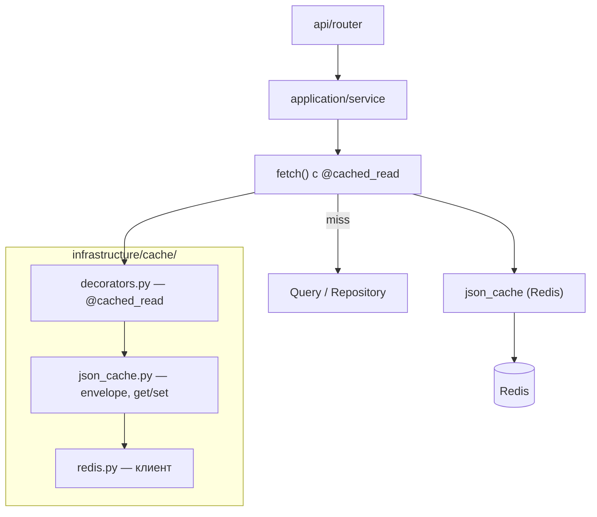

# Кэширование read-данных

## Назначение

Redis используется для **кэширования результатов идемпотентных read-запросов**, общих для нескольких пользователей или повторяющихся в рамках одного пользователя. Цель — снизить нагрузку на PostgreSQL и ClickHouse без дублирования бизнес-логики.

Кэшируется **read model** (строка запроса, доменная сущность), а не HTTP-ответ API. Маппинг в Pydantic-схемы остаётся в слое `application`.

## Что уже кэшируется в Redis (не response cache)

| Назначение | Ключ / механизм | TTL |
|------------|-----------------|-----|
| WB Gateway session revocation (активные `jti` на кабинет, SET) | `wb_gateway:account_sessions:{account_id}` | TTL сессии (30 мин), продлевается на каждое создание |
| WB Gateway handshake callback (одноразовый обмен на cookie) | внутренние ключи `handshake_callback_store` | 5 мин |
| Guided Connect session / cookies / suppliers | `wb_connect:session:*`, `wb_connect:cookies:*`, `wb_connect:suppliers:*` | 10 мин (сессия/cookies), отдельный TTL для suppliers |
| Счётчики API calls | `api_calls:user:{user_id}:{date}` | 48 ч |
| ARQ job queue | внутренние ключи ARQ | — |
| Rate limiting | slowapi + Redis | per-limit |

Подробнее: [Аутентификация](./authentication.md), [WB Gateway & Guided Connect](./wb-portal-proxy.md).

> WB Gateway также использует process-local (не Redis) TTL-кэш ≤5с для прав на разделы кабинета (`wb_gateway/infrastructure/section_cache.py`) — компромисс между свежестью проверки прав (читаются заново на каждый проксируемый запрос из БД, не из снапшота handshake) и нагрузкой на БД от десятков запросов WB portal на одну страницу.

## Архитектура response cache



### Слои

| Компонент | Путь | Ответственность |
|-----------|------|-----------------|
| Redis client | `infrastructure/cache/redis.py` | Singleton async-клиент |
| JSON cache | `infrastructure/cache/json_cache.py` | Envelope, ключи, cache-aside, stale fallback |
| Декоратор | `infrastructure/cache/decorators.py` | `@cached_read`, инвалидация |
| Политика + fetch | **в модуле-владельце данных** | TTL, namespace, сериализация |

**Правило:** модульный код кэширования не живёт в `infrastructure/cache/`. Shared-слой — только generic-инфраструктура.

## Где объявляется политика

Одна кэшируемая операция → одно место с `@cached_read`. Нет центрального `cache.py` на модуль.

### ClickHouse — в файле query

```
modules/search_tags/infrastructure/clickhouse/queries/
├── list_search_queries.py       # @cached_read на fetch(), TTL 30 мин
└── get_latest_monthly_by_query.py  # @cached_read на fetch(), TTL 15 мин

modules/admin/infrastructure/clickhouse/queries/
└── list_parser_wb_search_tags.py   # @cached_read на fetch(), TTL 20 мин
```

Синхронный `Query.execute()` остаётся без кэша; публичная точка входа — декорированная `fetch()` (async-обёртка: `sync=True` запускает `execute()` в thread pool).

### PostgreSQL — файл на операцию

```
modules/billing/infrastructure/cached/
├── get_all_plans.py      # каталог тарифов, platform, TTL 1 ч
├── effective_plan.py     # тариф пользователя, user scope, TTL 60 с
└── _plan_codec.py        # сериализация BillingPlan (не политика)

modules/organizations/infrastructure/cached/
└── list_roles.py         # каталог ролей, platform, TTL 1 ч
```

## Декоратор `@cached_read`

```python
from markethacker.infrastructure.cache.decorators import cached_read

@cached_read(
    namespace="search_tags:list",
    ttl_seconds=30 * 60,
    stale_ttl_seconds=2 * 60 * 60,  # опционально: fallback при сбое CH
    key_builder=_cache_key,         # dict параметров → hash ключа
    serialize=_serialize_result,
    deserialize=_deserialize_result,
    sync=True,                      # ClickHouse: sync fn → asyncio.to_thread
)
def fetch(params: ListSearchQueriesParams) -> tuple[list[SearchTagListRow], int]:
    return ListSearchQueriesQuery().execute(params)
```

Вызов: `await list_query.fetch(params)`.

Для async PostgreSQL — без `sync=True`:

```python
@cached_read(
    namespace="billing:plans",
    ttl_seconds=60 * 60,
    serialize=plans_to_dict,
    deserialize=plans_from_dict,
)
async def fetch(repo: BillingRepository) -> list[BillingPlan]:
    return await repo.get_all_plans()
```

На обёртке доступен `fetch.cache_policy` (namespace, ttl) — для инвалидации.

## Область данных и ключ кэша

Ключ Redis: `{namespace}:{sha256(canonical_json(params))}`.

Параметры в ключе должны отражать **то, что влияет на результат**, а не «кто спросил»:

| Область | Пример | Что в ключе | Что не в ключе |
|---------|--------|-------------|----------------|
| **platform** | search_tags, billing/plans, org/roles | фильтры запроса или `{}` | `user_id` (RBAC — gate до кэша) |
| **user** | effective_plan | `user_id` | — |
| **org** (будущее) | данные с RLS по org | `org_id` + фильтры | — |

JWT и permissions проверяются в router **до** обращения к кэшу. Если SQL-запрос фильтруется по `org_id`, `org_id` обязан быть в `key_builder`.

## Формат значения (envelope)

```json
{
  "v": 1,
  "data": "<payload>",
  "fresh_until": 1719850000.0
}
```

- **TTL свежести** (`ttl_seconds` в декораторе) — после истечения следующий запрос идёт в БД.
- **Stale TTL** (`stale_ttl_seconds`) — ключ в Redis живёт дольше; при ошибке источника отдаётся устаревшее значение (актуально для ClickHouse).

## Инвалидация

```python
from markethacker.infrastructure.cache.decorators import (
    invalidate_cached,
    invalidate_cached_namespace,
)

# Весь каталог (platform)
await invalidate_cached_namespace(plans_catalog.fetch)

# Один пользователь (user scope)
await effective_plan_cache.invalidate(user_id)
# внутри: await invalidate_cached(fetch, user_id=str(user_id))
```

Инвалидация `effective_plan` вызывается при:

- отмене подписки, вебхуках Stripe/ЮKassa;
- активации промокода;
- изменении подписки в админке.

Инвалидация каталога тарифов — при create/update плана в админке.

## Конфигурация

В `.env` только глобальный выключатель:

```env
CACHE_ENABLED=true
REDIS_URL=redis://localhost:6379/0
```

**TTL задаётся в коде** у каждой `@cached_read` — разные эндпоинты одного модуля могут иметь разный TTL без деплоя конфигов.

При `CACHE_ENABLED=false` или сбое Redis — **fail-open**: запрос прозрачно уходит в БД.

## Что не кэшируется

| Тип | Причина |
|-----|---------|
| Auth (login, refresh) | безопасность |
| Мутации (POST/PATCH/DELETE) | write path |
| WB API proxy | данные должны быть актуальными |
| Portal handshake tokens | уже ephemeral Redis-store |

## Добавление кэша для новой read-операции

1. Убедиться, что операция **идемпотентна** и read-only.
2. Определить **область данных** (platform / user / org) и состав ключа.
3. Для ClickHouse — добавить `@cached_read` + `fetch()` в файл query.
4. Для PostgreSQL без отдельного query-файла — создать `infrastructure/cached/<operation>.py`.
5. При изменении данных — добавить `invalidate_cached*` в места мутаций.
6. Не кэшировать HTTP-ответы и не выносить политики в shared `infrastructure/cache/`.

## Тесты

- `tests/unit/test_json_cache.py` — ключи, сериализация
- `tests/unit/test_cached_read.py` — декоратор, `cache_policy`, инвалидация

## См. также

- [Структура проекта](./structure.md) — расположение `infrastructure/cache/`
- [Технологический стек](./tech-stack.md) — роль Redis
- [Биллинг](./billing.md) — effective plan и лимиты
