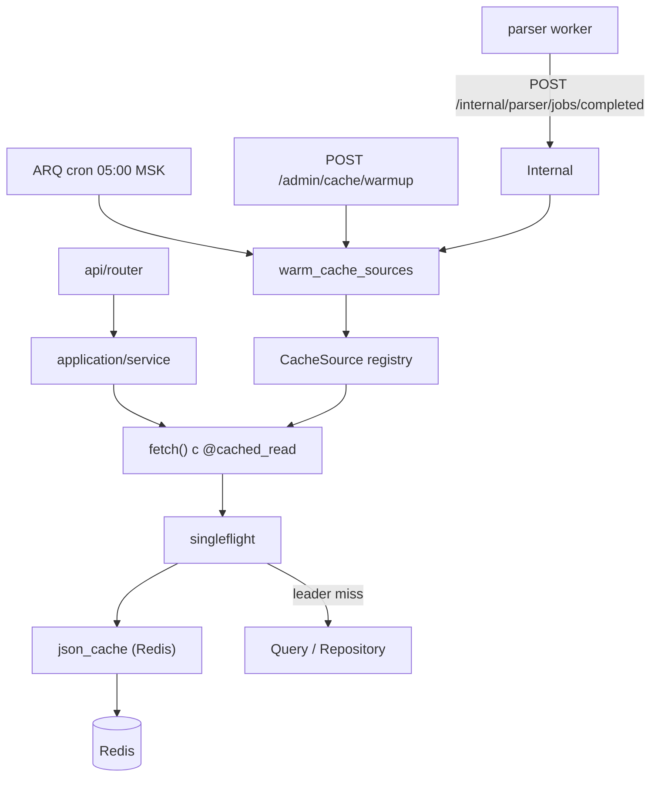

# Кэширование read-данных

## Назначение

Redis используется для **кэширования результатов идемпотентных read-запросов**, общих для нескольких пользователей или повторяющихся в рамках одного пользователя. Цель — снизить нагрузку на PostgreSQL и ClickHouse без дублирования бизнес-логики.

Кэшируется **read model** (строка запроса, доменная сущность), а не HTTP-ответ API. Маппинг в Pydantic-схемы остаётся в слое `application`.

Поверх cache-aside работает **универсальная инфраструктура**:

- distributed **single-flight** (защита от stampede);
- **реестр** `CacheSource` для прогрева и scoped-инвалидации;
- **автопрогрев** (ARQ cron + webhook от parser + admin API);
- **метрики** Prometheus.

## Что уже кэшируется в Redis (не response cache)

| Назначение | Ключ / механизм | TTL |
|------------|-----------------|-----|
| WB Gateway session revocation (активные `jti` на кабинет, SET) | `wb_gateway:account_sessions:{account_id}` | TTL сессии (30 мин), продлевается на каждое создание |
| WB Gateway handshake callback (одноразовый обмен на cookie) | внутренние ключи `handshake_callback_store` | 5 мин |
| Guided Connect session / cookies / suppliers | `wb_connect:session:*`, `wb_connect:cookies:*`, `wb_connect:suppliers:*` | 10 мин (сессия/cookies), отдельный TTL для suppliers |
| Счётчики API calls | `api_calls:user:{user_id}:{date}` | 48 ч |
| ARQ job queue | внутренние ключи ARQ | — |
| Rate limiting | slowapi + Redis | per-limit |
| Single-flight locks | `cache:lock:{cache_key}` | до 120 с |
| Access tracking (warm-set) | `cache:access:{namespace}` (ZSET) | 7 дней |

Подробнее: [Аутентификация](./authentication.md), [WB Gateway & Guided Connect](./wb-portal-proxy.md).

> WB Gateway также использует process-local (не Redis) TTL-кэш ≤5с для прав на разделы кабинета (`wb_gateway/infrastructure/section_cache.py`).

## Архитектура



### Слои

| Компонент | Путь | Ответственность |
|-----------|------|-----------------|
| Redis client | `infrastructure/cache/redis.py` | Singleton async-клиент |
| JSON cache | `infrastructure/cache/json_cache.py` | Envelope, ключи, cache-aside, stale fallback, SCAN-инвалидация |
| Single-flight | `infrastructure/cache/singleflight.py` | `SET NX` lock + wait |
| Декоратор | `infrastructure/cache/decorators.py` | `@cached_read`, инвалидация |
| Registry | `infrastructure/cache/registry.py` | `CacheSource` protocol, регистрация |
| Warmer | `infrastructure/cache/warmer.py` | Оркестратор прогрева / invalidate |
| Access tracker | `infrastructure/cache/access_tracker.py` | Recent queries для warm-set |
| Metrics | `infrastructure/cache/metrics.py` | Prometheus counters/histograms |
| Политика + fetch | **в модуле-владельце данных** | TTL, namespace, сериализация, `CacheSource` |

**Правило:** модульный код кэширования не живёт в `infrastructure/cache/` (кроме generic). Shared-слой — только инфраструктура.

## Жизненный цикл ключа

1. **Read:** hit + fresh → вернуть; miss/stale → single-flight.
2. **Leader:** повторная проверка → factory → `cache_set` → release lock.
3. **Follower:** ждёт появления fresh-значения (до ~30 с); при timeout — fail-open, строит сам.
4. **Stale fallback:** при ошибке источника отдаётся устаревший envelope (если есть).
5. **Warm:** ARQ/`WarmupRunner` заранее вызывает те же `fetch()`, перезаписывая ключи.
6. **Invalidate:** scoped delete (key / entity / namespace), без `FLUSHDB`.

## Где объявляется политика

Одна кэшируемая операция → одно место с `@cached_read`. Нет центрального `cache.py` на модуль.

### ClickHouse — в файле query

```
modules/search_tags/infrastructure/clickhouse/queries/
├── list_search_queries.py              # @cached_read, TTL 24 ч
├── get_monthly_analytics_by_query.py   # @cached_read, TTL 24 ч
└── get_frequency_trends_by_query.py    # @cached_read, TTL 24 ч

modules/search_tags/infrastructure/cache/
├── source.py      # CacheSource search_tags
└── warm_set.py    # top-N CH ∪ recent Redis

modules/admin/infrastructure/clickhouse/queries/
└── list_parser_wb_search_tags.py   # @cached_read, TTL 20 мин
```

### PostgreSQL — файл на операцию

```
modules/billing/infrastructure/cached/
├── get_all_plans.py      # каталог активных тарифов (platform), TTL 1 ч
├── effective_plan.py     # тариф пользователя, user scope, TTL 60 с
└── _plan_codec.py

modules/organizations/infrastructure/cached/
└── list_roles.py         # каталог ролей, platform, TTL 1 ч
```

## Декоратор `@cached_read`

```python
from markethacker.infrastructure.cache.decorators import cached_read

@cached_read(
    namespace="search_tags:monthly",
    ttl_seconds=24 * 60 * 60,
    stale_ttl_seconds=48 * 60 * 60,
    key_builder=lambda query: {"query": normalize_search_query(query)},
    serialize=_serialize,
    deserialize=_deserialize,
    sync=True,  # ClickHouse: sync fn → asyncio.to_thread
)
def fetch(query: str) -> SearchTagMonthlyRow | None:
    ...
```

Вызов: `await monthly_query.fetch(query)`.

На обёртке доступен `fetch.cache_policy` — для инвалидации.

## Область данных и ключ кэша

Ключ Redis: `{namespace}:{sha256(canonical_json(params))}`.

| Область | Пример | Что в ключе | Что не в ключе |
|---------|--------|-------------|----------------|
| **platform** | search_tags, billing/plans | фильтры запроса или `{}` | `user_id` |
| **user** | effective_plan | `user_id` | — |
| **org** (будущее) | данные с RLS по org | `org_id` + фильтры | — |

JWT и permissions проверяются в router **до** обращения к кэшу.

## Формат значения (envelope)

```json
{
  "v": 1,
  "data": "<payload>",
  "fresh_until": 1719850000.0
}
```

- **TTL свежести** (`ttl_seconds`) — после истечения следующий запрос идёт в источник (через single-flight).
- **Stale TTL** (`stale_ttl_seconds`) — ключ в Redis живёт дольше; при ошибке источника отдаётся устаревшее значение.

Версионирование схемы: bump `_CACHE_VERSION` или смена `namespace` (`…:v2`).

## Прогрев

### Триггеры

| Триггер | Когда | Поведение |
|---------|-------|-----------|
| Parser webhook | После `mark_completed` для `wb_search_tags` / `wb_market_niche` | `POST /api/v1/internal/parser/jobs/completed` → ARQ warmup с delay (default 90 с, Kafka→CH lag) |
| Cron | Ежедневно **05:00 Europe/Moscow** (= 02:00 UTC) | `schedule_daily_cache_warmup` |
| Admin | Вручную | `POST /api/v1/admin/cache/warmup` |

Debounce webhook: ARQ `_job_id=warm_cache:search_tags:{YYYY-MM-DD}` — повторные callbacks в тот же день не плодят параллельные прогревы.

### Warm-set search_tags

Гибрид:

1. **Top-N** (default 2000) — ClickHouse, последний `interval=month`, `ORDER BY frequency DESC`
2. **Recent** (default 2000) — Redis ZSET обращений API за 7 дней

На каждый query прогреваются: `monthly` + `frequency_trends` (`days_30`, `months_12`).

Concurrency: `SEARCH_TAGS_WARM_CONCURRENCY` (default 8). Ошибка одного query не останавливает остальные; ошибка одного `CacheSource` не останавливает другие источники.

## Инвалидация

Scoped, без безусловного flush:

| Scope | Смысл | Пример |
|-------|-------|--------|
| `key` | Один ключ | monthly по query |
| `entity` | Все варианты одного query | monthly + оба series |
| `namespace` / `all` | Все namespaces источника | `search_tags:*` |

Admin: `POST /api/v1/admin/cache/invalidate` с опцией `rebuild=true` (invalidate + enqueue warmup).

Инвалидация namespace использует **SCAN**, не `KEYS`.

Инвалидация `effective_plan` / billing plans — по-прежнему на мутациях (см. ниже).

## Admin / Internal API

| Метод | Путь | Auth |
|-------|------|------|
| GET | `/api/v1/admin/cache/sources` | superuser |
| POST | `/api/v1/admin/cache/warmup` | superuser |
| POST | `/api/v1/admin/cache/invalidate` | superuser |
| POST | `/api/v1/internal/parser/jobs/completed` | `X-Parser-Callback-Key` |

Секрет callback: `PARSER_CALLBACK_API_KEY` или fallback `PARSER_API_KEY`.  
Parser: `BACKEND_SERVICE_URL` + `BACKEND_CALLBACK_API_KEY` (prod compose: `http://markethacker-api:8000`, worker в сети `markethacker_apps`).

## Конфигурация

```env
CACHE_ENABLED=true
CACHE_WARMUP_ENABLED=true
CACHE_WARMUP_HOUR_UTC=2
CACHE_WARMUP_MINUTE_UTC=0
CACHE_WARMUP_AFTER_PARSER_DELAY_SECONDS=90
SEARCH_TAGS_WARM_TOP_N=2000
SEARCH_TAGS_WARM_RECENT_N=2000
SEARCH_TAGS_WARM_CONCURRENCY=8
PARSER_CALLBACK_API_KEY=
```

TTL для конкретных операций задаётся в коде у `@cached_read`.

При `CACHE_ENABLED=false` или сбое Redis — **fail-open**: запрос уходит в БД/CH.

## Метрики

| Метрика | Смысл |
|---------|-------|
| `mh_cache_lookups_total{namespace,result}` | hit / miss / stale / error |
| `mh_cache_build_duration_seconds` | время factory |
| `mh_cache_read_duration_seconds` | чтение Redis |
| `mh_cache_rebuilds_total` | перестроения |
| `mh_cache_singleflight_total` | leader / follower / follower_timeout |
| `mh_cache_warmup_total` / `_duration_seconds` / `_keys_total` | прогрев |

## Добавление нового кэшируемого сервиса

1. Убедиться, что операция **идемпотентна** и read-only.
2. Добавить `@cached_read` на `fetch()` (CH) или `infrastructure/cached/<op>.py` (PG).
3. Реализовать `CacheSource` (`warm` + `invalidate` + `describe`).
4. Зарегистрировать через `register_cache_source` / `ensure_*_registered()` в lifespan API и worker startup.
5. При необходимости — access tracking и расширить warm-set.
6. Не кэшировать HTTP-ответы и не дублировать single-flight/метрики в модуле.

## Что не кэшируется

| Тип | Причина |
|-----|---------|
| Auth (login, refresh) | безопасность |
| Мутации (POST/PATCH/DELETE) | write path |
| WB API proxy | данные должны быть актуальными |
| Portal handshake tokens | уже ephemeral Redis-store |

## Тесты

- `tests/unit/test_json_cache.py` — ключи, SCAN-инвалидация, single-flight
- `tests/unit/test_cached_read.py` — декоратор
- `tests/unit/test_cache_registry.py` — registry / изоляция ошибок прогрева
- `tests/unit/test_internal_parser_callback.py` — webhook → enqueue warmup

## Эксплуатация

1. После деплоя убедиться, что parser worker видит `BACKEND_SERVICE_URL` и backend `container_name=markethacker-api`.
2. После первого успешного `wb_search_tags` проверить логи `backend_callback.ok` / `cache.warmup.scheduled`.
3. Ручной прогрев: Admin → API `POST /admin/cache/warmup` или очередь ARQ.
4. Алертить на рост `mh_cache_warmup_total{result="error"}` и падение hit-rate.

## См. также

- [Структура проекта](./structure.md) — расположение `infrastructure/cache/`
- [Технологический стек](./tech-stack.md) — роль Redis
- [Parser](./parser.md) — Kafka → ClickHouse, job schedules
- [Биллинг](./billing.md) — effective plan и лимиты
