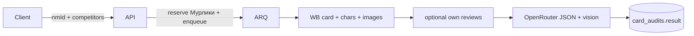

# ИИ-аудит карточки товара

## Назначение

Модуль `card_audit` запускает AI-аудит карточки Wildberries: своя карточка + опциональные конкуренты + опциональный сбор отзывов/вопросов **внутри аудита**. Результат — структурированный отчёт и промт для генерации контента. Списание — **Мурлики** (`card_audit/*` в каталоге весов).

**Отдельно от** `reviews_analysis`: флаг «учитывать отзывы» не подтягивает готовый анализ отзывов — он запускает собственный compact-сбор WB feedbacks/questions.

## Как связан skill `marketplace-card-analysis`

В репозитории лежит пакет [`marketplace-card-analysis/`](../../marketplace-card-analysis/SKILL.md). Это **не** прод-агент и **не** отдельный сервис.

| В skill | В продукте |
|---------|------------|
| `SKILL.md` + `references/*.md` | Curated expert md в `card_audit/.../llm/knowledge/` → system prompt |
| `scripts/wb_collect.mjs`, `wb_audit.mjs` | Python-сборщик карточки/конкурентов + отзывов в worker job |
| `chooseCategoryRoute` | `category_route.py`: clothing / pet-grooming / general-goods |
| `references/report-template.md`, `generation-and-ab.md` | JSON-схема отчёта (~разделы шаблона) + блок generation в knowledge |
| `agents/openai.yaml`, OpenAI Skills API | **Не используются** (рантайм — OpenRouter chat completions, в т.ч. vision) |
| `expert-source/`, `expert-rule-ledger.md` | Не грузятся в каждый аудит |
| Browser-досбор, полки, реклама | **Вне MVP** (quick-режим skill) |

## MVP (quick)

Вход: свой `nmId`, до 5 конкурентов, флаг `useReviews`, опционально `organizationId`.

1. Reserve Мурликов: `compute_cost(card_audit, use_reviews, competitor_count)` (UI берёт сумму через `POST /estimate-cost`).
2. Fetch своей карточки и конкурентов (card.wb.ru + basket `card.json` + характеристики/composition/colors + `rich_v1.json` сводка + URL big-изображений).
3. Если `useReviews` — свой сбор отзывов/вопросов по `imtId` (не `reviews_analysis`).
4. LLM (`card_audit_settings.llm_model`, дефолт `openai/gpt-5.4`) с vision обложки + 2–3 слайдов → JSON-отчёт (score, risks, слайды, аудитория, возражения, SWOT, текст-банк, A/B, roadmap, `generationPrompt`).
5. Commit Мурликов; при ошибке — release.

Не в MVP: Browser-полки/выдача/реклама, скачивание всех media на диск, сырой `expert-source/`, RAG по архиву экспертных эфиров.

## Поток

## API

Prefix: `/api/v1/card-audits`.

| Метод | Назначение |
|-------|------------|
| `POST /` | Создать аудит → `202` |
| `POST /estimate-cost` | Живой расчёт Мурликов |
| `GET /` | Список |
| `GET /active` | Активные (виджет) |
| `GET /{id}` | Статус |
| `GET /{id}/result` | Отчёт |
| `POST /{id}/cancel` | Отмена |

Admin: `/api/v1/admin/card-audit/settings`, `/audits`, `/audits/{id}`, `/audits/{id}/result`, cancel.

UI:
- Manager Portal → `/card-audits` (список, создание, отчёт).
- Активные аудиты показываются в общем FAB «Задачи в работе» вместе с анализом отзывов.
- Admin → «ИИ-аудит карточки»: список аудитов + параметры модели.

Фича тарифа: `card_audit` (seat-наследование, как у `reviews_analysis`).

## Веса Мурликов

См. [billing.md](./billing.md#мурлики-и-веса): `base` 30 + `with_reviews` 10 + `per_competitor` 5 (оверрайды в админке).
