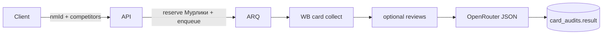

# ИИ-аудит карточки товара

## Назначение

Модуль `card_audit` запускает AI-аудит карточки Wildberries: своя карточка + опциональные конкуренты + опциональный учёт анализа отзывов. Результат — структурированный отчёт и промт для генерации контента. Списание — **Мурлики** (`card_audit/*` в каталоге весов).

## Как связан skill `marketplace-card-analysis`

В репозитории лежит пакет [`marketplace-card-analysis/`](../../marketplace-card-analysis/SKILL.md). Это **не** прод-агент и **не** отдельный сервис.

| В skill | В продукте |
|---------|------------|
| `SKILL.md` + `references/*.md` | Методология и политика доказательности → системный/user промпт и JSON-схема отчёта |
| `scripts/wb_collect.mjs`, `wb_audit.mjs` | Python-сборщик карточки/конкурентов в worker job |
| `references/report-template.md`, `generation-and-ab.md` | Поля `result` и блок «промт для генерации» |
| `agents/openai.yaml` | Только для Cursor/ChatGPT Agents UI; в backend не используется |
| Browser-досбор, полки, реклама | **Вне MVP** (quick-режим skill) |

Итого: skill — спецификация и эталон сбора; рантайм — обычный FastAPI + ARQ + OpenRouter, как `reviews_analysis`.

## MVP (quick)

Вход: свой `nmId`, до 5 конкурентов, флаг `useReviews`, опционально `organizationId`.

1. Reserve Мурликов: `compute_cost(card_audit, use_reviews, competitor_count)`.
2. Fetch своей карточки и конкурентов (card.wb.ru + basket card.json).
3. Если `useReviews` — подтянуть последний completed `reviews_analysis` пользователя по этому nm (сжатый `llm`+`stats`); без анализа — аудит без отзывов, в limitations `[НЕТ ДАННЫХ]`.
4. LLM (тот же OpenRouter / модель из `reviews_analysis_settings`) → JSON-отчёт: score, risks P0/P1, слайды, воронка, A/B, `generationPrompt`.
5. Commit Мурликов; при ошибке — release.

Не в MVP: Browser-полки/выдача/реклама, скачивание всех media на диск, категорийные expert-файлы целиком (сжимаем в промпт-ядро).

## Поток

## API (черновик)

Prefix: `/api/v1/card-audits`.

| Метод | Назначение |
|-------|------------|
| `POST /` | Создать аудит → `202` |
| `GET /` | Список |
| `GET /active` | Активные |
| `GET /{id}` | Статус |
| `GET /{id}/result` | Отчёт |
| `POST /{id}/cancel` | Отмена |

Фича тарифа: `card_audit` (seat-наследование, как у `reviews_analysis`).

## Веса Мурликов

См. [billing.md](./billing.md#мурлики-и-веса): `base` 30 + `with_reviews` 10 + `per_competitor` 5 (оверрайды в админке).
