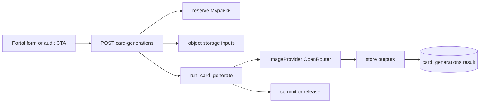

# ИИ-генерация фото карточки

## Назначение

Модуль `card_generate` генерирует кадры карточки товара по загруженному фото, формату, качеству и опциональному промту/референсам. Списание — **Мурлики** (`card_generate/quality_*`).

Отдельный модуль от `card_audit`: аудит может только подставить `generationPrompt` при создании генерации (`sourceAuditId`). Standalone-запуск без аудита обязателен.

## Поток

1. `POST /uploads` — фото товара (обязательно) и до 5 референсов → ключи в storage (`card-generate/{userId}/…`).
2. `POST /estimate-cost` — живой расчёт `image_count × quality`.
3. `POST /` — reserve Мурликов, enqueue `run_card_generate` → `202`.
4. Job: load inputs → `ImageGenerationProvider.generate` → upload outputs → commit; при ошибке — release.
5. `GET /{id}/result` — галерея с signed URL кадров.

## Провайдеры

Интерфейс `ImageGenerationProvider` + registry `get_provider(provider_key)`.

| Ключ | Адаптер | Назначение |
|------|---------|------------|
| `openrouter` (дефолт) | `OpenRouterImageProvider` | `POST /api/v1/images`, `input_references`, `resolution` 2K/4K (1K поднимается до 2K); `aspect_ratio` только в тексте промпта |

Настройки singleton: `card_generate_settings.provider_key`, `image_model` (дефолт `bytedance-seed/seedream-4.5`).

Новый провайдер — новый адаптер в registry **без** смены публичного API.

## API

Prefix: `/api/v1/card-generations`.

| Метод | Назначение |
|-------|------------|
| `POST /estimate-cost` | Живой расчёт Мурликов `{ imageCount, quality }` |
| `POST /uploads` | multipart `file` + `kind=product\|ref` |
| `POST /` | Создать генерацию → `202` |
| `GET /` | Список |
| `GET /active` | Активные (FAB) |
| `GET /{id}` | Статус |
| `GET /{id}/result` | Результат (URLs) |
| `POST /{id}/cancel` | Отмена |
| `GET /assets/{key}` | Локальная выдача файла (если не S3) |

Create body (camelCase): `productAssetKey`, `aspectRatio`, `imageCount` (1–5), `quality` (`1K`\|`2K`\|`4K`), опционально `prompt`, `description`, `refAssetKeys`, `sourceAuditId`, `organizationId`, `title`, `nmId`.

Если передан `sourceAuditId` и промт пустой — сервер подставляет `generationPrompt` из completed-аудита (с проверкой владельца).

Admin: `/api/v1/admin/card-generate/settings`, `/generations`, detail/result/cancel.

## UI

- Manager Portal → `/card-generations` (список, `/new`, результат).
- Из отчёта аудита: CTA «Сгенерировать» → `/card-generations/new?auditId=…`.
- Активные джобы — третий kind `card_generate` в FAB «Задачи в работе».
- Admin → «ИИ-генерация»: список запусков + параметры провайдера/модели.

Фича тарифа: `card_generate` (seat-наследование).

## Веса Мурликов

См. [billing.md](./billing.md#мурлики-и-веса): `quality_1K` 20 / `quality_2K` 40 / `quality_4K` 80 × число кадров.

## Вне MVP

- Wiring браузерного расширения (отдельный разработчик).
- Отдельный pipeline текста/инфографики поверх кадра.
- Доп. провайдеры (Higgsfield и др.) — только интерфейс готов.
