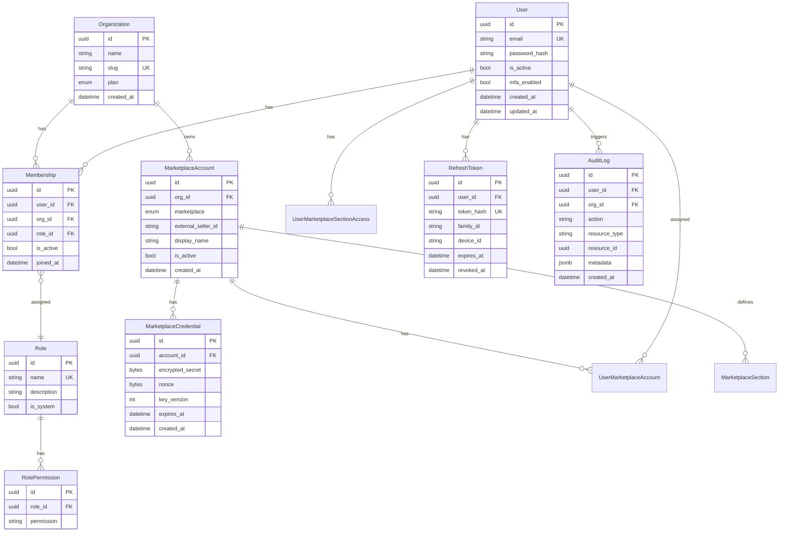

# Модель данных

## Принцип

Пользователь не «владеет» данными напрямую. Все бизнес-данные принадлежат **Organization**. Пользователь входит в организацию через **Membership** с назначенной ролью.

## ER-диаграмма



## Сущности

### User

Глобальная учётная запись. Один пользователь может состоять в нескольких организациях.

| Поле | Тип | Описание |
|------|-----|----------|
| `id` | UUID | Первичный ключ |
| `email` | string | Уникальный, используется для входа |
| `password_hash` | string | bcrypt / argon2 |
| `is_active` | bool | Деактивация аккаунта |
| `mfa_enabled` | bool | Включена ли двухфакторная аутентификация |

### Organization

Тенант — изолированная единица данных. Все marketplace accounts и аналитика привязаны к org.

| Поле | Тип | Описание |
|------|-----|----------|
| `id` | UUID | Первичный ключ |
| `name` | string | Отображаемое имя |
| `slug` | string | URL-safe идентификатор |
| `plan` | enum | `free`, `pro`, `enterprise` |

### Membership

Связь user ↔ organization с ролью.

| Поле | Тип | Описание |
|------|-----|----------|
| `user_id` | UUID | FK → User |
| `org_id` | UUID | FK → Organization |
| `role_id` | UUID | FK → Role |
| `is_active` | bool | Деактивация без удаления |

### MarketplaceAccount

Привязанный кабинет продавца на маркетплейсе.

| Поле | Тип | Описание |
|------|-----|----------|
| `marketplace` | enum | `wildberries`, `ozon` |
| `external_seller_id` | string | ID продавца на MP |
| `display_name` | string | Человекочитаемое имя |

### UserMarketplaceAccount

Привязка пользователя к кабинету MP (уровень 2 доступа).

| Поле | Тип | Описание |
|------|-----|----------|
| `user_id` | UUID | FK → User |
| `marketplace_account_id` | UUID | FK → MarketplaceAccount |
| `is_default` | bool | Кабинет по умолчанию для пользователя |

### UserMarketplaceSectionAccess

Гранулярные права на разделы кабинета (уровень 3).

| Поле | Тип | Описание |
|------|-----|----------|
| `user_id` | UUID | FK → User |
| `marketplace_account_id` | UUID | FK → MarketplaceAccount |
| `section_key` | string | `fin_analytics`, `ads`, `supplies`, ... |

См. [Модель доступа к кабинетам MP](./marketplace-access-model.md).

### MarketplaceCredential

Зашифрованные credentials для доступа к API маркетплейса. Отделены от account для ротации ключей.

| Поле | Тип | Описание |
|------|-----|----------|
| `encrypted_secret` | bytes | AES-256-GCM ciphertext |
| `nonce` | bytes | Nonce для GCM |
| `key_version` | int | Версия ключа шифрования |
| `expires_at` | datetime | Срок действия (если применимо) |

## Индексы

```sql
-- Быстрый поиск membership
CREATE INDEX idx_membership_user_org ON memberships(user_id, org_id);

-- Фильтрация аккаунтов по организации
CREATE INDEX idx_marketplace_account_org ON marketplace_accounts(org_id);

-- Audit log по организации и времени
CREATE INDEX idx_audit_log_org_created ON audit_logs(org_id, created_at DESC);

-- Refresh tokens по family (для rotation detection)
CREATE INDEX idx_refresh_token_family ON refresh_tokens(family_id);
```

## Row Level Security

PostgreSQL RLS как дополнительный слой изоляции:

```sql
ALTER TABLE marketplace_accounts ENABLE ROW LEVEL SECURITY;

CREATE POLICY org_isolation ON marketplace_accounts
    USING (org_id = current_setting('app.current_org_id')::uuid);
```

`app.current_org_id` устанавливается middleware из JWT перед каждым запросом.

## Миграции

- Alembic для версионирования схемы.
- Каждая миграция — атомарная, с `upgrade` и `downgrade`.
- Seed-данные для системных ролей и permissions — отдельная data-миграция.
