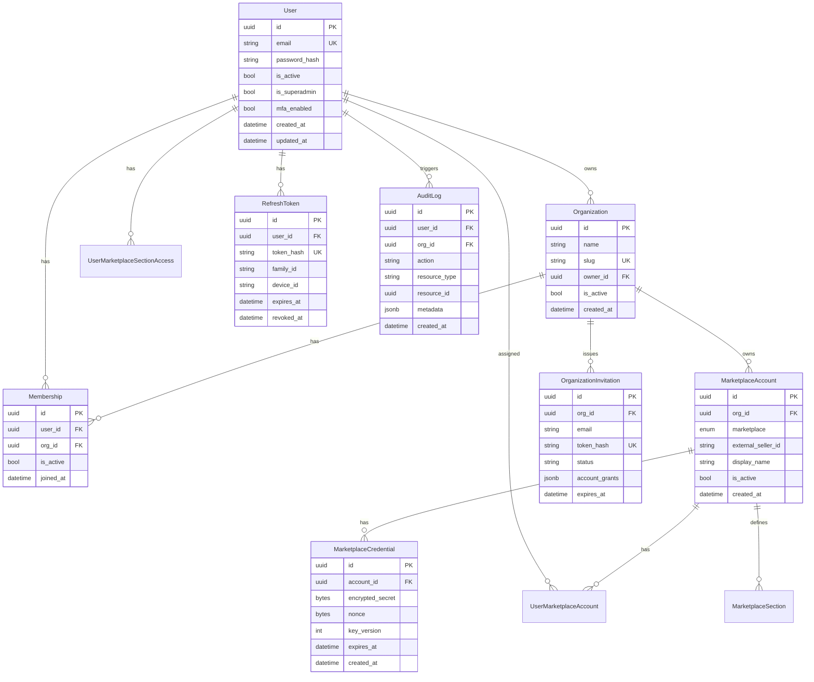

# Модель данных

## Принцип

Пользователь не «владеет» бизнес-данными напрямую — данные принадлежат
**Organization**. Но правами управляет именно пользователь: организацией
владеет `Organization.owner_id`, а не «роль» в членстве. Пользователь входит
в организацию через **Membership** без каких-либо ролей — это лишь факт
принадлежности к команде; фактические права на кабинеты и разделы задаются
отдельными грантами (`UserMarketplaceAccount`, `UserMarketplaceSectionAccess`).
Подробности — в [Контроле доступа](./access-control.md).

## ER-диаграмма



## Сущности

### User

Глобальная учётная запись. Один пользователь может состоять в нескольких организациях.

| Поле | Тип | Описание |
|------|-----|----------|
| `id` | UUID | Первичный ключ |
| `email` | string | Уникальный, используется для входа |
| `password_hash` | string | bcrypt / argon2 |
| `is_active` | bool | Деактивация аккаунта |
| `mfa_enabled` | bool | Включена ли двухфакторная аутентификация |

### Organization

Тенант — изолированная единица данных. Все marketplace accounts и аналитика привязаны к org. Тариф организации определяется биллинг-планом её `owner_id`; лимиты org (участники, API) могут быть увеличены докупками владельца (см. [Биллинг](./billing.md)).

| Поле | Тип | Описание |
|------|-----|----------|
| `id` | UUID | Первичный ключ |
| `name` | string | Отображаемое имя |
| `slug` | string | URL-safe идентификатор |
| `owner_id` | UUID | FK → User. Единолично управляет org (см. [Контроль доступа](./access-control.md)) |
| `is_active` | bool | Деактивация без удаления |

### Membership

Связь user ↔ organization. Не хранит роль и не даёт прав — только факт членства в команде; см. [Контроль доступа](./access-control.md).

| Поле | Тип | Описание |
|------|-----|----------|
| `user_id` | UUID | FK → User |
| `org_id` | UUID | FK → Organization |
| `is_active` | bool | Деактивация без удаления |

### OrganizationInvitation

Приглашение по email с заранее заданными грантами на кабинеты (`account_grants`), которые применяются при принятии приглашения.

| Поле | Тип | Описание |
|------|-----|----------|
| `org_id` | UUID | FK → Organization |
| `email` | string | Email приглашённого |
| `token_hash` | string | Хэш одноразового токена |
| `status` | string | `pending` / `accepted` / `revoked` / `expired` |
| `account_grants` | jsonb | Список `{marketplace_account_id, sections}` |
| `expires_at` | datetime | TTL 7 дней |

### MarketplaceAccount

Привязанный кабинет продавца на маркетплейсе.

| Поле | Тип | Описание |
|------|-----|----------|
| `marketplace` | enum | `wildberries`, `ozon` |
| `external_seller_id` | string | Внутренний UUID (генерируется сервером при создании) |
| `display_name` | string | Человекочитаемое имя кабинета (отображается в UI и в прокси WB) |
| `is_active` | bool | `false` после деактивации (`DELETE`) |

**Ограничение:** не более одного активного кабинета на маркетплейс в организации.

### UserMarketplaceAccount

Привязка пользователя к кабинету MP (уровень 2 доступа).

| Поле | Тип | Описание |
|------|-----|----------|
| `user_id` | UUID | FK → User |
| `marketplace_account_id` | UUID | FK → MarketplaceAccount |
| `is_default` | bool | Кабинет по умолчанию для пользователя |

### UserMarketplaceSectionAccess

Гранулярные права на разделы кабинета (уровень 3).

| Поле | Тип | Описание |
|------|-----|----------|
| `user_id` | UUID | FK → User |
| `marketplace_account_id` | UUID | FK → MarketplaceAccount |
| `section_key` | string | `growth`, `products`, `shipments`, `analytics`, `promotion`, `finances` (WB) |
| `can_read` | bool | Доступ на чтение раздела |
| `can_write` | bool | Доступ на изменение (где применимо) |

См. [Модель доступа к кабинетам MP](./marketplace-access-model.md).

### MarketplaceCredential

Зашифрованные credentials для доступа к API маркетплейса. Отделены от account для ротации ключей.

| Поле | Тип | Описание |
|------|-----|----------|
| `encrypted_secret` | bytes | AES-256-GCM ciphertext |
| `nonce` | bytes | Nonce для GCM |
| `key_version` | int | Версия ключа шифрования |
| `expires_at` | datetime | Срок действия (если применимо) |

### Биллинг (кратко)

Подробности — в [Биллинг и оплата](./billing.md). Основные таблицы PostgreSQL:

| Таблица | Назначение |
|---------|------------|
| `billing_plans` | Каталог тарифов |
| `billing_subscriptions` | Подписка пользователя (1:1 с `users`) |
| `billing_payments` | Платежи ЮKassa / Stripe |
| `billing_limit_addon_products` | Каталог продуктов докупки лимитов |
| `billing_limit_addon_entitlements` | Активные докупки пользователя |
| `promo_codes` / `promo_code_redemptions` | Промокоды и их использование |

Миграции: `20260704_0019_limit_addons`, `20260704_0020_limit_addon_billing_modes`.

## Индексы

```sql
-- Быстрый поиск membership
CREATE INDEX idx_membership_user_org ON memberships(user_id, org_id);

-- Фильтрация аккаунтов по организации
CREATE INDEX idx_marketplace_account_org ON marketplace_accounts(org_id);

-- Audit log по организации и времени
CREATE INDEX idx_audit_log_org_created ON audit_logs(org_id, created_at DESC);

-- Refresh tokens по family (для rotation detection)
CREATE INDEX idx_refresh_token_family ON refresh_tokens(family_id);
```

## Row Level Security

PostgreSQL RLS как дополнительный слой изоляции:

```sql
ALTER TABLE marketplace_accounts ENABLE ROW LEVEL SECURITY;

CREATE POLICY org_isolation ON marketplace_accounts
    USING (org_id = current_setting('app.current_org_id')::uuid);
```

`app.current_org_id` устанавливается зависимостью `require_org_path_context` из
`org_id` в пути запроса (не из JWT — токен не содержит org-контекста, см.
[Контроль доступа](./access-control.md)).

## Миграции

- Alembic для версионирования схемы.
- Каждая миграция — атомарная, с `upgrade` и `downgrade`.
