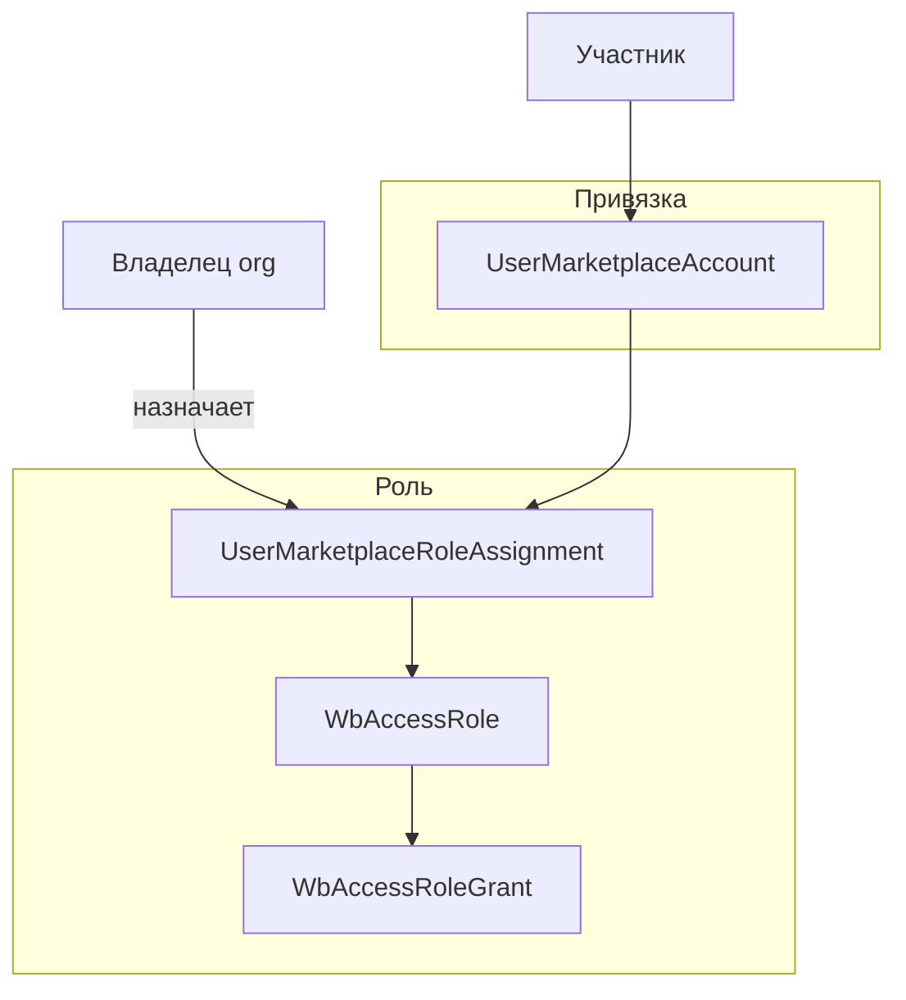
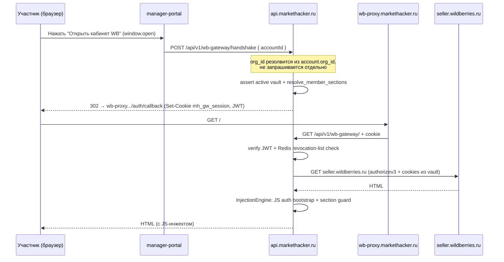
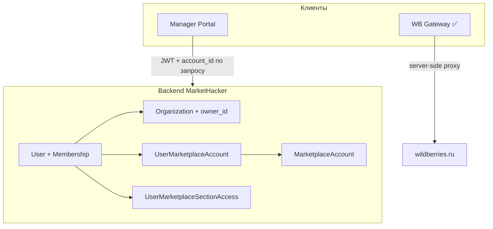

# Модель доступа к кабинетам маркетплейсов

Документ описывает, как участники организации получают доступ к конкретным
кабинетам Wildberries/Ozon и разделам внутри них. Общие принципы владения
организацией и биллинг-гейты — см. [Контроль доступа](./access-control.md).

## Обзор

Доступ к кабинету MP строится так:

1. **Привязка к кабинету** (`user_marketplace_accounts`) — есть ли доступ.
2. **Именованная роль доступа** (`wb_access_roles` + grants + assignment,
   per marketplace) — какие разделы и capabilities открыты. Подробности —
   [Роли доступа к кабинетам MP](./wb-access-roles.md).

Историческая таблица `user_marketplace_section_access` сохранена для миграции;
runtime enforcement в gateway читает role grants.



| Уровень | Что контролирует | Таблица |
|---|---|---|
| **1. Account binding** | К какому кабинету продавца привязан пользователь | `user_marketplace_accounts` |
| **2. Role grants** | Разделы и capabilities (и задел brand/article) | `wb_access_*` |

Право *выдавать* и *отзывать* эти права — следствие владения организацией
(`OrganizationAccess.assert_owner`, см. [Контроль доступа](./access-control.md)).

---

## Уровень 1: Привязка к кабинету

```sql
CREATE TABLE user_marketplace_accounts (
    id                      UUID PRIMARY KEY,
    user_id                 UUID NOT NULL REFERENCES users(id) ON DELETE CASCADE,
    marketplace_account_id  UUID NOT NULL REFERENCES marketplace_accounts(id) ON DELETE CASCADE,
    is_default              BOOLEAN NOT NULL DEFAULT false,
    granted_at              TIMESTAMPTZ NOT NULL,
    granted_by_id           UUID REFERENCES users(id) ON DELETE SET NULL,
    UNIQUE (user_id, marketplace_account_id)
);
```

**Кто и как получает привязку:**

- **Создатель кабинета** (всегда владелец org — создание кабинета требует
  `assert_owner`) получает привязку автоматически в момент создания
  (`MemberAccessService.grant_creator_access`), вместе с полным доступом ко
  всем разделам. Это не «особый путь для владельца» — просто гранты
  проставляются программно, а не вручную.
- **Остальные участники** привязываются владельцем вручную:

```
POST   /organizations/{org_id}/marketplace-accounts/{account_id}/access
DELETE /organizations/{org_id}/marketplace-accounts/{account_id}/access/{user_id}
```

Без привязки пользователь не может открыть кабинет через WB Gateway и
не видит его в `GET /organizations/{org_id}/marketplace-accounts/mine`.

### MarketplaceAccount

Кабинет хранит зашифрованные credentials для доступа к MP в `MarketplaceCredentialVault`.

| Ограничение | Поведение |
|---|---|
| `supplier_id` | Реальный `x-supplier-id` WB, заполняется сервером только после успешного Guided Connect; пусто в `draft`/`connecting` |
| `status` | Явный жизненный цикл (`draft → connecting → active/expired/revoked → archived`) — источник истины для WB Gateway, а не отдельный флаг `is_active` |
| Удаление | `DELETE` переводит кабинет в `archived` (soft-delete) и мгновенно отзывает все активные WB Gateway-сессии (Redis revocation-list) |
| Маркетплейс | На проде поддерживается только `wildberries` (Ozon — в разработке) |

Привязка выполняется через **Guided Connect** — владелец логинится в WB через onboarding-прокси (popup), сервер пассивно перехватывает `authorizev3` JWT и HttpOnly cookies (`wbx-validation-key` и т.д.), без DevTools. Fallback — ручной JS-сниппет в консоли браузера.

Статус подключения: `GET /marketplace-accounts/{id}/credentials-status` — единственный источник правды (`status`, `hasActiveSession`, `lastVerifiedAt`); отдельного `verify`-эндпоинта больше нет, `status` уже явно отражает `expired`/`revoked`.

---

## Уровень 2: Разделы кабинета (section permissions)

```sql
CREATE TABLE user_marketplace_section_access (
    id                      UUID PRIMARY KEY,
    user_id                 UUID NOT NULL REFERENCES users(id) ON DELETE CASCADE,
    marketplace_account_id  UUID NOT NULL REFERENCES marketplace_accounts(id) ON DELETE CASCADE,
    section_key             VARCHAR(100) NOT NULL,
    can_read                BOOLEAN NOT NULL DEFAULT true,
    can_write               BOOLEAN NOT NULL DEFAULT false,
    granted_at              TIMESTAMPTZ NOT NULL,
    granted_by_id           UUID REFERENCES users(id) ON DELETE SET NULL,
    UNIQUE (user_id, marketplace_account_id, section_key)
);
```

Назначение раздела:

```
PUT /organizations/{org_id}/marketplace-accounts/{account_id}/access/{user_id}/sections/{section_key}
{ "canRead": true, "canWrite": false }
```

**Пустой список записей для пользователя на данном кабинете = нет доступа ни
к одному разделу** (даже при наличии привязки уровня 1) — это принципиально
иная семантика, чем «доступ ко всем разделам по умолчанию»: создатель
кабинета получает полный набор грантов явно (`grant_all_sections`), а не
через отсутствие ограничений.

### Разделы Wildberries (6 групп меню)

Секции соответствуют **шести группам бокового меню** `seller.wildberries.ru`
и одновременно — группам API-путей WB, проксируемых через default-deny ACL
`markethacker.modules.wb_gateway.domain.access_policy.AccessPolicy`:

| section_key | Раздел кабинета | Пример API-путей WB |
|---|---|---|
| `growth` | Рост продаж | — |
| `products` | Товары и цены | `/content/v1`, `/content/v2`, `/api/v1/prices`, `/api/v1/feedbacks` |
| `shipments` | Поставки и заказы | `/api/v1/orders`, `/api/v1/warehouses`, `/api/v1/stocks` |
| `analytics` | Аналитика | `/api/v1/analytics`, `/api/v1/statistics` |
| `promotion` | Продвижение | `/adv/v1`, `/adv/v2` |
| `finances` | Финансы | `/api/v1/finances`, `/api/v1/reportDetailByPeriod` |

Каталог доступен через `GET /organizations/{org_id}/marketplace-accounts/sections-catalog`.
Для Ozon — отдельный набор (`SECTIONS_BY_MARKETPLACE`), т.к. структура кабинета другая.

### Резолюция доступа при handshake

`member_access_resolver.py` — единственное место, где секции превращаются в
решение допустить/не допустить запрос:

```python
async def user_has_member_access(session, *, user_id, org_id, account_id) -> bool:
    membership = await MembershipRepository(session).get_for_user_org(user_id, org_id)
    if not membership or not membership.is_active:
        return False
    return await _has_account_binding(session, user_id=user_id, account_id=account_id)

async def resolve_member_sections(session, *, user_id, org_id, account_id) -> dict[str, dict[str, bool]]:
    """Только явные grants из user_marketplace_section_access (deny-by-default)."""
```

---

## Приглашения с грантами на кабинеты

Владелец при создании приглашения сразу указывает `accountGrants` — список
кабинетов и разделов, которые будут выданы приглашённому:

```json
POST /organizations/{org_id}/invitations
{
  "email": "manager@example.com",
  "accountGrants": [
    {
      "marketplaceAccountId": "uuid",
      "sections": [
        { "sectionKey": "analytics", "canRead": true, "canWrite": false },
        { "sectionKey": "promotion", "canRead": true, "canWrite": true }
      ]
    }
  ]
}
```

Гранты валидируются при создании приглашения (кабинет должен принадлежать
той же org и быть активным) и применяются атомарно в момент принятия
приглашения (`InvitationService._apply_account_grants`) — до этого момента
у приглашённого пользователя нет ни `Membership`, ни доступа к кабинетам.

---

## Механизм WB Gateway: ограничение видимости разделов

Участник работает с кабинетом MP **без прямого доступа** к credentials
продавца — через reverse proxy `wb-proxy.markethacker.ru`.

> Полное техническое описание — [WB Gateway & Guided Connect](./wb-portal-proxy.md).



Ключевое отличие от предыдущей модели: клиент передаёт только `account_id`.
Организация, к которой относится handshake, определяется на сервере через
`account.org_id` — вызывающему не нужно (и не может) указать «текущую»
организацию, потому что такого понятия в токене больше нет.

### Компоненты gateway-слоя

| Компонент | Роль |
|---|---|
| **wb-proxy.markethacker.ru** | Публичный домен прокси (Caddy → FastAPI, `wb_gateway`) |
| **Credentials MP** | Хранятся на сервере зашифрованными (AES-256-GCM) в `MarketplaceCredentialVault`; участник не видит |
| **`mh_gw_session`** | Короткоживущий audience-scoped JWT (TTL 30 мин) в httponly cookie, с Redis revocation-list для мгновенного отзыва — не opaque Redis-токен |
| **JS-инжект (auth)** | Устанавливает auth-токены в localStorage/cookies до загрузки WB SPA |
| **JS guard** | Скрывает chip-элементы меню, блокирует fetch/XHR и навигацию к запрещённым разделам |
| **Профиль WB** | Селектор профиля заменён статическим текстом (`displayName` кабинета); модалка «Профиль» заблокирована |

### Двойной enforcement

| Слой | Как применяется |
|---|---|
| **Backend (`GatewayService.create_handshake_session` / `proxy_request`)** ✅ | Проверка активной vault-сессии при handshake, `AccessPolicy.evaluate` (default-deny) + section-фильтр на каждый проксируемый `/ns/*`-запрос |
| **WB Gateway (`InjectionEngine`)** ✅ | Server-side проверка `/ns/*` путей + JS guard (скрытие chip-меню, блокировка fetch/навигации) |

Даже если JS guard на клиенте обойти, сервер не отдаст данные раздела, на
который у пользователя нет `can_read` в `user_marketplace_section_access` —
фильтрация происходит до отправки ответа, а не только визуально. Неизвестные
`/ns/*`-пути отклоняются по умолчанию (403), а не пропускаются, как было раньше.

### Onboarding кабинета (Guided Connect)

WB использует HttpOnly-cookies, недоступные JS. Основной путь — **Guided
Connect**, без DevTools:

1. В manager-portal нажать **«Привязать WB»** → `capture-init` открывает popup
   с логином WB через onboarding subdomain-прокси (`wb_connect`).
2. Владелец логинится (телефон + SMS) на реальном UI WB, отображаемом через
   поддомены `*.wb-connect.markethacker.ru`.
3. Rewriter-скрипт автоматически отправляет перехваченные `authorizev3` +
   накопленные HttpOnly cookies на `POST /wb-connect/capture/{token}`.
4. Credentials зашифровываются (`MarketplaceCredentialVault`) и сохраняются в БД,
   кабинет переходит в статус `active`.
5. Все участники с доступом к этому кабинету используют сохранённую сессию через `wb_gateway`.

Fallback (если auto-capture не сработал) — ручной JS-сниппет в DevTools Console на `seller.wildberries.ru`, с ручным копированием `wbx-validation-key`.

---

## API управления доступами

| Группа | Эндпоинты |
|---|---|
| Auth | `POST /auth/login`, `POST /auth/refresh`, `POST /auth/logout`, `GET /auth/me` |
| Organizations | `GET/POST/PATCH/DELETE /organizations/{org_id}` |
| Members | `GET /organizations/{org_id}/members`, `DELETE .../members/{user_id}` |
| Invitations | `POST/GET/DELETE /organizations/{org_id}/invitations`, `GET /invitations/preview/{token}` |
| Marketplace Accounts | `GET/POST/PATCH/DELETE /organizations/{org_id}/marketplace-accounts`, `capture-init`, `select-supplier`, `credentials-status` |
| Account access | `POST/DELETE /organizations/{org_id}/marketplace-accounts/{id}/access/{user_id}` |
| Section access | `GET/PUT /organizations/{org_id}/marketplace-accounts/{id}/access/{user_id}/sections/{key}` |
| WB Gateway | `POST /api/v1/wb-gateway/handshake`, `GET /api/v1/wb-gateway/auth/callback`, `DELETE /api/v1/wb-gateway/session` (браузер) |

---

## Архитектура клиентов

Manager-portal (веб) — единственный актуальный клиент, с доступом к кабинетам
через WB Gateway (server-side reverse proxy). Ранее прорабатывался вариант с
отдельным Chromium-расширением (client-side enforcement), но он не был
реализован (`/proxy/handshake`, `/proxy/wb/*` — эндпоинты не существуют в
кодовой базе) и не разрабатывается; текущая архитектура полностью полагается
на server-side proxy (вариант B ниже).



### MP Gateway ✅ реализован для WB

Отдельный сервис `wb-proxy.markethacker.ru` (`wb_gateway`) — см.
[WB Gateway & Guided Connect](./wb-portal-proxy.md). Credentials seller-аккаунта
никогда не покидают сервер; секции проверяются и на входе (handshake), и на
каждый проксируемый вызов (`AccessPolicy`, default-deny).

#### Статус реализации

| Этап | Подход | Статус |
|---|---|---|
| **v1** | **WB Gateway** — reverse proxy, 6 section groups, profile lock, invitations с account grants, default-deny ACL | ✅ Готово |
| v2 | Gateway для Ozon — marketplace-specific adapters | Планируется |

---

## Модель данных (полная)

```sql
CREATE TABLE organizations (
    id         UUID PRIMARY KEY,
    name       VARCHAR(255) NOT NULL,
    slug       VARCHAR(100) UNIQUE NOT NULL,
    owner_id   UUID NOT NULL REFERENCES users(id) ON DELETE CASCADE,
    is_active  BOOLEAN NOT NULL DEFAULT true
);

CREATE TABLE memberships (
    id        UUID PRIMARY KEY,
    user_id   UUID NOT NULL REFERENCES users(id) ON DELETE CASCADE,
    org_id    UUID NOT NULL REFERENCES organizations(id) ON DELETE CASCADE,
    is_active BOOLEAN NOT NULL DEFAULT true,
    UNIQUE (user_id, org_id)
);

CREATE TABLE organization_invitations (
    id             UUID PRIMARY KEY,
    org_id         UUID NOT NULL REFERENCES organizations(id) ON DELETE CASCADE,
    email          VARCHAR(255) NOT NULL,
    token_hash     VARCHAR(64) UNIQUE NOT NULL,
    status         VARCHAR(20) NOT NULL DEFAULT 'pending',
    account_grants JSONB,
    expires_at     TIMESTAMPTZ NOT NULL
);

CREATE TABLE user_marketplace_accounts (
    id                      UUID PRIMARY KEY,
    user_id                 UUID NOT NULL REFERENCES users(id) ON DELETE CASCADE,
    marketplace_account_id  UUID NOT NULL REFERENCES marketplace_accounts(id) ON DELETE CASCADE,
    is_default              BOOLEAN NOT NULL DEFAULT false,
    UNIQUE (user_id, marketplace_account_id)
);

CREATE TABLE user_marketplace_section_access (
    id                      UUID PRIMARY KEY,
    user_id                 UUID NOT NULL REFERENCES users(id) ON DELETE CASCADE,
    marketplace_account_id  UUID NOT NULL REFERENCES marketplace_accounts(id) ON DELETE CASCADE,
    section_key             VARCHAR(100) NOT NULL,
    can_read                BOOLEAN NOT NULL DEFAULT true,
    can_write               BOOLEAN NOT NULL DEFAULT false,
    UNIQUE (user_id, marketplace_account_id, section_key)
);
```

---

## Связь с другими документами

| Документ | Содержание |
|---|---|
| [Контроль доступа](./access-control.md) | Владение организацией, billing-гейты, JWT, алгоритм проверки |
| [Модель данных](./data-model.md) | ER-диаграмма, таблицы |
| [Аутентификация](./authentication.md) | JWT, refresh tokens |
| [WB Gateway & Guided Connect](./wb-portal-proxy.md) | Техническая реализация reverse proxy и привязки кабинета |
