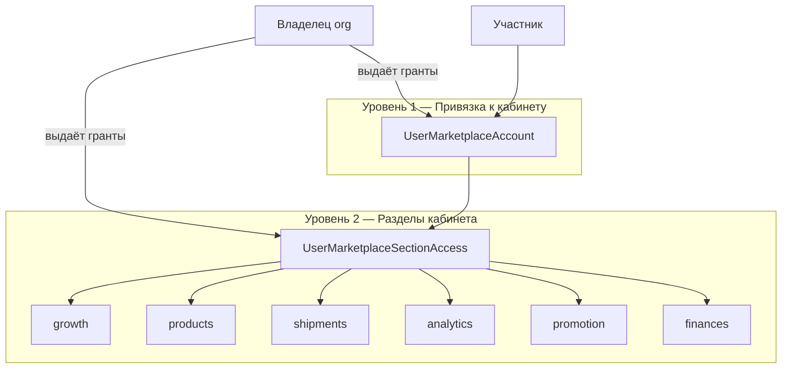
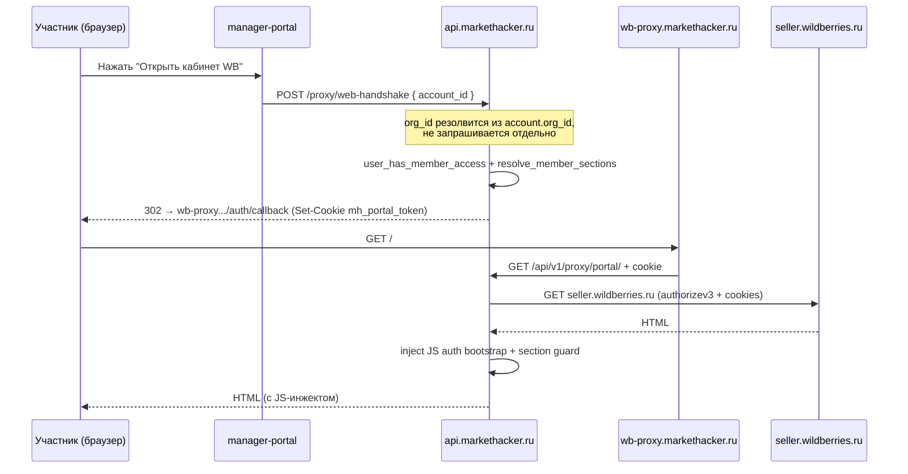

# Модель доступа к кабинетам маркетплейсов

Документ описывает, как участники организации получают доступ к конкретным
кабинетам Wildberries/Ozon и разделам внутри них. Общие принципы владения
организацией и биллинг-гейты — см. [Контроль доступа](./access-control.md).

## Обзор

Доступ к кабинету MP — это **два независимых уровня явных грантов**, которые
выдаёт владелец организации. Здесь нет ролей: гранты либо есть у конкретного
пользователя на конкретный кабинет/раздел, либо доступа нет (deny-by-default).



| Уровень | Что контролирует | Таблица |
|---|---|---|
| **1. Account binding** | К какому кабинету продавца привязан пользователь | `user_marketplace_accounts` |
| **2. Section permissions** | Какие разделы кабинета MP видит пользователь | `user_marketplace_section_access` |

Право *выдавать* и *отзывать* эти гранты — не отдельное permission, а прямое
следствие владения организацией (`OrganizationAccess.assert_owner`, см.
[Контроль доступа](./access-control.md)).

---

## Уровень 1: Привязка к кабинету

```sql
CREATE TABLE user_marketplace_accounts (
    id                      UUID PRIMARY KEY,
    user_id                 UUID NOT NULL REFERENCES users(id) ON DELETE CASCADE,
    marketplace_account_id  UUID NOT NULL REFERENCES marketplace_accounts(id) ON DELETE CASCADE,
    is_default              BOOLEAN NOT NULL DEFAULT false,
    granted_at              TIMESTAMPTZ NOT NULL,
    granted_by_id           UUID REFERENCES users(id) ON DELETE SET NULL,
    UNIQUE (user_id, marketplace_account_id)
);
```

**Кто и как получает привязку:**

- **Создатель кабинета** (всегда владелец org — создание кабинета требует
  `assert_owner`) получает привязку автоматически в момент создания
  (`MemberAccessService.grant_creator_access`), вместе с полным доступом ко
  всем разделам. Это не «особый путь для владельца» — просто гранты
  проставляются программно, а не вручную.
- **Остальные участники** привязываются владельцем вручную:

```
POST   /organizations/{org_id}/marketplace-accounts/{account_id}/access
DELETE /organizations/{org_id}/marketplace-accounts/{account_id}/access/{user_id}
```

Без привязки пользователь не может открыть кабинет через WB Portal Proxy и
не видит его в `GET /organizations/{org_id}/marketplace-accounts/mine`.

### MarketplaceAccount

Кабинет хранит зашифрованные credentials для доступа к MP.

| Ограничение | Поведение |
|---|---|
| `external_seller_id` | Генерируется сервером (UUID), не вводится пользователем |
| Удаление | `DELETE` деактивирует кабинет (`is_active=false`) и отзывает proxy-сессии |
| Маркетплейс | На проде поддерживается только `wildberries` (Ozon — в разработке) |

Типы credentials:

- **portal_session** — cookies + JWT для WB Portal Proxy (Guided Connect через
  JS-сниппет в консоли браузера)
- **api_token** — опционально, для серверной синхронизации данных

Проверка валидности: `POST /marketplace-accounts/{id}/verify`,
`GET /marketplace-accounts/{id}/credentials-status`.

---

## Уровень 2: Разделы кабинета (section permissions)

```sql
CREATE TABLE user_marketplace_section_access (
    id                      UUID PRIMARY KEY,
    user_id                 UUID NOT NULL REFERENCES users(id) ON DELETE CASCADE,
    marketplace_account_id  UUID NOT NULL REFERENCES marketplace_accounts(id) ON DELETE CASCADE,
    section_key             VARCHAR(100) NOT NULL,
    can_read                BOOLEAN NOT NULL DEFAULT true,
    can_write               BOOLEAN NOT NULL DEFAULT false,
    granted_at              TIMESTAMPTZ NOT NULL,
    granted_by_id           UUID REFERENCES users(id) ON DELETE SET NULL,
    UNIQUE (user_id, marketplace_account_id, section_key)
);
```

Назначение раздела:

```
PUT /organizations/{org_id}/marketplace-accounts/{account_id}/access/{user_id}/sections/{section_key}
{ "canRead": true, "canWrite": false }
```

**Пустой список записей для пользователя на данном кабинете = нет доступа ни
к одному разделу** (даже при наличии привязки уровня 1) — это принципиально
иная семантика, чем «доступ ко всем разделам по умолчанию»: создатель
кабинета получает полный набор грантов явно (`grant_all_sections`), а не
через отсутствие ограничений.

### Разделы Wildberries (6 групп меню)

Секции соответствуют **шести группам бокового меню** `seller.wildberries.ru`
и одновременно — группам API-путей WB, проксируемых через
`markethacker.modules.proxy.domain.wb_routes`:

| section_key | Раздел кабинета | Пример API-путей WB |
|---|---|---|
| `growth` | Рост продаж | — |
| `products` | Товары и цены | `/content/v1`, `/content/v2`, `/api/v1/prices`, `/api/v1/feedbacks` |
| `shipments` | Поставки и заказы | `/api/v1/orders`, `/api/v1/warehouses`, `/api/v1/stocks` |
| `analytics` | Аналитика | `/api/v1/analytics`, `/api/v1/statistics` |
| `promotion` | Продвижение | `/adv/v1`, `/adv/v2` |
| `finances` | Финансы | `/api/v1/finances`, `/api/v1/reportDetailByPeriod` |

Каталог доступен через `GET /organizations/{org_id}/marketplace-accounts/sections-catalog`.
Для Ozon — отдельный набор (`SECTIONS_BY_MARKETPLACE`), т.к. структура кабинета другая.

### Резолюция доступа при handshake

`member_access_resolver.py` — единственное место, где секции превращаются в
решение допустить/не допустить запрос:

```python
async def user_has_member_access(session, *, user_id, org_id, account_id) -> bool:
    membership = await MembershipRepository(session).get_for_user_org(user_id, org_id)
    if not membership or not membership.is_active:
        return False
    return await _has_account_binding(session, user_id=user_id, account_id=account_id)

async def resolve_member_sections(session, *, user_id, org_id, account_id) -> dict[str, dict[str, bool]]:
    """Только явные grants из user_marketplace_section_access (deny-by-default)."""
```

---

## Приглашения с грантами на кабинеты

Владелец при создании приглашения сразу указывает `accountGrants` — список
кабинетов и разделов, которые будут выданы приглашённому:

```json
POST /organizations/{org_id}/invitations
{
  "email": "manager@example.com",
  "accountGrants": [
    {
      "marketplaceAccountId": "uuid",
      "sections": [
        { "sectionKey": "analytics", "canRead": true, "canWrite": false },
        { "sectionKey": "promotion", "canRead": true, "canWrite": true }
      ]
    }
  ]
}
```

Гранты валидируются при создании приглашения (кабинет должен принадлежать
той же org и быть активным) и применяются атомарно в момент принятия
приглашения (`InvitationService._apply_account_grants`) — до этого момента
у приглашённого пользователя нет ни `Membership`, ни доступа к кабинетам.

---

## Механизм MP Proxy: ограничение видимости разделов

Участник работает с кабинетом MP **без прямого доступа** к credentials
продавца — через reverse proxy `wb-proxy.markethacker.ru`.

> Полное техническое описание — [WB Portal Proxy](./wb-portal-proxy.md).



Ключевое отличие от предыдущей модели: клиент передаёт только `account_id`.
Организация, к которой относится handshake, определяется на сервере через
`account.org_id` — вызывающему не нужно (и не может) указать «текущую»
организацию, потому что такого понятия в токене больше нет.

### Компоненты proxy-слоя

| Компонент | Роль |
|---|---|
| **wb-proxy.markethacker.ru** | Публичный домен прокси (Caddy → FastAPI) |
| **Credentials MP** | Хранятся на сервере зашифрованными (AES-256-GCM); участник не видит |
| **proxy_session** | Краткоживущий Redis-токен (TTL 1ч), хранит `sections`, посчитанные один раз при handshake |
| **JS-инжект (auth)** | Устанавливает auth-токены в localStorage/cookies до загрузки WB SPA |
| **JS guard** | Скрывает chip-элементы меню, блокирует fetch/XHR и навигацию к запрещённым разделам |
| **Профиль WB** | Селектор профиля заменён статическим текстом (`displayName` кабинета); модалка «Профиль» заблокирована |

### Двойной enforcement

| Слой | Как применяется |
|---|---|
| **Backend (`ProxyService.handshake` / `proxy_wb`)** ✅ | Проверка `user_has_member_access` при handshake, `resolve_route` + section-фильтр на каждый вызов `/proxy/wb/*` |
| **WB Portal Proxy** ✅ | Server-side проверка `/ns/*` путей + JS guard (скрытие chip-меню, блокировка fetch/навигации) |

Даже если JS guard на клиенте обойти, сервер не отдаст данные раздела, на
который у пользователя нет `can_read` в `user_marketplace_section_access` —
фильтрация происходит до отправки ответа, а не только визуально.

### Onboarding кабинета (захват portal-сессии)

WB использует HttpOnly-cookies, недоступные JS. Захват делается в два шага:

1. В manager-portal нажать **«Привязать WB»** → получить одноразовый JS-сниппет.
2. Открыть `seller.wildberries.ru`, войти, вставить сниппет в **DevTools Console**.
3. Сниппет автоматически захватит `authorizev3` и доступные cookies.
4. Сниппет попросит вручную скопировать `wbx-validation-key` из **DevTools → Application → Cookies**.
5. Credentials зашифровываются и сохраняются в БД.
6. Все участники с доступом к этому кабинету используют сохранённую сессию через прокси.

---

## API управления доступами

| Группа | Эндпоинты |
|---|---|
| Auth | `POST /auth/login`, `POST /auth/refresh`, `POST /auth/logout`, `GET /auth/me` |
| Organizations | `GET/POST/PATCH/DELETE /organizations/{org_id}` |
| Members | `GET /organizations/{org_id}/members`, `DELETE .../members/{user_id}` |
| Invitations | `POST/GET/DELETE /organizations/{org_id}/invitations`, `GET /invitations/preview/{token}` |
| Marketplace Accounts | `GET/POST/PATCH/DELETE /organizations/{org_id}/marketplace-accounts`, `capture-init`, `verify`, `credentials-status` |
| Account access | `POST/DELETE /organizations/{org_id}/marketplace-accounts/{id}/access/{user_id}` |
| Section access | `GET/PUT /organizations/{org_id}/marketplace-accounts/{id}/access/{user_id}/sections/{key}` |
| WB Proxy | `POST /proxy/handshake` (extension), `POST /proxy/web-handshake` (браузер) |

---

## Архитектура клиентов

MarketHacker имеет **Chromium-расширение** с `host_permissions` на
`wildberries.ru` и `ozon.ru`, а также manager-portal (веб) с доступом к
кабинетам через WB Portal Proxy.

```mermaid
flowchart TB
    subgraph backend [Backend MarketHacker]
        ORG[Organization + owner_id]
        USER[User + Membership]
        MPA[MarketplaceAccount]
        UMA[UserMarketplaceAccount]
        UMS[UserMarketplaceSectionAccess]
    end

    subgraph clients [Клиенты]
        EXT[Chrome Extension]
        WEB[Manager Portal]
        PROXY[WB Portal Proxy ✅]
    end

    USER --> ORG
    USER --> UMA --> MPA
    USER --> UMS
    EXT -->|JWT (только user_id)| backend
    WEB -->|JWT + account_id по запросу| backend
    PROXY -->|alternative path| MP[wildberries.ru]
```

### Два пути enforcement

#### Вариант A: Extension-first

1. Пользователь логинится в extension → получает JWT (только `user_id`).
2. При открытии кабинета extension вызывает `POST /proxy/handshake` с
   `account_id` → получает `proxy_token` (Redis, TTL 1ч) и список доступных
   `sections`, посчитанных сервером на основе грантов.
3. Content script на `wildberries.ru`/`ozon.ru` скрывает пункты меню по
   `sections`, блокирует навигацию и перехватывает XHR/fetch к запрещённым
   разделам.
4. Backend API дублирует проверки для своих эндпоинтов (`/proxy/wb/*`).

**Плюсы:** не нужен отдельный proxy, работает с нативным UI маркетплейса.
**Минусы:** enforcement частично на клиенте; для строгой изоляции нужен
server-side proxy (см. вариант B).

#### Вариант B: MP Proxy ✅ реализован для WB

Отдельный сервис `wb-proxy.markethacker.ru` — см. раздел выше. Credentials
seller-аккаунта никогда не покидают сервер; секции проверяются и на входе
(handshake), и на каждый проксируемый вызов.

#### Статус реализации

| Этап | Подход | Статус |
|---|---|---|
| MVP | Extension-first — section-aware enforcement на бэкенде + UI filtering в content script | ✅ Готово |
| **v1** | **Proxy для WB** — reverse proxy, 6 section groups, profile lock, invitations с account grants | ✅ Готово |
| v2 | Proxy для Ozon — marketplace-specific adapters | Планируется |

---

## Модель данных (полная)

```sql
CREATE TABLE organizations (
    id         UUID PRIMARY KEY,
    name       VARCHAR(255) NOT NULL,
    slug       VARCHAR(100) UNIQUE NOT NULL,
    owner_id   UUID NOT NULL REFERENCES users(id) ON DELETE CASCADE,
    is_active  BOOLEAN NOT NULL DEFAULT true
);

CREATE TABLE memberships (
    id        UUID PRIMARY KEY,
    user_id   UUID NOT NULL REFERENCES users(id) ON DELETE CASCADE,
    org_id    UUID NOT NULL REFERENCES organizations(id) ON DELETE CASCADE,
    is_active BOOLEAN NOT NULL DEFAULT true,
    UNIQUE (user_id, org_id)
);

CREATE TABLE organization_invitations (
    id             UUID PRIMARY KEY,
    org_id         UUID NOT NULL REFERENCES organizations(id) ON DELETE CASCADE,
    email          VARCHAR(255) NOT NULL,
    token_hash     VARCHAR(64) UNIQUE NOT NULL,
    status         VARCHAR(20) NOT NULL DEFAULT 'pending',
    account_grants JSONB,
    expires_at     TIMESTAMPTZ NOT NULL
);

CREATE TABLE user_marketplace_accounts (
    id                      UUID PRIMARY KEY,
    user_id                 UUID NOT NULL REFERENCES users(id) ON DELETE CASCADE,
    marketplace_account_id  UUID NOT NULL REFERENCES marketplace_accounts(id) ON DELETE CASCADE,
    is_default              BOOLEAN NOT NULL DEFAULT false,
    UNIQUE (user_id, marketplace_account_id)
);

CREATE TABLE user_marketplace_section_access (
    id                      UUID PRIMARY KEY,
    user_id                 UUID NOT NULL REFERENCES users(id) ON DELETE CASCADE,
    marketplace_account_id  UUID NOT NULL REFERENCES marketplace_accounts(id) ON DELETE CASCADE,
    section_key             VARCHAR(100) NOT NULL,
    can_read                BOOLEAN NOT NULL DEFAULT true,
    can_write               BOOLEAN NOT NULL DEFAULT false,
    UNIQUE (user_id, marketplace_account_id, section_key)
);
```

---

## Связь с другими документами

| Документ | Содержание |
|---|---|
| [Контроль доступа](./access-control.md) | Владение организацией, billing-гейты, JWT, алгоритм проверки |
| [Модель данных](./data-model.md) | ER-диаграмма, таблицы |
| [Аутентификация](./authentication.md) | JWT, refresh tokens |
| [WB Portal Proxy](./wb-portal-proxy.md) | Техническая реализация reverse proxy |
