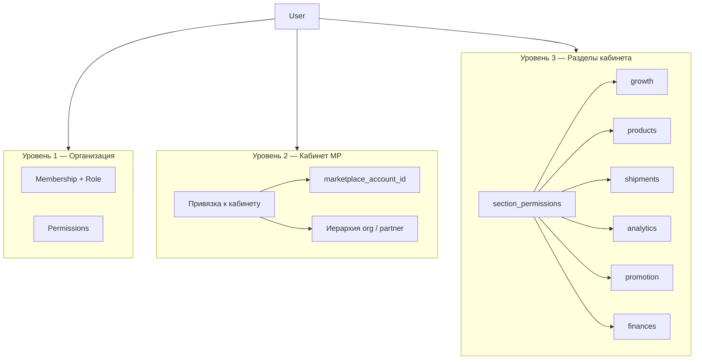
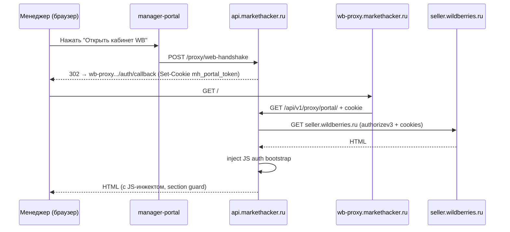
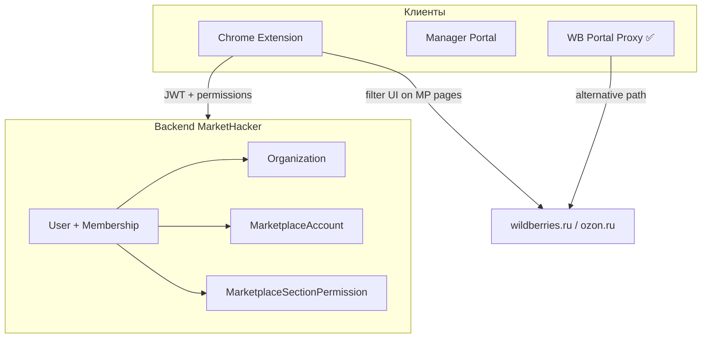

# Модель доступа к кабинетам маркетплейсов

Документ описывает трёхуровневую модель контроля доступа к кабинетам Wildberries, Ozon и других маркетплейсов в MarketHacker.

## Обзор

MarketHacker использует **трёхуровневую** систему доступа, а не классический «пользователь → организация → роль»:



| Уровень | Что контролирует | Где проверяется |
|---------|------------------|-----------------|
| **1. Org RBAC** | Доступ к функциям MarketHacker, управление командой | Backend API, web admin |
| **2. Account binding** | К какому кабинету продавца привязан пользователь | `marketplace_account_id` в JWT |
| **3. Section permissions** | Какие разделы кабинета MP видит менеджер | Extension / MP Proxy + `section_permissions` |

---

## Уровень 1: RBAC в организации

Роли и permissions на уровне организации — см. [Контроль доступа](./access-control.md).

| Роль | Назначение |
|------|------------|
| `owner` | Полный доступ, биллинг, удаление org |
| `admin` | Управление командой, кабинетами MP, section permissions |
| `manager` | Работа с аналитикой и рекламой в назначенных кабинетах |
| `viewer` | Только чтение |

### Иерархия партнёров / агентств

Для модели «агентство управляет клиентами»:

- **Parent org** — агентство; видит sub-orgs или linked accounts.
- **Sub-org** — клиент агентства.
- Admin агентства назначает менеджеров на конкретные кабинеты клиентов.

---

## Уровень 2: Привязка к кабинету продавца

Пользователь привязывается к одному или нескольким кабинетам MP через `user_marketplace_accounts`:

```json
{
  "user_id": "uuid",
  "org_id": "uuid",
  "marketplace_account_id": "uuid",
  "marketplace": "wildberries",
  "display_name": "ООО \"Звезда\"",
  "section_permissions": {
    "analytics": { "can_read": true, "can_write": false },
    "promotion": { "can_read": true, "can_write": true }
  }
}
```

| Поле | Смысл |
|------|-------|
| `marketplace_account_id` | ID кабинета MP в MarketHacker |
| `marketplace` | `wildberries`, `ozon`, ... |
| `display_name` | Отображаемое имя (юр. лицо) |

Назначение кабинета:

```
PUT /api/v1/members/{user_id}/marketplace-accounts
{ "marketplace_account_id": "uuid" }
```

Без привязки к кабинету пользователь **не может** работать с данными этого MP — UI показывает ошибку «Кабинет не назначен».

### MarketplaceAccount

Кабинет хранит credentials для доступа к MP. Создание упрощено: указываются только `marketplace` и `display_name`.

| Ограничение | Поведение |
|-------------|-----------|
| Один кабинет на маркетплейс | В организации не более одного активного WB и одного Ozon |
| `external_seller_id` | Генерируется сервером (UUID), не вводится пользователем |
| Удаление | `DELETE` деактивирует кабинет (`is_active=false`) и отзывает proxy-сессии |

Типы credentials:

- **portal_session** — cookies + JWT для WB Portal Proxy (захват через JS-сниппет)
- **api_token** — опционально, для серверной синхронизации данных (не требуется при создании кабинета)

Проверка валидности: `POST /marketplace-accounts/{id}/verify`, `GET /marketplace-accounts/{id}/credentials-status`.

---

## Уровень 3: Section permissions (разделы кабинета)

Гранулярные права **внутри** кабинета MP. Назначаются отдельно от org roles через `UserMarketplaceSectionAccess` с флагами `can_read` / `can_write`:

```
PUT /api/v1/organizations/{org_id}/marketplace-accounts/{account_id}/section-access
{ "section_key": "promotion", "can_read": true, "can_write": false }
```

### Разделы Wildberries (6 групп меню)

Секции соответствуют **шести группам бокового меню** `seller.wildberries.ru`. Каталог: `wb_menu_groups.py`.

| section_key | Раздел кабинета | section_chip (меню WB) |
|-------------|-----------------|------------------------|
| `growth` | Рост продаж | `section.growth-tools` |
| `products` | Товары и цены | `section.items-and-prices` |
| `shipments` | Поставки и заказы | `section.shipments-and-orders` |
| `analytics` | Аналитика | `section.analytics-new` |
| `promotion` | Продвижение | `section.promotion-new` |
| `finances` | Финансы | `section.dbo` |

Каждая группа включает набор пунктов меню (chip-id) и URL-префиксов SPA. При отсутствии `can_read` на группу прокси скрывает соответствующие chip-элементы меню и блокирует навигацию/API.

**Пустой список grants** — полный доступ ко всем разделам назначенного кабинета (policy по умолчанию для `owner` / `admin`).

Для Ozon — отдельный набор `marketplace_sections` (см. `sections.py`), т.к. структура кабинета другая.

---

## Механизм MP Proxy: ограничение видимости разделов

Менеджер работает с кабинетом MP **без прямого доступа** к credentials продавца — через reverse proxy `wb-proxy.markethacker.ru`.

> Полное техническое описание — [WB Portal Proxy](./wb-portal-proxy.md).



### Компоненты proxy-слоя

| Компонент | Роль |
|-----------|------|
| **wb-proxy.markethacker.ru** | Публичный домен прокси (Caddy → FastAPI) |
| **Credentials MP** | Хранятся на сервере зашифрованными (AES-256-GCM); менеджер не видит |
| **proxy_session** | Краткоживущий Redis-токен (TTL 1h), привязывает cookie к сессии |
| **JS-инжект (auth)** | Устанавливает auth-токены в localStorage/cookies до загрузки WB SPA |
| **JS guard** | Скрывает chip-элементы меню, блокирует fetch/XHR и навигацию к запрещённым разделам |
| **Профиль WB** | Селектор профиля заменён статическим текстом (`display_name` кабинета); модалка «Профиль» заблокирована |
| **MH badge** | Фиксированная метка «Работает через MH» в левом нижнем углу |

### Onboarding кабинета (захват portal-сессии)

WB использует HttpOnly-cookies, недоступные JS. Захват делается в два шага:

1. В manager-portal нажать **«Привязать WB»** → получить одноразовый JS-сниппет.
2. Открыть `seller.wildberries.ru`, войти, вставить сниппет в **DevTools Console**.
3. Сниппет автоматически захватит `authorizev3` и доступные cookies.
4. Сниппет попросит вручную скопировать `wbx-validation-key` из **DevTools → Application → Cookies**.
5. Credentials зашифровываются и сохраняются в БД.
6. Все менеджеры этого кабинета используют сохранённую сессию через прокси.

---

## API управления доступами

| Группа | Эндпоинты |
|--------|-----------|
| Auth | `POST /auth/login`, `POST /auth/logout`, `GET /auth/me` |
| Members | `GET /organizations/{org_id}/members`, `DELETE .../members/{user_id}` |
| Invitations | `POST/GET/DELETE /organizations/{org_id}/invitations`, `GET /invitations/preview/{token}` |
| Marketplace Accounts | `GET/POST/PATCH/DELETE /marketplace-accounts`, `capture-init`, `verify`, `credentials-status` |
| Account access | `POST/DELETE /marketplace-accounts/{id}/access/{user_id}` |
| Section permissions | `GET/PUT /marketplace-accounts/{id}/section-access` |
| WB Proxy | `POST /proxy/web-handshake` |

---

## Архитектура клиентов

MarketHacker имеет **Chromium-расширение** с `host_permissions` на `wildberries.ru` и `ozon.ru`.



### Два пути enforcement

#### Вариант A: Extension-first

1. Пользователь логинится в extension → получает JWT с `marketplace_account_id` и `section_permissions`.
2. Content script на `wildberries.ru` / `ozon.ru`:
   - скрывает пункты меню и виджеты по `section_permissions`;
   - блокирует навигацию на запрещённые URL;
   - перехватывает XHR/fetch и отклоняет запросы к запрещённым API MP.
3. Backend API дублирует проверки для своих эндпоинтов.

**Плюсы:** не нужен отдельный proxy, работает с нативным UI маркетплейса.  
**Минусы:** enforcement на клиенте; для строгой изоляции нужен server-side proxy.

#### Вариант B: MP Proxy ✅ реализован для WB

Отдельный сервис `wb-proxy.markethacker.ru`:

1. Reverse proxy перед `seller.wildberries.ru`.
2. Credentials seller account хранятся на сервере зашифрованными (AES-256-GCM); `wbx-validation-key` и `x-supplier-id` — только server-side.
3. JS-инжект (auth + guard + badge) управляет auth-состоянием WB SPA.
4. Section guard по **6 группам меню** блокирует запрещённые разделы (chip-меню, API, навигация).
5. Селектор профиля WB заменён названием кабинета; менеджер не может сменить компанию или выйти.
6. Manager-portal открывает прокси через `web-handshake`; приглашения могут включать account grants с section permissions.

**Плюсы:** строгий контроль, менеджер не имеет прямого доступа к seller credentials.  
**Минусы:** требует поддержки при изменении WB SPA.

#### Статус реализации

| Этап | Подход | Статус |
|------|--------|--------|
| MVP | Extension-first — permissions с backend, UI filtering в content script | Частично |
| **v1** | **Proxy для WB** — reverse proxy, 6 section groups, profile lock, invitations | ✅ **Готово** |
| v2 | Proxy для Ozon — marketplace-specific adapters | Будущее |

---

## Модель данных

```sql
CREATE TABLE marketplace_sections (
    id           UUID PRIMARY KEY,
    marketplace  VARCHAR(20) NOT NULL,
    section_key  VARCHAR(50) NOT NULL,
    display_name VARCHAR(100) NOT NULL,
    UNIQUE (marketplace, section_key)
);

CREATE TABLE user_marketplace_section_access (
    id                      UUID PRIMARY KEY,
    user_id                 UUID NOT NULL REFERENCES users(id),
    marketplace_account_id  UUID NOT NULL REFERENCES marketplace_accounts(id),
    section_key             VARCHAR(50) NOT NULL,
    can_read                BOOLEAN NOT NULL DEFAULT true,
    can_write               BOOLEAN NOT NULL DEFAULT false,
    granted_by              UUID REFERENCES users(id),
    created_at              TIMESTAMPTZ NOT NULL DEFAULT now(),
    UNIQUE (user_id, marketplace_account_id, section_key)
);
```

### JWT payload

```json
{
  "sub": "user_uuid",
  "org_id": "org_uuid",
  "marketplace_account_id": "account_uuid",
  "marketplace": "wildberries",
  "section_permissions": {
    "analytics": { "can_read": true, "can_write": false },
    "promotion": { "can_read": true, "can_write": true },
    "shipments": { "can_read": true, "can_write": false }
  },
  "permissions": ["analytics:read"]
}
```

---

## Связь с другими документами

| Документ | Содержание |
|----------|------------|
| [Контроль доступа](./access-control.md) | Org RBAC, permissions, алгоритм проверки |
| [Модель данных](./data-model.md) | ER-диаграмма, таблицы |
| [Аутентификация](./authentication.md) | JWT, refresh tokens |
