# Parser — разработка новых парсеров

Руководство по добавлению парсеров в сервис [parser](https://github.com/MarketHackerLabs/parser): архитектура, чеклист включения Kafka и пошаговый процесс.

## Архитектура данных

Parser **не пишет напрямую в ClickHouse**. Результат парсинга публикуется в Kafka; ClickHouse забирает события через Kafka Engine.

```mermaid
flowchart LR
    API[Parser API] -->|create job| PG[(PostgreSQL jobs)]
    PG --> ARQ[ARQ Worker]
    ARQ --> SVC[application/parsers/.../service.py]
    SVC --> KAFKA_PY[application/parsers/.../kafka.py]
    KAFKA_PY --> PUB[KafkaBatchPublisher]
    PUB --> TOPIC[(Kafka topic)]
    TOPIC --> CHK[ClickHouse Kafka Engine]
    CHK --> MV[Materialized View]
    MV --> CH[(MergeTree table)]
```



| Слой | Ответственность |
|------|-----------------|
| `domain/` | Модели, enum'ы, доменные ошибки |
| `infrastructure/<marketplace>/parsers/<name>/` | HTTP-клиенты, парсинг файлов, **constants** (включая `KAFKA_TOPIC`) |
| `application/parsers/<marketplace>/<name>/` | Use case: оркестрация + публикация в Kafka |
| `infrastructure/kafka/` | **Общий** producer и batch publisher (без логики конкретных парсеров) |
| `infrastructure/jobs/` | ARQ handlers, реестр типов задач |
| `clickhouse/migrations/` | Целевая таблица + Kafka Engine + materialized view |

### Соглашения по именованию

| Артефакт | Пример |
|----------|--------|
| Тип задачи (`job_type`) | `wb_search_tags` |
| Kafka topic | `markethacker.wb.search_tags` |
| ClickHouse таблица | `wb_search_tags` |
| Kafka Engine таблица | `wb_search_tags_kafka` |
| Materialized view | `wb_search_tags_kafka_mv` |

Топик и прочие параметры парсера — **в constants**, не в `.env`.

---

## Включение Kafka: локальная разработка

### 1. Обновить окружение

```bash
cd parser
cp .env.example .env   # или вручную добавить блок Kafka в существующий .env
uv sync
```

В `.env` должны быть (общие настройки брокера):

```bash
KAFKA_ENABLED=true
KAFKA_BOOTSTRAP_SERVERS=localhost:9094
```

> Порт `9094` — EXTERNAL listener Kafka в Docker. Внутри docker-сети используется `kafka:9092`.

Удалите устаревшие переменные, если они остались от предыдущей версии:

- `SEARCH_TAGS_SINK`
- `KAFKA_TOPIC_WB_SEARCH_TAGS`

### 2. Поднять инфраструктуру

```bash
make networks      # один раз, если сети ещё не созданы
make up-infra      # postgres, pgbouncer, redis, clickhouse, kafka
```

Проверка:

```bash
docker compose -f docker-compose.yml -f docker-compose.local.yml ps kafka clickhouse
```

### 3. Применить миграции

```bash
make migrate       # Alembic (PG) + ClickHouse (включая 003_wb_search_tags_kafka.sql)
make ch-status     # убедиться, что 003 применена
```

### 4. Запустить приложение

```bash
make dev      # терминал 1 — API :8010
make worker   # терминал 2 — ARQ worker (инициализирует Kafka producer при старте)
```

Worker **обязательно перезапустить** после обновления кода или `.env`.

### 5. Проверить end-to-end

```bash
# Поставить задачу
curl -X POST http://localhost:8010/api/v1/jobs/wb-search-tags \
  -H "X-Parser-Api-Key: $PARSER_API_KEY" \
  -H "Content-Type: application/json" \
  -d '{"interval": "yesterday"}'

# Kafka UI (только локальная разработка): http://127.0.0.1:8085

# Сообщения в топике (из контейнера Kafka)
docker exec markethacker-parser-kafka \
  /opt/kafka/bin/kafka-console-consumer.sh \
  --bootstrap-server localhost:9092 \
  --topic markethacker.wb.search_tags \
  --from-beginning --max-messages 1

# Данные в ClickHouse (после ingestion, может быть задержка 1–30 с)
curl -s "http://127.0.0.1:8124/?user=default&password=$CLICKHOUSE_PASSWORD" \
  --data "SELECT count() FROM markethacker_parser.wb_search_tags"
```

---

## Включение Kafka: production

### 1. Обновить `.env` на VPS

В `parser/.env` добавьте или обновите:

```bash
KAFKA_ENABLED=true
KAFKA_BOOTSTRAP_SERVERS=kafka:9092
```

Удалите `SEARCH_TAGS_SINK` и parser-specific Kafka-переменные, если они есть.

### 2. Поднять инфраструктуру с Kafka

```bash
cd infra && make networks
cd ../parser
make infra-up-prod    # поднимает postgres, pgbouncer, redis, clickhouse, kafka
```

### 3. Задеплоить код и миграции

```bash
make prod-deploy DEPLOY_HOST=your.server
# или вручную:
make prod-migrate     # PG + ClickHouse (003_wb_search_tags_kafka.sql)
make prod-up          # пересборка и перезапуск api + worker
```

Скрипт `scripts/deploy-prod.sh` уже выполняет миграции PG и ClickHouse; после деплоя worker поднимается с новым кодом.

### 4. Проверка на prod

```bash
# Health API
curl -s http://127.0.0.1:8010/api/v1/readyz

# Логи worker — должны быть kafka.producer.started
docker compose -f docker-compose.prod.yml logs worker | tail -50

# Kafka topic
docker exec markethacker-parser-kafka \
  /opt/kafka/bin/kafka-topics.sh \
  --bootstrap-server localhost:9092 --list
```

### Порядок деплоя всего стека

```bash
cd infra && make networks
cd backend && make infra-up-prod && make prod-migrate && make prod-up
cd ../parser && make infra-up-prod && make prod-migrate && make prod-up
```

Parser infra теперь включает Kafka; backend ходит в ClickHouse по сети `markethacker_apps`, ingestion идёт внутри parser infra.

---

## Как добавить новый парсер

Эталон — **WB search tags** (`wb_search_tags`).

### Шаг 1. Domain

`src/markethacker_parser/domain/<parser_name>.py`:

- enum'ы (интервалы, статусы);
- dataclass'ы строк результата;
- константа `JOB_TYPE_*`;
- доменная ошибка.

### Шаг 2. Infrastructure — парсинг и constants

```
infrastructure/<marketplace>/parsers/<name>/
  constants.py    ← KAFKA_TOPIC, таймауты, лимиты (не .env!)
  parser.py       ← разбор файлов / API-ответов
  report.py       ← клиент отчётов (если нужен)
```

Пример constants:

```python
KAFKA_TOPIC = "markethacker.wb.my_report"
JOB_TIMEOUT_SECONDS = 900
ROW_LIMIT = 300_000
```

### Шаг 3. Application — use case

```
application/parsers/<marketplace>/<name>/
  service.py   ← оркестрация: fetch → parse → publish
  kafka.py     ← сериализация JSONEachRow + вызов KafkaBatchPublisher
  __init__.py  ← публичный API модуля
```

`kafka.py` использует **общий** publisher:

```python
from markethacker_parser.infrastructure.kafka import KafkaBatchPublisher, KafkaMessage
from markethacker_parser.infrastructure.wildberries.parsers.my_report.constants import KAFKA_TOPIC

async def publish_rows(...) -> int:
    messages = [KafkaMessage(key=..., value=...) for row in rows]
    return await KafkaBatchPublisher().publish(topic=KAFKA_TOPIC, messages=messages)
```

Формат value — **JSONEachRow**, совместимый со схемой ClickHouse.

### Шаг 4. ARQ job handler

`infrastructure/jobs/<name>_jobs.py`:

- загрузка job из PostgreSQL;
- вызов `Service().run(payload)`;
- обработка ошибок, DLQ, метрики.

Зарегистрировать в `infrastructure/jobs/worker.py` → `WorkerSettings.functions`.

### Шаг 5. Реестр типов задач

`infrastructure/jobs/registry.py`:

- `JobTypeDefinition` (label, поля формы для admin-panel);
- `normalize_job_payload()`;
- `job_timeout_seconds()` при необходимости.

### Шаг 6. API endpoint (опционально)

Если нужен dedicated endpoint — добавить router; иначе достаточно generic `POST /api/v1/jobs` с `job_type`.

### Шаг 7. ClickHouse

Две миграции (или одна, если таблица новая):

1. `NNN_<name>.sql` — целевая MergeTree-таблица;
2. `NNN_<name>_kafka.sql` — Kafka Engine + materialized view в целевую таблицу.

```sql
CREATE TABLE IF NOT EXISTS my_report_kafka ( ... )
ENGINE = Kafka
SETTINGS
    kafka_broker_list = 'kafka:9092',
    kafka_topic_list = 'markethacker.wb.my_report',
    kafka_group_name = 'clickhouse_my_report',
    kafka_format = 'JSONEachRow',
    kafka_num_consumers = 1;

CREATE MATERIALIZED VIEW IF NOT EXISTS my_report_kafka_mv TO my_report AS
SELECT * FROM my_report_kafka;
```

`kafka_broker_list` и `kafka_topic_list` должны совпадать с Docker DNS и `KAFKA_TOPIC` в constants.

Применить: `make migrate-ch`.

### Шаг 8. Тесты

| Что тестировать | Где |
|-----------------|-----|
| Парсинг файлов / API | `tests/unit/test_<name>_parser.py` |
| Сериализация JSONEachRow | `tests/unit/test_<name>_kafka.py` |
| ARQ handler (mock service) | `tests/unit/test_<name>_jobs.py` |
| Generic Kafka publisher | уже покрыт `test_kafka_publisher.py` |

### Шаг 9. Admin Panel (при необходимости)

Расписание подхватит новый `job_type` автоматически через `GET /api/v1/admin/job-types`, если он зарегистрирован в `registry.py`.

---

## Чеклист нового парсера

- [ ] `domain/` — модели и `JOB_TYPE`
- [ ] `infrastructure/.../constants.py` — `KAFKA_TOPIC`, таймауты
- [ ] `infrastructure/.../parser.py` — извлечение данных
- [ ] `application/parsers/.../service.py` — use case
- [ ] `application/parsers/.../kafka.py` — публикация в Kafka
- [ ] `infrastructure/jobs/<name>_jobs.py` + регистрация в worker
- [ ] `infrastructure/jobs/registry.py` — описание для UI
- [ ] `clickhouse/migrations/` — таблица + Kafka Engine + MV
- [ ] Unit-тесты
- [ ] Локальная проверка: job → Kafka topic → ClickHouse table

---

## Частые проблемы

| Симптом | Причина | Решение |
|---------|---------|---------|
| `Kafka producer is not initialized` | Worker не перезапущен или `KAFKA_ENABLED=false` | `make worker`, проверить `.env` |
| `Connection refused` к Kafka | Infra не поднята или неверный bootstrap | Локально: `localhost:9094`, Docker: `kafka:9092` |
| Job успешен, CH пуст | Миграция 003 не применена или MV не создан | `make ch-status`, `make migrate-ch` |
| Broken messages в CH | JSON не совпадает со схемой Kafka-таблицы | Сверить поля serializer и DDL |
| `rows_parsed > 0`, job failed | Ошибка publish в Kafka | Логи worker: `search_tags.kafka_published` / `KafkaError` |

---

## Связанные документы

- [Parser Service — Foundation](./parser.md)
- [Инфраструктура](./infrastructure.md)
- [Фоновые задачи](./background-jobs.md)
- [README parser-сервиса](../../parser/README.md)
