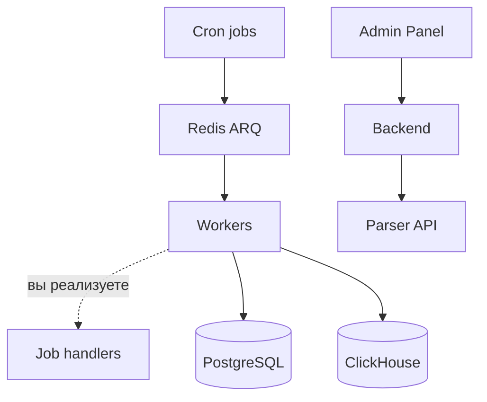

# Parser Service — Foundation

Платформа фоновых задач и аналитики. **Без готовой бизнес-логики** — только инфраструктура.

## Миграции

### PostgreSQL — Alembic

Операционные данные: `jobs`, `parser_metric_hourly`.

### ClickHouse — версионированные SQL

```
clickhouse/migrations/
  001_...sql
```

- Трекинг в `_schema_migrations` (MergeTree)
- CLI: `python -m markethacker_parser.cli clickhouse upgrade`
- Только forward-migrations (откат = новая миграция)
- При деплое: `make migrate` (PG + CH)

## Архитектура



## Расширение

1. Добавьте ARQ handler
2. Зарегистрируйте в `WorkerSettings`
3. Создавайте задачи через `JobRepository`
4. Добавьте ClickHouse-миграции при необходимости

## Scrapy vs httpx

| | httpx/Playwright | Scrapy |
|--|------------------|--------|
| Стек | async-native, ARQ | sync/Twisted, subprocess |
| Кейс | JSON API, точечные запросы | Массовый HTML-crawl |
| Интеграция | ARQ job handler | spider → CH/Redis pipeline |

Scrapy — опциональная зависимость (`uv sync --group spiders`).
