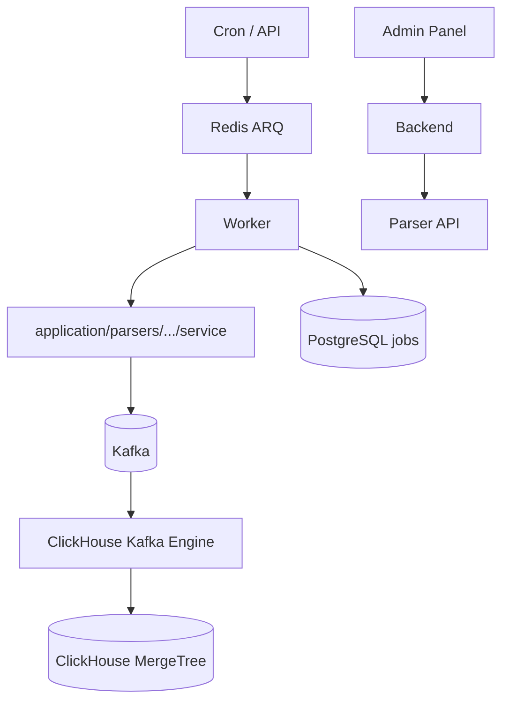

# Parser Service — Foundation

Платформа фоновых задач и аналитики. Реализованы парсеры WB:

| `job_type` | Описание |
|------------|----------|
| `wb_search_tags` | Поисковые запросы (отчёт content-analytics) |
| `wb_market_niche` | Анализ ниш по категориям и предметам |
| `wb_subjects` | Справочник предметных групп |

Новые парсеры добавляются по [руководству по разработке](./parser-development.md).

## Поток данных



Parser публикует события в Kafka. ClickHouse читает топики через Kafka Engine — прямой записи из worker в CH нет.

## Миграции

### PostgreSQL — Alembic

Операционные данные: `jobs`, `parser_job_schedules`, `parser_metric_hourly`, профили WB auth.

### ClickHouse — версионированные SQL

```
clickhouse/migrations/
  001_wb_search_tags.sql
  003_wb_search_tags_kafka.sql
  004_wb_subjects.sql
  005_wb_subjects_kafka.sql
  006_wb_subjects_dict.sql
  007_wb_search_tags_top_order_subject_id.sql
  008_wb_market_niche.sql
  009_wb_market_niche_kafka.sql
  010_merge_memory_tuning.sql
  011_wb_search_tags_kafka_partitions.sql
  012_wb_search_tags_query_projection.sql  -- p_by_interval_query; MATERIALIZE по партициям вручную
```

- Трекинг в `_schema_migrations` (MergeTree)
- CLI: `python -m markethacker_parser.cli clickhouse upgrade`
- Только forward-migrations (откат = новая миграция)
- При деплое: `make migrate` (PG + CH)

## Структура кода

```
src/markethacker_parser/
  domain/                          # модели, ошибки
  application/parsers/             # use cases по маркетплейсу
    wb/search_tags/
      service.py
      kafka.py
    wb/market_niche/
      service.py
      kafka.py
      subject_resolver.py
    wb/subjects/
      service.py
      kafka.py
  infrastructure/
    kafka/                         # общий producer + batch publisher
    jobs/                          # ARQ handlers, registry, dispatcher
    wildberries/
      content_analytics_file_manager.py
      portal_client.py
      parsers/search_tags/
      parsers/market_niche/
      parsers/subjects/
  clickhouse/migrations/           # DDL + Kafka Engine
```

## Расширение

Подробный пошаговый процесс: **[Разработка новых парсеров](./parser-development.md)**.

Кратко:

1. Domain + infrastructure (parser, constants с `KAFKA_TOPIC`)
2. `application/parsers/<mp>/<name>/` — service + kafka
3. ARQ handler + registry + worker + **dispatcher** (`handler_by_type`)
4. ClickHouse: MergeTree + Kafka Engine + materialized view
5. Тесты, локальная проверка end-to-end

## Scrapy vs httpx

| | httpx/Playwright | Scrapy |
|--|------------------|--------|
| Стек | async-native, ARQ | sync/Twisted, subprocess |
| Кейс | JSON API, точечные запросы | Массовый HTML-crawl |
| Интеграция | ARQ job → Kafka | spider → Kafka pipeline |

Scrapy — опциональная зависимость (`uv sync --group spiders`).
