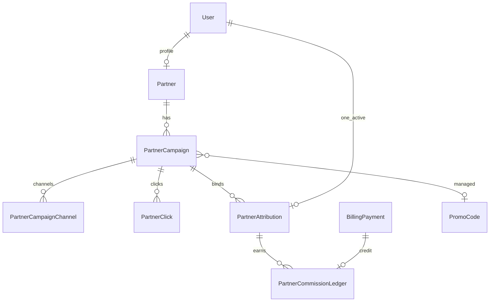

# Партнёры

Универсальная партнёрская программа: регистрация партнёров, рекламные кампании,
атрибуция клиентов, начисление вознаграждения, аналитика.

Модуль: `modules/partners/` (bounded context). Не путать с биллинговыми
промокодами (`billing`) и продуктовыми баннерами (`promotions`).

Типы кампаний (взаимоисключающие): `promo_code` или `referral_link`.

## Принципы

| Принцип | Решение |
|---------|---------|
| Субъект привязки | User (плательщик) — биллинг per-user |
| Attribution | First-touch immutable + override только superuser |
| Момент bind | Регистрация (`?ref=`) или первый успешный промокод партнёра |
| База комиссии | `BillingPayment.amount` (факт оплаты) |
| Округление | `ROUND_HALF_UP`, 2 знака |
| Идемпотентность | UNIQUE `idempotency_key` на ledger |
| Промокоды | Managed `PromoCode` (origin=`partner`) для бонуса клиенту |
| Клиентский UI | Admin Panel «Партнёры»; Manager Portal — только захват `?ref=` + промокод в биллинге (отдельного кабинета партнёра нет) |

## Модель данных



### Таблицы

| Таблица | Назначение |
|--------|------------|
| `partners` | Профиль партнёра (1:1 с `users`) |
| `partner_status_history` | Аудит статусов |
| `partner_campaigns` | Кампании, ставки, client bonus, `public_code` |
| `partner_campaign_channels` | Типы каналов (`promo_code`, `referral_link`, …) |
| `partner_clicks` | Переходы по ссылке |
| `partner_attributions` | Активная привязка user→partner (+ `reward_snapshot`) |
| `partner_attribution_history` | История override |
| `partner_commission_ledger` | Начисления / reversal / adjustment |

На `promo_codes`: `origin` (`manual`\|`partner`), `partner_campaign_id`.
Managed-коды (`origin=partner`) создаются/обновляются из кампании; описание —
«Партнёрская кампания «{name}»»; в списке админских промокодов не показываются.

## Жизненный цикл партнёра

`pending` → `active` ↔ `inactive` / `blocked` → `deleted` (soft).

- `inactive` / `blocked` / `deleted`: новые attributions и commissions запрещены.
- Существующие привязки сохраняются для истории.
- При deactivation кампании переводятся в `paused`.

## Жизненный цикл кампании

`draft` → `active` → `paused` / `ended` → `archived`.

Bind разрешён только если партнёр `active`, кампания `active` и сейчас в окне
`[starts_at, ends_at]`. После bind ставки берутся из `reward_snapshot`
атрибуции (смена % кампании не переписывает историю).

## Attribution

1. Переход `?ref=CODE` → signed HttpOnly cookie `mh_ref` (30 дней) + click.
2. Регистрация: consume cookie / `refCode` body → first-touch attribution.
3. Промокод партнёра: после валидного redeem/upgrade → try_attribute.
4. Self-referral запрещён (`partner.user_id != user_id`).
5. Повторная атрибуция игнорируется (first-touch wins).

## Вознаграждение

```
commission = quantize(basis_amount * rate_percent / 100, 2dp, ROUND_HALF_UP)
```

- `first` rate — первый успешный in-scope платёж пользователя.
- `subsequent` — все следующие.
- In-scope: `subscription_initial`, `subscription_renewal`,
  `limit_addon_initial`, `limit_addon_renewal`. Exclude: `admin_test`.
- Хук: после `mark_payment_processed` в `_process_success`.
- `idempotency_key = commission:{payment_id}`.
- Reversal: `reversal:{payment_id}:{refund_id}` (refund pipeline — later).

## Реферальный cookie и клиентский оффер

Payload cookie: `{code, ts}` + HMAC-SHA256 (`jwt_secret`). TTL 30 дней.
Manager Portal дополнительно зеркалит код в `localStorage` до успешной
регистрации / выхода из аккаунта.

Публичный `GET/POST /partners/public/r/{code}` возвращает клиенту (без ставок
комиссии партнёра):

| Поле | Назначение |
|------|------------|
| `publicCode` | Код кампании |
| `campaignName` | Название |
| `campaignType` | `referral_link` \| `promo_code` |
| `clientBonusType` | `none` \| `discount` \| `free_period` |
| `discountPercent` / `discountAmount` | Скидка клиенту (если есть) |
| `freePeriodDays` / `bonusTargetPlan` | Бесплатные дни и целевой тариф |
| `redirectUrl` | Обычно `{manager_portal}/register?ref={CODE}` |

### Manager Portal

1. Переход по ссылке с `?ref=` → resolve + cookie + баннер «вы получите…» на
   `/register` (баннер только при свежем `?ref=` в URL, не из «старого»
   localStorage после выхода).
2. Поле «Промокод» на регистрации (необязательно; префилл из оффера).
3. После регистрации: `free_period` / `trial` / `limits_boost` — redeem;
   `discount` — откладывается и применяется на `/billing` при upgrade.
4. Раздел «Тариф» (`BillingWorkspace`): проверка промокода, цены на карточках
   планов со зачёркиванием старой цены; доступен **без** организации
   (подписка per-user).

Кабинета партнёра в Manager Portal нет; API `/partners/me/*` зарезервирован
под будущий Partner Portal.

## API

| Префикс | Доступ |
|---------|--------|
| `/api/v1/partners/public/r/{code}` | Public, rate-limited |
| `/api/v1/partners/me/*` | Активный партнёр (кабинет — вне Manager Portal) |
| `/api/v1/admin/partners/*` | Superuser (Admin Panel) |

## Вне v1

- Отдельный Partner Portal (UI поверх `/partners/me`)
- Банковские выплаты (статусы ledger `paid` уже есть)
- Полный YooKassa refund clawback
- CPA / tiered commissions UI
- ClickHouse pipeline партнёрской аналитики
