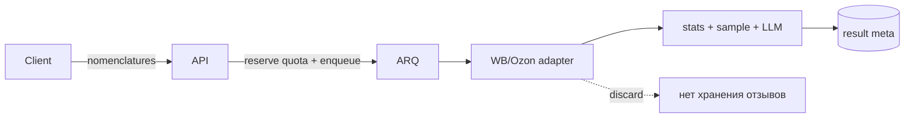
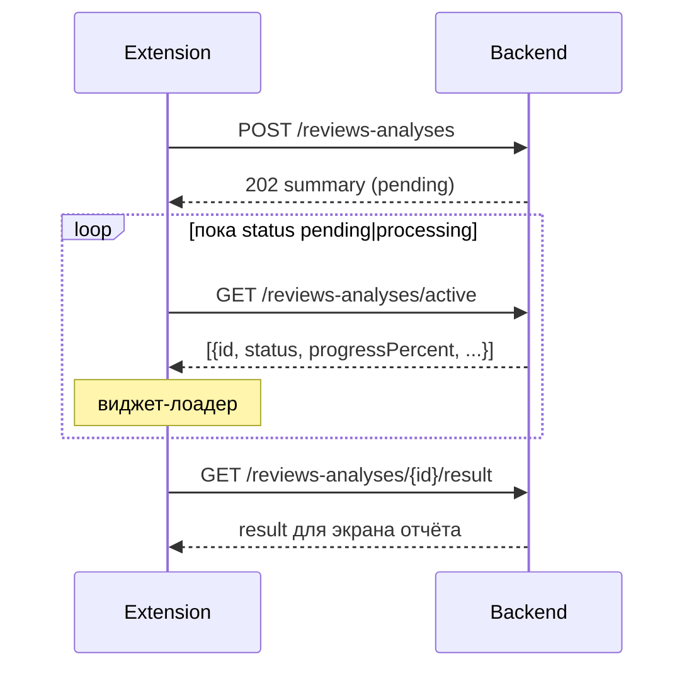

# Анализ отзывов и вопросов по товарам маркетплейсов

## Назначение

Модуль `reviews_analysis` запускает AI-анализ отзывов и вопросов по одной или нескольким номенклатурам.

Сырые отзывы **не хранятся**: backend загружает их с маркетплейса на время job, считает статистику, делает выборку для LLM и сохраняет только агрегированный результат.

## Поток

1. `POST /api/v1/reviews-analyses` — reserve квоты, `202`, ARQ job.
2. Worker: fetch → gender → aggregate LLM → optional per-item → finalize → commit квоты.
3. `GET /api/v1/reviews-analyses/active` — виджет активных анализов.
4. `GET /api/v1/reviews-analyses/{id}` — статус / прогресс (без результата).
5. `GET /api/v1/reviews-analyses/{id}/result` — полный отчёт (`completed`).
6. `POST /api/v1/reviews-analyses/{id}/cancel` — отмена.

## Интеграция в Manager Portal

UI: Manager Portal → Анализ отзывов (`/reviews-analysis`).

- Список, создание, карточка со статусом и отчётом.
- Виджет активного анализа в оболочке портала (пока идёт обработка).
- Доступ по фиче тарифа `reviews_analysis` (`session.planFeatures`).
- Только клиентский API из таблицы выше; admin journal — отдельно в Admin Panel.

## Интеграция в браузерное расширение

Auth — как у остальных API расширения: `Authorization: Bearer <accessToken>`.  
Обновление токена — `POST /api/v1/auth/refresh`. Подробнее: [authentication.md](./authentication.md).

JSON — camelCase. Обёртка: `{ "data": ... }` или paginated `{ "items", "total", "page", "pageSize" }`.

### Рекомендуемый UX-сценарий

| Шаг | Запрос | Что делать на клиенте |
|-----|--------|------------------------|
| Запуск | `POST .../reviews-analyses` | Сохранить `id` из `data`, открыть виджет |
| Квота | `GET .../quota` | Показать остаток товаров за период |
| Виджет | `GET .../active` каждые 2–5 с | Если массив не пуст — лоадер; пуст — скрыть |
| Poll одного | `GET .../{id}` | Альтернатива active, если открыт конкретный анализ |
| Отчёт | `GET .../{id}/result` | Только после `status === "completed"` |
| Список | `GET .../reviews-analyses` | История: title, status, nm, даты |
| Отмена | `POST .../{id}/cancel` | По кнопке в виджете |

Не показывайте пользователю: имена моделей, токены, stage-коды пайплайна, quota/org internals, сырые ошибки инфраструктуры.

### Эндпоинты клиента

Базовый prefix: `/api/v1/reviews-analyses`.

#### `POST /` → `202`

Тело:

| Поле | Тип | Обязательный | Описание |
|------|-----|--------------|----------|
| `marketplace` | string | да | Сейчас: `wb`. `ozon` — создание временно отключено (антибот на DC IP) |
| `nomenclatures` | number[] | да | 1…50 артикулов |
| `organizationId` | uuid \| null | нет | Нужен при неоднозначном seat (иначе 409) |
| `sampleSize` | number \| null | нет | Размер выборки; иначе default из настроек |
| `splitByItems` | boolean | нет | default `true` |
| `includeRecommendations` | boolean | нет | default `true` |
| `mode` | `"full"` \| `"budget"` | нет | default `full` |
| `title` | string \| null | нет | Заголовок в списке |
| `dateFrom` / `dateTo` | string \| null | нет | Фильтр дат (если поддерживается источником) |

Ответ: `ReviewsAnalysisSummary` (см. ниже).

Лимит тарифа — число **товаров** (артикулов) за период (`max_reviews_products_per_period`), не число запусков и не токены. Каждый артикул в запросе списывает 1 единицу, в том числе при повторном анализе того же товара. При исчерпании квоты create вернёт ошибку лимита.

#### `GET /quota`

Query: `organizationId` (опционально).

Ответ `data`:

| Поле | Тип | Описание |
|------|-----|----------|
| `limit` | number \| null | Лимит товаров; `null` — безлимит |
| `used` | number | Зарезервировано + списано за период |
| `remaining` | number \| null | Остаток; `null` при безлимите |
| `periodStart` / `periodEnd` | datetime | Границы расчётного периода |
| `organizationId` | uuid \| null | Org seat, если применимо |
| `quotaMode` | string | `per_member_seat` \| `shared_pool` |

#### `GET /`

Query: `page` (≥1), `pageSize` (1…100, alias `pageSize`), `status` (опционально).

Ответ: paginated список `ReviewsAnalysisSummary`.

#### `GET /active`

Ответ `data`: массив `ReviewsAnalysisActiveItem` — только `pending` и `processing` текущего пользователя.

| Поле | Тип | Описание |
|------|-----|----------|
| `id` | uuid | Идентификатор анализа |
| `status` | `"pending"` \| `"processing"` | Состояние |
| `marketplace` | string | Маркетплейс |
| `nomenclatures` | number[] | Артикулы |
| `title` | string \| null | Заголовок |
| `progressPercent` | number | 0…100 для лоадера |

#### `GET /{analysisId}`

Ответ: `ReviewsAnalysisSummary`.

| Поле | Тип | Описание |
|------|-----|----------|
| `id` | uuid | Идентификатор |
| `status` | `"pending"` \| `"processing"` \| `"completed"` \| `"error"` \| `"cancelled"` | Статус |
| `marketplace` | string | Маркетплейс |
| `nomenclatures` | number[] | Артикулы |
| `title` | string \| null | Заголовок |
| `progressPercent` | number | Прогресс 0…100 |
| `reviewsCount` | number \| null | После обработки |
| `questionsCount` | number \| null | После обработки |
| `errorMessage` | string \| null | Пользовательский текст при `error` |
| `createdAt` | datetime | Создан |
| `completedAt` | datetime \| null | Завершён / ошибка / отмена |

В summary **нет** `result`, модели LLM, cost, quota ids, внутренних stage.

#### `GET /{analysisId}/result`

Только для `status === "completed"` и непустого результата.

| Поле | Тип | Описание |
|------|-----|----------|
| `id` | uuid | Идентификатор |
| `status` | `"completed"` | Всегда completed |
| `marketplace` | string | Маркетплейс |
| `nomenclatures` | number[] | Артикулы |
| `title` | string \| null | Заголовок |
| `reviewsCount` | number \| null | Число отзывов |
| `questionsCount` | number \| null | Число вопросов |
| `result` | object | Агрегированный отчёт (stats, llm, warnings, …) |
| `createdAt` | datetime | Создан |
| `completedAt` | datetime \| null | Завершён |

Если анализ ещё идёт или без результата → `409 CONFLICT` («Результат анализа ещё не готов»).  
Чужой / несуществующий id → `404`.

Структура `result` ориентирована на UI отчёта (статистика, сильные/слабые стороны, рекомендации, предупреждения). Поля warnings содержат пользовательские сообщения; коды warnings — для логики клиента (скрытие секций), не для прямого показа как tech error.

#### `POST /{analysisId}/cancel`

Ответ: обновлённый `ReviewsAnalysisSummary`.

### Типовые ошибки (клиенту)

| HTTP | Смысл для UI |
|------|----------------|
| 401 | Нужно войти / обновить токен |
| 403 | Нет доступа / раздел выключен |
| 404 | Анализ не найден |
| 409 | Нужен `organizationId` или результат ещё не готов |
| 400 | Некорректный запрос (маркетплейс, nm, лимиты) |

## Квоты

Фича тарифа: `reviews_analysis` (`user_or_org_seat`).  
Лимит: `max_reviews_products_per_period` (+ докупка add-on `reviews_products_per_period`).

Единица списания — товар в запуске: `units = len(nomenclatures)`.  
Повторный анализ того же артикула снова расходует лимит (каждый запуск вызывает модель).

Режим в настройках раздела (`quotaMode`):

| Режим | Поведение |
|-------|-----------|
| `per_member_seat` (default) | У каждого участника org свой лимит товаров = лимит тарифа owner. 2 org → 2 независимых пула. |
| `shared_pool` | Все seat-запуски едят общий пул товаров owner. |

Анализ всегда привязан к пользователю, который запустил. При неоднозначности seat нужен `organizationId` (иначе 409).

Клиентский остаток: `GET /api/v1/reviews-analyses/quota?organizationId=…`.

## Настройки раздела (admin)

`GET/PATCH /api/v1/admin/reviews-analysis/settings`  
Не `platform_settings`. Секреты OpenRouter только в `.env` на сервере (не в клиентских ответах).

LLM HTTP timeout: 600 с (connect 30 с). На `ReadTimeout` — не больше 2 попыток; на 5xx upstream — до 3. Для долгих запросов через HTTP-прокси нужен высокий idle/request timeout прокси (иначе обрыв до ответа).

## Журнал анализов (admin)

UI: Admin Panel → Анализ отзывов → Анализы.

| Метод | Path | Назначение |
|-------|------|------------|
| GET | `/api/v1/admin/reviews-analysis/analyses` | Список с фильтрами |
| GET | `/api/v1/admin/reviews-analysis/analyses/{id}` | Детали + параметры запуска |
| GET | `/api/v1/admin/reviews-analysis/analyses/{id}/result` | Полный result (только completed) |
| POST | `/api/v1/admin/reviews-analysis/analyses/{id}/cancel` | Отмена (без проверки владельца) |

Query списка: `page`, `pageSize`, `status`, `marketplace`, `search` (email / имя / id анализа / title / артикул).

В ответе для админа допустимы служебные поля (`llmModel`, `progressStage`, cost, quota flags) — это панель поддержки, не клиентское UI.

## Wildberries (публичный источник)

Адаптер повторяет поток сайта, не seller API:

1. `nm` → `imt_id`: basket CDN `GET https://{host}/vol{vol}/part{part}/{nm}/info/ru/card.json`
   (`vol = nm // 100000`, `part = nm // 1000`; host из `cdn.wbbasket.ru/api/v3/upstreams` →
   `origin.mediabasket_route_map`, fallback — `shard-list.json` / статическая таблица диапазонов).
2. Хост отзывов: `GET https://feedback-bt.wildberries.ru/feedback/api/v2/host?imt={imt}` → `https://feedback-view-NN.wb.ru`.
3. Отзывы: `GET {host}/feedbacks/v2/{imt}` (параметр — **imt**). Публично ~до 1000 отзывов на карточку; фильтр по запрошенным nm.
4. Вопросы: `https://questions.wildberries.ru/api/v1/questions?imtId={imt}`.
5. Медиа: `photos[]`, `video`; legacy `photo` учитывается.

Fallback-хосты: `feedbacks1.wb.ru`, `feedbacks2.wb.ru`.

## Ozon (публичный источник)

Seller API не подходит: нужны отзывы любого товара, не только своего кабинета.

Адаптер ходит в публичный composer-api витрины:

1. Отзывы: `GET .../page/json/v2?url=/product/{id}/reviews/?sort=published_at_desc&page=1`
   Пагинация: не наращивать `page` вручную — без `page_key` виджет `webListReviews` пропадает.
   Следующая страница — из `paging.nextButton` (например `?page=2&page_key=...&sort=published_at_desc`).
2. Вопросы: `.../questions/?page={n}` (`paging.type=loadMore`, `page` без `page_key` работает).
3. Виджеты: `webListReviews-*`, `webListQuestions-*` в `widgetStates` (значение — JSON-строка или объект).

Маппинг в канон:

| Ozon | Review / Question |
|------|-------------------|
| `uuid` / `id` | `comment_id` / `question_id` |
| `itemId` | `nomenclature` |
| `content.score` | `product_valuation` |
| `content.comment` / `positive` / `negative` | текст / pros / cons |
| `publishedAt` (unix) | `feedback_date` ISO |
| ответы продавца в `comments.list` | `answer_text` |

Антибот (Variti): обычный Python TLS (`httpx`) даёт `307`/`403` даже с валидной cookie —
отсев по отпечатку клиента. Адаптер ходит через `curl_cffi` с impersonate Chrome и
следует редиректам `__rr=N`.

Настройки:

- `OZON_COMPOSER_COOKIE` — Cookie-строка витрины (одна строка в кавычках в `.env`)
- `OZON_HTTP_PROXY_URL` — опциональный HTTP-прокси; env `HTTP_PROXY`/`HTTPS_PROXY` намеренно не читаются (`trust_env=false`)

### Какие cookies нужны

Снимать лучше заголовок `Cookie` с **успешного** (`200`) запроса
`/api/composer-api.bx/page/json/v2` (DevTools → Network), а не «все cookies домена наугад».
Туда попадут и HttpOnly.

| Cookie | Роль | Обязательность | Срок (ориентир) |
|--------|------|----------------|-----------------|
| `abt_data` | антибот Variti | **критично** — без неё типичен `307` | короткий: часы…дни; «хрупкая», часто протухает первой |
| `rfuid` | антибот / device fingerprint | **критично** — без неё типичен `307` | короткий / средний |
| `__Secure-access-token` | сессия витрины | нужна для стабильной сессии | дни…недели; в значении есть метка выдачи |
| `__Secure-refresh-token` | обновление сессии | желательна вместе с access | как у access |
| `xcid` | client id витрины | желательна | долгая |
| `__Secure-ext_xcid` | связанный client id | желательна | долгая |
| `__Secure-ETC` | edge/client token | желательна; в Set-Cookie встречался срок ~1 год | долгая (~год) |
| `__Secure-user-id` | id пользователя (`0` = гость) | необязательна сама по себе | как сессия |
| `__Secure-ab-group` | A/B | не критична | долгая |
| `is_cookies_accepted` | согласие на cookies | не критична | долгая |
| `ADDRESSBOOKBAR_*` и прочий UI | виджеты витрины | не нужны для composer-api | разные |

Практичный минимум для `OZON_COMPOSER_COOKIE`: `abt_data` + `rfuid` + access/refresh + `xcid`/`__Secure-ETC`.
Полная строка с успешного composer-запроса предпочтительнее ручной «сборки».

Точные `Expires` / `Max-Age` — в браузере: Application → Cookies → `ozon.ru`.
При массовых `ozon_composer.antibot` в логах — обновить cookie (и при необходимости прокси с тем же egress, с которого снимали сессию).

Идентификатор номенклатуры — storefront `product_id` / `itemId` (целое число, совместимо с `nomenclatures[]`).

## Ограничения

- До 5000 отзывов на анализ (настраивается, потолок 5000).
- Несколько номенклатур с первого дня.
- Marketplace-agnostic канон Review/Question; адаптеры WB и Ozon.
- WB публично отдаёт срез (~1000) отзывов по imt — полный `feedbackCount` с карточки больше.
- Ozon: адаптер есть, но **создание анализа временно отключено** (Variti на типичном DC IP режет composer-api даже с cookie с той же машины).

## Масштабирование

- Горизонтально: больше ARQ workers.
- Новый маркетплейс: адаптер `ReviewsSource` + factory.
- Смена LLM: только admin settings / OpenRouter на сервере.
