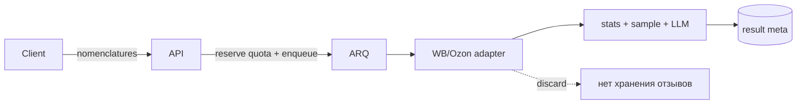

# Анализ отзывов и вопросов по товарам маркетплейсов

## Назначение

Модуль `reviews_analysis` запускает AI-анализ отзывов и вопросов по одной или нескольким номенклатурам.

Сырые отзывы **не хранятся**: backend загружает их с маркетплейса на время job, считает статистику, делает выборку для LLM и сохраняет только агрегированный результат.

## Поток



1. `POST /api/v1/reviews-analyses/estimate` — оценка по counts (без записи).
2. `POST /api/v1/reviews-analyses` — reserve квоты, 202, ARQ job.
3. Worker: fetch → gender → aggregate LLM → optional per-item → finalize → commit квоты.
4. `GET /api/v1/reviews-analyses/{id}` — статус / прогресс / результат.
5. `POST /api/v1/reviews-analyses/{id}/cancel` — отмена.

## Квоты

Фича тарифа: `reviews_analysis` (`user_or_org_seat`).  
Лимит: `max_reviews_analyses_per_period` (+ докупка add-on).

Режим в настройках раздела (`quotaMode`):

| Режим | Поведение |
|-------|-----------|
| `per_member_seat` (default) | У каждого участника org свой лимит = лимит тарифа owner. 2 org → 2 независимых пула. |
| `shared_pool` | Все seat-запуски едят общий пул owner. |

Анализ всегда привязан к `requestedByUserId`. При неоднозначности seat нужен `organizationId` (иначе 409).

## Настройки раздела

`GET/PATCH /api/v1/admin/reviews-analysis/settings`  
Не `platform_settings`. Секреты OpenRouter только в `.env`:

- `OPENROUTER_API_KEY`
- `OPENROUTER_BASE_URL`
- `OPENROUTER_PROXY_URL`

LLM HTTP timeout: 600 с (connect 30 с). На `ReadTimeout` — не больше 2 попыток; на 5xx upstream — до 3.

## Wildberries (публичный источник)

Адаптер `WildberriesReviewsSource` повторяет поток сайта, не seller API:

1. `nm` → `root` (imt): `GET https://card.wb.ru/cards/v4/detail?...&nm={nm}`.
2. Хост отзывов: `GET https://feedback-bt.wildberries.ru/feedback/api/v2/host?imt={root}` → список `https://feedback-view-NN.wb.ru`.
3. Отзывы: `GET {host}/feedbacks/v2/{root}` (параметр — **imt**, не nm). Публично ~до 1000 отзывов на карточку без пагинации; в ответе бывают отзывы всех nm одного imt — адаптер фильтрует по запрошенным номенклатурам.
4. Вопросы: `https://questions.wildberries.ru/api/v1/questions?imtId={root}` (с nm count=0).
5. Медиа в отзыве: `photos[]` (объекты с `key`) и `video` (`{id, ...}`); legacy `photo` тоже учитывается.

Fallback-хосты: `feedbacks1.wb.ru`, `feedbacks2.wb.ru` с тем же path.

## Ограничения

- До 5000 отзывов на анализ (настраивается, потолок 5000).
- Несколько номенклатур с первого дня.
- Marketplace-agnostic канон `Review`/`Question`; сейчас реализован WB, Ozon — stub ошибки.
- WB публично отдаёт только срез (~1000) отзывов по imt — полный `feedbackCount` с карточки больше.

## Тестовая HTML-страница

Standalone-макет для проверки UI и API (без client app):

`backend/src/markethacker/modules/reviews_analysis/static/reviews-analysis-test.html`

Открыть через одноразовый прокси (без правок CORS backend):

```bash
cd backend/src/markethacker/modules/reviews_analysis/static
python3 reviews-analysis-test-proxy.py
```

Браузер: `http://127.0.0.1:8765/` (API base = `/api/v1`).  
По умолчанию — mock из `market-navigators/src/routes/reviews-analysis.tsx`.  
Панель: `estimate` / создать анализ / poll / вставка JSON (`Bearer`).

## Масштабирование

- Горизонтально: больше ARQ workers.
- Новый маркетплейс: адаптер `ReviewsSource` + factory.
- Смена LLM: модель в admin settings / OpenRouter.
