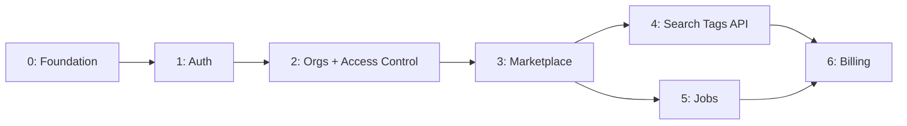

# Дорожная карта реализации

## Этапы

| Этап | Название | Результат |
|:----:|----------|-----------|
| 0 | Foundation | Запускаемый скелет проекта |
| 1 | Auth | Extension может логиниться |
| 2 | Orgs + Access Control | Мультиарендность, owner-based доступ |
| 3 | Marketplace Accounts | Привязка WB/Ozon |
| 4 | Search Tags API | Extension показывает поисковые запросы WB |
| 5 | Background Jobs | Актуальные данные с MP |
| 6 | Billing | Монетизация |

---

## Этап 0: Foundation

**Цель:** запускаемый скелет с инфраструктурой.

### Задачи

- [ ] Инициализация проекта (`pyproject.toml`, uv)
- [ ] Структура каталогов (см. [Структура проекта](./structure.md))
- [ ] FastAPI app factory + health endpoints
- [ ] Docker Compose (PostgreSQL + Redis)
- [ ] SQLAlchemy + Alembic setup
- [ ] Базовые settings (pydantic-settings)
- [ ] CI pipeline (lint, typecheck)
- [ ] `.env.example`

### Критерий готовности

```bash
docker compose up -d && curl http://localhost:8000/health
# → {"status": "ok"}
```

---

## Этап 1: Auth

**Цель:** регистрация, вход, refresh — extension может аутентифицироваться.

### Задачи

- [ ] Модель `User` + миграция
- [ ] Password hashing (Argon2id)
- [ ] `POST /auth/register` — user + org + membership
- [ ] `POST /auth/login` — выдача JWT
- [ ] `POST /auth/refresh` — rotation
- [ ] `POST /auth/logout` — отзыв токена
- [ ] JWT middleware
- [ ] Rate limiting на auth endpoints
- [ ] Тесты: register → login → refresh → logout

### Критерий готовности

Extension выполняет login и получает рабочий access token.

---

## Этап 2: Organizations + Access Control

**Цель:** мультиарендность, доступ без ролей — владение org + явные гранты (см. [Контроль доступа](./access-control.md)).

### Задачи

- [x] Модели: `Organization` (с `owner_id`), `Membership` (без роли)
- [x] `OrganizationAccess.assert_owner` / `assert_member` — вместо `authorize()` по permission
- [x] CRUD organizations, включая `DELETE` (только владелец)
- [x] Invite / remove members, приглашения с `account_grants`
- [x] `require_org_path_context` — членство + RLS из `org_id` в пути (без `switch-org` и `org_id` в JWT)
- [x] PostgreSQL RLS policies
- [x] Audit log (базовый)

### Критерий готовности

Владелец организации управляет ей единолично; другие участники получают доступ только к явно выданным кабинетам/разделам.

---

## Этап 3: Marketplace Accounts

**Цель:** привязка кабинетов WB/Ozon, безопасное хранение credentials.

### Задачи

- [x] Модели: `MarketplaceAccount`, `MarketplaceCredentialVault`
- [x] AES-256-GCM encryption service
- [x] `POST /marketplace-accounts` — создание (`marketplace`, `displayName`; один кабинет на MP в org)
- [x] `GET /marketplace-accounts` — список (без credentials)
- [x] `DELETE /marketplace-accounts/{id}` — деактивация (`archived`) + отзыв всех WB Gateway-сессий
- [x] WB Gateway — reverse proxy к seller.wildberries.ru, JWT-сессия с Redis revocation, default-deny ACL (`wb_gateway/domain/access_policy.py`)
- [x] WB Connect (Guided Connect) — popup-привязка WB без DevTools, onboarding subdomain-прокси
- [x] Section permissions — 6 групп меню WB (`wb_gateway/domain/access_policy.py`, `marketplace_accounts/domain/wb_menu_groups.py`)
- [x] Явные member-access гранты (`UserMarketplaceAccount`, `UserMarketplaceSectionAccess`) вместо ReBAC `resource_access`
- [x] Приглашения с account grants и section permissions
- [ ] Адаптеры: Wildberries API client (полная синхронизация)
- [ ] Адаптеры: Ozon API client (базовый)

### Критерий готовности

Пользователь привязывает кабинет WB, credentials зашифрованы в БД, API возвращает список аккаунтов.

---

## Этап 4: Search Tags API

**Цель:** read-only API по поисковым запросам WB из ClickHouse (данные парсера).

### Задачи

- [x] Модуль `search_tags` — query objects, mappers, service
- [x] `GET /search-tags/queries` — постраничный список с фильтрами
- [x] `GET /search-tags/queries/monthly` — метрики с `MetricDelta`
- [x] Право `search_tags:read` для системных ролей
- [x] Redis-кэш (`@cached_read`) для ClickHouse-запросов
- [x] Admin: `GET /admin/parser/wb-search-tags`
- [ ] Генерация TypeScript типов для extension
- [ ] API client в extension-chrome

### Критерий готовности

Extension отображает список и monthly-аналитику по поисковым запросам WB.

> Удалён устаревший модуль `analytics` (PG-таблицы заказов/кампаний, permissions `analytics:*`). Данные MP-sync — в этапе 5.

---

## Этап 5: Background Jobs

**Цель:** автоматическая синхронизация данных с маркетплейсов.

### Задачи

- [ ] ARQ worker setup
- [ ] `sync_marketplace_orders` task
- [ ] `sync_ad_campaigns` task
- [ ] `refresh_marketplace_tokens` task
- [ ] `aggregate_analytics` task (планируется; не связан с Search Tags API)
- [ ] Retry + DLQ
- [ ] Cron scheduling
- [ ] Мониторинг: queue depth, failed jobs

### Критерий готовности

Данные обновляются автоматически каждые 15-30 минут без ручного вмешательства.

---

## Этап 6: Billing

**Цель:** подписки, лимиты, монетизация.

### Задачи

- [x] Модель `Subscription` (plan, status, period)
- [x] Интеграция с платёжной системой (ЮKassa / Stripe)
- [x] Лимиты по plan (кол-во accounts, members)
- [x] ABAC: проверка plan при доступе к features
- [x] Webhook для payment events
- [x] Фоновая сверка статуса платежей (ARQ defer + cron)
- [x] `GET /billing/subscription` — текущий план
- [x] `POST /billing/subscription/upgrade` — оформление подписки
- [x] `POST /billing/payments/{id}/verify` — ручная проверка оплаты
- [x] Промокоды: `discount`, `trial`, `free_period`, `limits_boost`
- [x] `POST /billing/promo/validate`, `POST /billing/promo/redeem`
- [x] Годовая подписка (`billing_period: yearly`) в checkout
- [x] Admin CRUD промокодов (`/admin/billing/promo-codes`)
- [x] Org-seat для `browser_extension` / `search_tags` (`resolve_user_feature_keys`)
- [x] Product promotions: баннеры в Manager Portal (`/promotions/*`, admin CRUD)

### Критерий готовности

Пользователь на free plan не может подключить более N аккаунтов; upgrade через оплату.
Участник org наследует доступ к расширению с тарифа владельца; в портале — управляемые CTA.

---

## Зависимости между этапами



Этапы 4 и 5 могут выполняться параллельно после завершения этапа 3.
