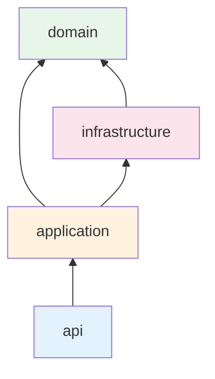

# Структура проекта

## Дерево каталогов

```
backend/
├── src/
│   └── markethacker/
│       ├── main.py                 # FastAPI app factory
│       ├── config/                 # Settings (pydantic-settings)
│       ├── shared/                 # Общие утилиты, exceptions, types
│       ├── infrastructure/         # DB, Redis, encryption, external clients
│       │   ├── database/
│       │   ├── cache/
│       │   ├── security/
│       │   └── marketplace/        # WB/Ozon API adapters
│       └── modules/                # Bounded contexts
│           ├── auth/
│           ├── users/
│           ├── organizations/
│           ├── marketplace_accounts/
│           ├── permissions/
│           ├── analytics/
│           └── billing/
├── alembic/
├── tests/
├── docker/
├── pyproject.toml
└── README.md
```

## Структура модуля (bounded context)

Каждый модуль в `modules/` следует единому шаблону:

```
modules/auth/
├── api/              # routers, request/response schemas
├── application/      # use cases (services)
├── domain/           # entities, value objects, domain events
└── infrastructure/   # repositories impl
```

### Слои и зависимости



| Слой | Ответственность | Зависит от |
|------|-----------------|------------|
| `domain` | Бизнес-правила, сущности | Ничего (чистый слой) |
| `application` | Use cases, оркестрация | `domain` |
| `infrastructure` | БД, внешние API, кэш | `domain` (реализует интерфейсы) |
| `api` | HTTP, валидация входа/выхода | `application` |

**Правило:** `domain` не импортирует `infrastructure` и `api`.

## Модули и их зона ответственности

| Модуль | Зона ответственности |
|--------|----------------------|
| `auth` | Login, logout, refresh, MFA, управление сессиями |
| `users` | Профиль пользователя, настройки |
| `organizations` | CRUD организаций, приглашения, membership |
| `permissions` | Роли, permissions, проверка доступа |
| `marketplace_accounts` | Привязка WB/Ozon, хранение credentials |
| `analytics` | Агрегаты, отчёты, read-only API для extension |
| `billing` | Подписки, тарифы, лимиты, ЮKassa/Stripe |

## Shared и Infrastructure

### `shared/`

- Базовые исключения (`NotFoundError`, `PermissionDeniedError`)
- Общие типы (`UUID`, пагинация)
- Утилиты (datetime, id generation)

### `infrastructure/`

- `database/` — SQLAlchemy engine, session factory, base model
- `cache/` — Redis client, декораторы кэширования
- `security/` — JWT, encryption, password hashing
- `marketplace/` — адаптеры API Wildberries и Ozon

## Конфигурация

Настройки через `pydantic-settings`, загрузка из env:

```python
# config/settings.py
class Settings(BaseSettings):
    model_config = SettingsConfigDict(env_file=".env")

    database_url: str
    redis_url: str
    jwt_secret: str
    jwt_access_ttl_minutes: int = 15
    jwt_refresh_ttl_days: int = 30
    encryption_key: str
```

Секреты никогда не коммитятся — только `.env.example` с описанием переменных.

## Тесты

```
tests/
├── unit/           # domain, application (без БД)
├── integration/    # API + PostgreSQL (testcontainers)
└── conftest.py     # fixtures
```
