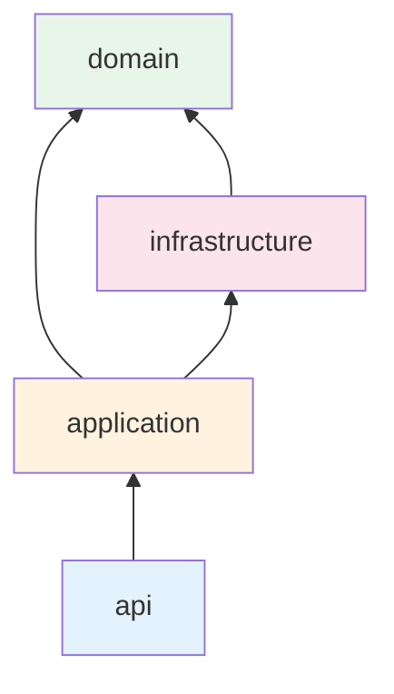

# Структура проекта

## Дерево каталогов

```
backend/
├── src/
│   └── markethacker/
│       ├── main.py                 # FastAPI app factory
│       ├── config/                 # Settings (pydantic-settings)
│       ├── shared/                 # Общие утилиты, exceptions, types
│       ├── infrastructure/         # DB, Redis, encryption, external clients
│       │   ├── database/
│       │   ├── cache/                # generic: redis, json_cache, @cached_read
│       │   ├── clickhouse/
│       │   ├── security/
│       │   └── jobs/
│       └── modules/                # Bounded contexts
│           ├── auth/
│           ├── users/
│           ├── organizations/
│           ├── marketplace_accounts/
│           ├── search_tags/
│           ├── billing/
│           ├── admin/
│           ├── wb_connect/
│           └── wb_gateway/
├── alembic/
├── tests/
├── docker/
├── pyproject.toml
└── README.md
```

## Структура модуля (bounded context)

Каждый модуль в `modules/` следует единому шаблону:

```
modules/auth/
├── api/              # routers, request/response schemas
├── application/      # use cases (services)
├── domain/           # entities, value objects, domain events
└── infrastructure/   # repositories, cached/*, clickhouse/queries
```

Для кэшируемых read-операций политика объявляется **рядом с источником данных** (`@cached_read` в query-файле или `infrastructure/cached/<op>.py`), а не в общем `cache.py` модуля. Подробнее: [Кэширование](./caching.md).

### Слои и зависимости



| Слой | Ответственность | Зависит от |
|------|-----------------|------------|
| `domain` | Бизнес-правила, сущности | Ничего (чистый слой) |
| `application` | Use cases, оркестрация | `domain` |
| `infrastructure` | БД, внешние API, кэш | `domain` (реализует интерфейсы) |
| `api` | HTTP, валидация входа/выхода | `application` |

**Правило:** `domain` не импортирует `infrastructure` и `api`.

## Модули и их зона ответственности

| Модуль | Зона ответственности |
|--------|----------------------|
| `auth` | Login, logout, refresh, MFA, управление сессиями |
| `users` | Профиль пользователя, настройки |
| `organizations` | CRUD организаций, роли, приглашения, membership |
| `marketplace_accounts` | Привязка WB/Ozon, хранение credentials |
| `search_tags` | Поисковые запросы WB (ClickHouse, read-only) |
| `billing` | Подписки, тарифы, лимиты, промокоды, ЮKassa/Stripe |
| `admin` | Админ-панель, управление тарифами и парсером |
| `wb_connect` | Guided Connect — первичная привязка кабинета WB (onboarding subdomain-прокси) |
| `wb_gateway` | Reverse proxy к seller.wildberries.ru для уже подключённых кабинетов |

## Shared и Infrastructure

### `shared/`

- Базовые исключения (`NotFoundError`, `PermissionDeniedError`, `ClickHouseUnavailableError`)
- Общие схемы: `PaginatedResponse`, `MetricDelta`, `APIResponse`
- Утилиты метрик: `shared/metrics.py` (`count_metric_delta`, `rate_metric_delta`)
- Утилиты (datetime, id generation)

### `infrastructure/`

- `database/` — SQLAlchemy engine, session factory, base model
- `cache/` — Redis client, JSON cache-aside, декоратор `@cached_read` (см. [Кэширование](./caching.md))
- `clickhouse/` — общий read-only слой для данных парсера:
  - `client.py` — singleton `clickhouse_connect`
  - `support.py` — `require_clickhouse_client()`, `build_where_clause()`, парсеры типов
  - `tables.py` — имена таблиц (`WB_SEARCH_TAGS_TABLE`)
- `security/` — JWT, encryption, password hashing
- `jobs/` — ARQ worker

### ClickHouse в модулях

SQL и read models живут **в модуле-владельце**, не в общем repository:

```
modules/search_tags/infrastructure/clickhouse/
├── models.py
├── mappers.py
└── queries/
    ├── list_search_queries.py          # Query.execute() + @cached_read fetch()
    └── get_latest_monthly_by_query.py

modules/admin/infrastructure/clickhouse/
├── models.py
├── mappers.py
└── queries/
    └── list_parser_wb_search_tags.py   # с фильтрами auth_profile / org / account
```

Поток: `api/router` → `application/service` → `query.fetch()` (кэш) → `Query.execute()` (sync `client.query`) → `mappers`. Синхронный клиент не блокирует event loop: `@cached_read(sync=True)` выполняет `execute()` в thread pool.

## Конфигурация

Настройки через `pydantic-settings`, загрузка из env:

```python
# config/settings.py
class Settings(BaseSettings):
    model_config = SettingsConfigDict(env_file=".env")

    database_url: str
    redis_url: str
    jwt_secret: str
    jwt_access_ttl_minutes: int = 15
    jwt_refresh_ttl_days: int = 30
    encryption_key: str
    cache_enabled: bool = True   # TTL — в @cached_read у каждой операции
```

Секреты никогда не коммитятся — только `.env.example` с описанием переменных.

## Тесты

```
tests/
├── unit/           # domain, application (без БД)
├── integration/    # API + PostgreSQL (testcontainers)
└── conftest.py     # fixtures
```
