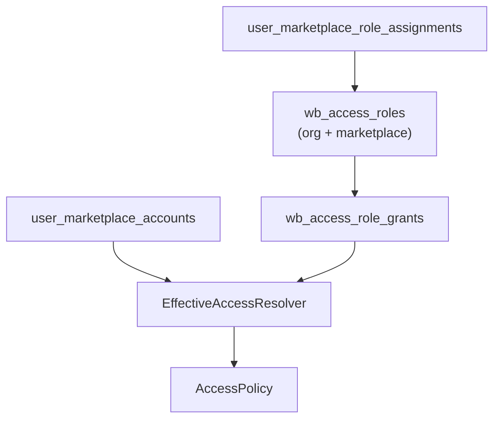

# Именованные роли доступа к кабинетам маркетплейсов

Дополнение к [модели доступа к кабинетам MP](./marketplace-access-model.md).
Права Manager Portal (owner / membership / billing) **не меняются** —
см. [Контроль доступа](./access-control.md).

## Обзор

Источник истины прав на разделы и возможности кабинета — **org-scoped
именованные роли** (`wb_access_roles`) с нормализованными grants и назначением
`(user, marketplace_account) → role`.

Роль **привязана к маркетплейсу** (`wildberries` | `ozon`): каталог разделов/
capabilities и назначение на кабинет всегда в рамках одного MP. Роль WB
нельзя назначить на кабинет Ozon и наоборот.

| Сущность | Назначение |
|---|---|
| `wb_access_roles` | Display `name` + technical `key` + `marketplace`; unique `(org_id, marketplace, key)` |
| `wb_access_role_grants` | scoped resource/action rows |
| `user_marketplace_role_assignments` | одна роль на пару user×кабинет |

Таблица `user_marketplace_section_access` сохранена для миграции/legacy
write-through (deprecated PUT sections); runtime enforcement читает **только**
role grants.

При создании кабинета владельцу назначается системная роль `full_access`
для соответствующего маркетплейса.

## Уровни ограничений (scope_type)

| scope_type | Phase | Смысл |
|---|---|---|
| `cabinet` | реализован | Разделы + capabilities на весь кабинет |
| `brand` | схема готова | capability по бренду (`scope_id` + `marketplace_account_id`) |
| `article` | схема готова | capability по артикулу / nm_id |

Правило оценки: **most-specific wins** (article > brand > cabinet); если на
узком scope нет grant по ресурсу — fallback к широкому; иначе deny-by-default.

## Resource types

Каталог зависит от маркетплейса (`GET .../permissions-catalog?marketplace=`):

| MP | `wb_section` (разделы меню) | `capability` |
|---|---|---|
| Wildberries | группы меню seller.wildberries.ru (`growth`, `products`, …) | `prices`, `reviews`, `ads`, `supplies` (с родительским section) |
| Ozon | заказы, аналитика, реклама, финансы, товары | пока пусто (зарезервировано) |

Семантика section × capability:

1. Нет section read → весь section и связанные capability запрещены.
2. Путь с `capability_key` требует и section, и capability.
3. Capability grant без родительской section — 422 при сохранении роли.

## UI (Manager Portal)

| Раздел | Путь | Назначение |
|---|---|---|
| Команда → Участники | `/team` | Участники, приглашения, опционально роль при invite |
| Команда → Роли доступа | `/team/roles` | CRUD ролей и редактор grants (фильтр по MP) |
| Кабинет | `/accounts/{id}` | Привязка менеджеров; текущая роль видна в таблице; назначение роли только из ролей этого MP |

## API

- `GET /organizations/{org}/wb-access/permissions-catalog?marketplace=`
- `GET /organizations/{org}/wb-access/roles?marketplace=` (опциональный фильтр)
- `CRUD /organizations/{org}/wb-access/roles` (create принимает `marketplace`)
- `PUT /organizations/{org}/wb-access/roles/{id}/grants`
- `PUT .../marketplace-accounts/{acc}/access/{user}/role` — роль должна совпадать с `account.marketplace`
- `GET .../access` — в ответе `roleId` / `roleKey` / `roleName`
- `GET .../access/{user}/effective`

Приглашения принимают `roleId` в `accountGrants` (роль должна совпадать с
маркетплейсом кабинета). Если в invite выбраны кабинеты разных MP — роль
в invite не задаётся, назначение на странице кабинета.

## Excel-импорт (зарезервировано)

Будущий импорт брендов/артикулов пишет batch в `wb_access_role_grants`
(тот же формат scope). Точки расширения: `AccessImportPort`, шаблон Excel,
`ImportValidationReport`, async job для больших файлов. UI Registry уровней
(`RestrictionLevelRegistry`) подключит brand/article без перестройки редактора.

## Enforcement

`GatewayService` → `resolve_member_acl` → `AccessPolicy(sections, capabilities)`.
Helper-subdomains (`seller-ads`, `seller-supply`, …) проверяются через
`evaluate_helper_host`.
