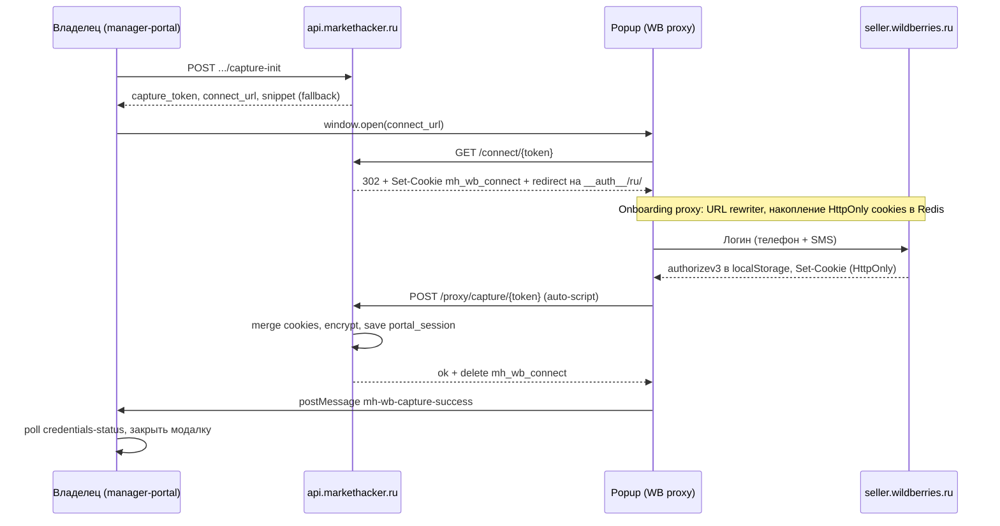

# WB Portal Proxy

Полное описание механизма reverse-proxy к `seller.wildberries.ru`, реализованного в MarketHacker.

---

## Назначение

WB Portal Proxy позволяет менеджерам работать в личном кабинете Wildberries **через безопасный прокси-сервер** без получения прямого доступа к учётным данным продавца.

| Проблема | Решение |
|----------|---------|
| Менеджер не должен знать API-ключ или cookies владельца | Credentials хранятся на сервере, менеджер их не видит |
| WB SPA требует живую сессию (JWT + cookies) | Владелец делает однократный «захват» сессии через **Guided Connect** (popup) или JS-сниппет (fallback) |
| WB использует HttpOnly-cookies (`wbx-validation-key`) | При Guided Connect прокси накапливает HttpOnly cookies server-side; cookie **не попадает в браузер менеджера** |
| Менеджер не должен переключать компанию / выходить из WB | Селектор профиля заменён статическим текстом; модалка «Профиль» заблокирована |
| WB SPA пытается выйти из сессии и редиректить на auth | JS-инжект блокирует logoff и auth-редиректы |

---

## Компоненты

```
team.markethacker.ru          wb-proxy.markethacker.ru
(manager-portal)               (WB Portal Proxy)
       │                              │
       │  POST /web-handshake         │
       ├──────────────────────►  api.markethacker.ru:8000
       │                              │  GET /api/v1/proxy/portal/*
       │                              │◄──────────────────────────
       │  callback_url redirect       │
       │◄─────────────────────        │
       │                              │
  browser открывает                   │
  wb-proxy.markethacker.ru            │
       │──────────────────────────────►
                                 Caddy rewrite → API
                                 API → seller.wildberries.ru
```

| Компонент | Технология | Описание |
|-----------|------------|----------|
| `wb-proxy.markethacker.ru` | Caddy → FastAPI | Публичный домен прокси |
| `portal_router.py` | FastAPI | Маршрутизация всех запросов к WB, guided connect |
| `portal_onboarding.py` | Python | Onboarding proxy: захват без DevTools |
| `portal_root_assets.py` + middleware | Python | Root-запросы WB (`/index.html`, `/auth/*`) во время connect |
| `portal_service.py` | Python | Бизнес-логика: сессии, права доступа |
| `wb_portal_client.py` | httpx | HTTP-клиент к `seller.wildberries.ru` и субдоменам |
| `portal_inject.py` | JS → HTML | JS-скрипт, инжектируемый в HTML-ответы WB |
| `wb_hosts.py` | Python | Маппинг WB-субдоменов → фиксированные URL-префиксы |

---

## Полный флоу открытия кабинета

```mermaid
sequenceDiagram
    participant M as Менеджер (браузер)
    participant MP as manager-portal
    participant API as api.markethacker.ru
    participant Caddy as wb-proxy.markethacker.ru (Caddy)
    participant WB as seller.wildberries.ru

    M->>MP: Нажать "Открыть кабинет WB"
    MP->>API: POST /api/v1/proxy/web-handshake
    API-->>MP: { callback_url, portal_url }

    M->>Caddy: GET /auth/callback?token=xxx
    Caddy->>API: GET /api/v1/proxy/portal/auth/callback?token=xxx
    API-->>M: 302 → / (Set-Cookie: mh_portal_token; Path=/; Secure)

    M->>Caddy: GET /
    Caddy->>API: GET /api/v1/proxy/portal/ (Cookie: mh_portal_token=...)
    API->>WB: GET https://seller.wildberries.ru/ (authorizev3 + credentials)
    WB-->>API: HTML
    API->>API: inject auth + guard + badge scripts
    API-->>M: HTML с inject-скриптами
```

## Безопасность credentials в прокси

Секретные данные WB **не передаются в браузер менеджера**. Модель разделения:

| Данные | Где живут | Кто видит |
|--------|-----------|-----------|
| `authorizev3`, `WBTokenV3` | localStorage / cookie браузера (bootstrap) | Браузер менеджера (только для WB SPA) |
| `wbx-validation-key`, `x-supplier-id`, `x-supplier-id-external` | PostgreSQL (AES-256-GCM), `SERVER_ONLY_COOKIE_KEYS` | Только сервер прокси |
| `mh_portal_token` | Cookie браузера менеджера | Привязка к proxy-сессии MarketHacker |

При каждом запросе к WB сервер **мержит** server-only cookies из vault с relay-cookies из браузера (`locale`). Менеджер не может подменить supplier id или validation key.

Константы: `portal_auth.py` → `SERVER_ONLY_COOKIE_KEYS`, `BROWSER_RELAY_COOKIE_KEYS`.

---

## Onboarding: захват portal-сессии

WB SPA использует:
- `authorizev3` JWT в `localStorage` — основной токен авторизации
- `wbx-validation-key` — HttpOnly-cookie (недоступна JS)
- `x-supplier-id` — ID поставщика в cookies и `localStorage`

### Guided Connect (рекомендуемый способ)

Владелец привязывает кабинет **без DevTools**: popup с логином WB через onboarding proxy.



| Шаг | Endpoint / действие | Описание |
|-----|---------------------|----------|
| 1 | `POST .../capture-init` | Одноразовый `capture_token` в Redis (TTL 30 мин), `connect_url` |
| 2 | `GET /proxy/portal/connect/{token}` | Cookie `mh_wb_connect`, редирект на `__auth__/ru/` |
| 3 | Onboarding proxy | Проксирует seller-auth и seller portal, копит `Set-Cookie` в Redis |
| 4 | `POST /proxy/capture/{token}` | JS auto-capture: JWT + cookies + накопленные HttpOnly |
| 5 | `GET .../credentials-status` | Manager-portal poll: `has_portal_session`, `portal_session_saved_at` |

**Cookies guided connect:**

| Cookie | Path | Назначение |
|--------|------|------------|
| `mh_wb_connect` | `/` | Временный capture-токен во время popup-логина |
| `mh_portal_token` | `/api/v1/proxy/portal` (dev) или `/` (prod) | Сессия менеджера в прокси после web-handshake |

После успешного capture `mh_wb_connect` удаляется (done-страница, ответ capture, или при следующем запросе к portal proxy, если токен уже потреблён). Просроченная `mh_wb_connect` **не блокирует** `mh_portal_token`.

**Manager-portal:** компонент `WbConnectModal` — popup без `noopener` (для `postMessage`), poll `credentials-status` по `portal_session_saved_at`, ручной сниппет в collapsible «DevTools».

### Fallback: JS-сниппет (DevTools)

Если Guided Connect не сработал, владелец может использовать сниппет из `capture-init`:

1. Открыть `seller.wildberries.ru` и войти.
2. Вставить сниппет в **DevTools Console**.
3. Сниппет читает `authorizev3` из `localStorage` и cookies из `document.cookie`.
4. Вручную скопировать `wbx-validation-key` из DevTools → Application → Cookies (prompt).
5. Отправить `{authorizev3, cookies}` на `POST /proxy/capture/{token}`.

### Хранение credentials

Данные шифруются (AES-256-GCM) и сохраняются в `marketplace_credentials` с типом `portal_session`.

```json
{
  "authorizev3": "eyJ...",
  "cookies": {
    "x-supplier-id": "123456",
    "wbx-validation-key": "abc...",
    "locale": "ru"
  },
  "local_storage": {
    "authorizev3": "eyJ...",
    "wb-eu-passport-v2.access-token": "eyJ...",
    "access-token": "eyJ..."
  }
}
```

---

## Прокси-сессия

Схема авторизации прокси использует краткоживущий Redis-токен:

```
1. web-handshake → создать proxy_session в Redis (TTL 1h)
                   → создать одноразовый callback_token (TTL 5m)
2. /auth/callback → exchange callback_token → установить cookie mh_portal_token
3. /{path} → проверить cookie: валидный mh_wb_connect → onboarding;
             иначе mh_portal_token → загрузить portal_auth из DB
```

| Сущность | Хранилище | TTL |
|----------|-----------|-----|
| `proxy_session` | Redis | 1 час |
| `callback_token` | Redis | 5 минут |
| `portal_capture` (+ cookies) | Redis | 30 минут (guided connect) |
| `mh_portal_token` | Cookie (браузер) | 1 час |
| `mh_wb_connect` | Cookie (браузер) | до завершения capture / 30 мин |
| `portal_session` credentials | PostgreSQL (AES-256-GCM) | бессрочно |

---

## URL-маршрутизация субдоменов WB

WB использует множество субдоменов. Каждый субдомен маппируется на фиксированный URL-префикс:

| WB-субдомен | Прокси-префикс |
|-------------|----------------|
| `seller.wildberries.ru` (основной) | `/` (корень прокси) |
| `seller-auth.wildberries.ru` | `/__auth__/` |
| `seller-supply.wildberries.ru` | `/__supply__/` |
| `seller-communications.wildberries.ru` | `/__comm__/` |
| `seller-analytics.wildberries.ru` | `/__analytics__/` |
| `seller-ads.wildberries.ru` | `/__ads__/` |
| `suppliers-portal-api.wildberries.ru` | `/__portalapi__/` |
| `passport.wildberries.ru` | `/__passport__/` |
| ... и другие | см. `wb_hosts.py` |

Неизвестные `*.wildberries.ru` и `*.wb.ru` субдомены обрабатываются через fallback — hostname используется напрямую как префикс (`/seller-new.wildberries.ru/...`).

### Rewrite в `rewrite_body`

Статические URL в HTML/JS переписываются при проксировании:
```
https://seller.wildberries.ru → https://wb-proxy.markethacker.ru
https://seller-auth.wildberries.ru → https://wb-proxy.markethacker.ru/__auth__
//seller-supply.wildberries.ru/ → https://wb-proxy.markethacker.ru/__supply__/
```

---

## JS-инжект (`portal_inject.py`)

В каждый HTML-ответ WB добавляются **три скрипта** перед первым `<script>` страницы:

| ID | Назначение |
|----|------------|
| `mh-portal-auth` | Auth bootstrap — токены, URL rewriter, перехват fetch/XHR |
| `mh-portal-guard` | Section guard — скрытие меню, блокировка API/навигации, замена профиля |
| `mh-proxy-badge` | Метка «Работает через MH» (левый нижний угол) |

Скрипты выполняются **до загрузки WB-кода**.

### 1. Auth bootstrap (`mh-portal-auth`)

**Pre-inject токенов (до WB-кода)**

В браузер попадают только `authorizev3` и `WBTokenV3` — **не** `x-supplier-id` и **не** `wbx-validation-key`:

```javascript
localStorage.setItem("wb-eu-passport-v2.access-token", token);
localStorage.setItem("access-token", token);
localStorage.setItem("authorizev3", token);
document.cookie = "WBTokenV3=" + token + "; path=/; max-age=86400; SameSite=Lax";
```

Секретные cookies добавляет сервер при проксировании запросов к WB.

**URL rewriter**

Перехватывает все WB-URL и переписывает через прокси-префиксы. Обрабатывает:
- Абсолютные URL (`https://seller-auth.wildberries.ru/...`)
- Protocol-relative (`//seller-auth.wildberries.ru/...`)
- Корневые пути (`/ns/something` → `proxyBase + /ns/something`)
- Auth login pages → редирект на корень прокси

**Перехват fetch/XHR**
- Добавляет заголовок `authorizev3: getToken()` к каждому запросу (динамически читает из localStorage)
- Блокирует logoff-запросы (возвращает фиктивный `200`)
- Конвертирует `401` на `/ns/abac/` и `/ns/validate` → `204` (WB не инициирует logoff)

**Перехват навигации**
- `window.location.assign/replace` → rewriteUrl
- `history.pushState/replaceState` → rewriteUrl
- Блокирует переходы к auth login pages (`seller-auth.wildberries.ru/ru/`)

**Защита localStorage**

`setInterval` каждые 500ms восстанавливает ключи, если WB SPA их сбросила.

**Блокировка кнопки выхода**

`document.click` — interceptor блокирует клики на кнопки с текстом «Выйти» / `logout`.

### 2. Section guard (`mh-portal-guard`)

Параметры передаются из `proxy_session` при `web-handshake`:

```json
{
  "denied": ["/advertising", "/financial-reports", ...],
  "denied_menu_chips": ["section.promotion-new", "cmp-campaign", ...],
  "account_label": "ИП Пяткова А. И."
}
```

**Скрытие меню**

CSS скрывает chip-элементы меню WB по `data-testid="menu.{chip-id}-chips-component"`. `MutationObserver` отслеживает динамическую отрисовку SPA.

**Блокировка API и навигации**

- Перехват `fetch` / `XMLHttpRequest` — запрещённые пути возвращают `403`
- При загрузке запрещённого URL — замена body на «Доступ ограничен»

**Замена селектора профиля**

Кнопка выбора компании в шапке WB (`HeaderItemsBlock__profile-select`) **заменяется** статическим текстом с `display_name` кабинета MarketHacker (`account_label`). Модальное окно «Профиль» (переключение компаний, настройки, документы) скрывается и блокируется. Менеджер не может сменить юрлицо или выйти из сессии WB.

### 3. MH badge (`mh-proxy-badge`)

Фиксированная метка в левом нижнем углу: «Работает через MH». Фирменный стиль (lime `#ccff00`, тёмный градиент). `pointer-events: none` — не мешает работе с UI WB.

### Кастомизация через админ-панель

Конфигурация хранится в `platform_settings.wb_portal_inject` и редактируется в **Админ-панель → Team → Инжект WB** (`/team/wb-portal-inject`). Старый URL `/wb-portal-inject` перенаправляет на новый.

| Возможность | Описание |
|-------------|----------|
| Модули auth / guard / badge | Вкл/выкл, режим `builtin` / `append` / `override` |
| Monaco-редактор | Подсветка JS, нумерация строк, append и полная замена |
| Custom scripts | Произвольные скрипты в позициях `before_auth` … `end` |
| API | `GET/PUT /api/v1/admin/wb-portal-inject` |

Изменения применяются без перезапуска API (runtime cache).

### Locale cookies

`locale` и `external-locale` **всегда принудительно `ru`**:
- server-side при запросах к WB (`merge_upstream_cookies`);
- client-side в auth bootstrap (`document.cookie`);
- `Set-Cookie` в ответах прокси браузеру.

---

## Set-Cookie relay

WB устанавливает новые значения cookies в ответах (обновление `wbx-validation-key`, `WBTokenV3` и т.д.).

**Проблема:** WB ставит их как `HttpOnly; Secure; Domain=wildberries.ru` — браузер их не сохранит для нашего домена.

**Решение:**
1. `WbPortalClient` собирает `Set-Cookie` из ответов WB в `self.last_set_cookies`.
2. `portal_router.py` через `_relay_set_cookie()` очищает каждую куку: убирает `HttpOnly`, `Domain`, `Secure`, `SameSite=None` → `SameSite=Lax`.
3. Очищенные `Set-Cookie` добавляются в ответ браузеру.
4. При следующих запросах браузер отправляет обновлённые куки, прокси читает их из `Cookie` заголовка и мержит с сохранёнными credentials (credentials имеют приоритет).

---

## Section permissions в прокси

При `web-handshake` сервис определяет разрешённые секции пользователя (6 групп меню WB) и сохраняет их в `proxy_session`. На каждый запрос через `proxy_request` проверяется:

- Известные `/ns/*` пути → проверка `section_key` против `user_sections` (`wb_portal_routes.py`)
- URL-префиксы SPA → `denied_path_prefixes()` из `wb_menu_groups.py`
- Неизвестные `/ns/*` пути → пропускаются без ограничений (инфраструктурные вызовы WB)

### Шесть групп меню WB

| section_key | Раздел | section_chip |
|-------------|--------|--------------|
| `growth` | Рост продаж | `section.growth-tools` |
| `products` | Товары и цены | `section.items-and-prices` |
| `shipments` | Поставки и заказы | `section.shipments-and-orders` |
| `analytics` | Аналитика | `section.analytics-new` |
| `promotion` | Продвижение | `section.promotion-new` |
| `finances` | Финансы | `section.dbo` |

JS guard-скрипт (`build_portal_inject_script`) дополнительно блокирует на стороне клиента:
- Fetch/XHR к запрещённым путям (возвращает `403`)
- Chip-элементы меню по `denied_menu_chips`
- Отображение страницы при переходе на запрещённый раздел

---

## Production-конфигурация

### Backend `.env`

```env
WB_PORTAL_PUBLIC_BASE_URL=https://wb-proxy.markethacker.ru
WB_PORTAL_COOKIE_PATH=/
WB_PORTAL_COOKIE_SECURE=true
```

> ⚠️ `WB_PORTAL_COOKIE_PATH=/` обязателен. Без него cookie `mh_portal_token` устанавливается с `path=/api/v1/proxy/portal`, но браузер отправляет запросы к `wb-proxy.markethacker.ru/` (корень) — и кука не передаётся.

### Caddy (`caddy/Caddyfile`)

```caddy
wb-proxy.markethacker.ru {
    encode gzip zstd
    import security_headers

    handle {
        rewrite * /api/v1/proxy/portal{uri}
        reverse_proxy 127.0.0.1:8000 {
            import api_upstream
        }
    }
}
```

`{uri}` сохраняет путь + query string. `/auth/callback?token=xxx` → `/api/v1/proxy/portal/auth/callback?token=xxx`.

### CORS

```env
CORS_ORIGINS=["https://team.markethacker.ru","https://wb-proxy.markethacker.ru","https://admin.markethacker.ru"]
```

---

## Ограничения и известные особенности

| Проблема | Статус |
|----------|--------|
| `wbx-validation-key` HttpOnly — нельзя захватить через JS | Guided Connect: server-side накопление; fallback — DevTools prompt |
| Секретные cookies в браузере менеджера | `SERVER_ONLY_COOKIE_KEYS` — не инжектятся и не relay'ятся из браузера |
| Stale `mh_wb_connect` после capture | Игнорируется при наличии `mh_portal_token`; cookie сбрасывается в ответе |
| WB Service Worker кэширует HTML | SW отключён (noop) во время onboarding |
| `/auth/*` на корне origin при connect | `WbPortalRootAssetMiddleware` + root asset proxy |
| WB SPA обновляет токен через `slide-v3` | Onboarding bootstrap вызывает slide-v3 на seller portal |
| WB периодически сбрасывает localStorage | `setInterval` каждые 500ms восстанавливает токены |
| WB возвращает `401` на ABAC/validate без `wbx-validation-key` | Конвертируется в `204` чтобы WB не инициировал logoff |
| Селектор профиля WB (смена компании, выход) | Заменён статическим текстом; модалка заблокирована |
| Новые WB-субдомены не в маппинге | Fallback: hostname используется как префикс напрямую |
| WebSocket-соединения | URL переписывается через `rewriteUrl`, но токен в header не поддерживается |

---

## Связанные файлы

| Файл | Назначение |
|------|------------|
| `backend/src/markethacker/modules/proxy/api/portal_router.py` | FastAPI routes, connect/done, Set-Cookie relay |
| `backend/src/markethacker/modules/proxy/api/portal_root_middleware.py` | ASGI middleware для root-запросов WB |
| `backend/src/markethacker/modules/proxy/application/portal_onboarding.py` | Onboarding proxy (guided connect) |
| `backend/src/markethacker/modules/proxy/application/portal_root_assets.py` | Проксирование `/index.html`, `/auth/*`, assets |
| `backend/src/markethacker/modules/proxy/application/portal_service.py` | Бизнес-логика, сессии |
| `backend/src/markethacker/modules/proxy/application/portal_inject.py` | JS bootstrap + guard + capture auto-script |
| `backend/src/markethacker/infrastructure/cache/portal_capture.py` | Redis: capture token + накопленные cookies |
| `backend/src/markethacker/modules/proxy/infrastructure/wb_portal_client.py` | HTTP-клиент к WB |
| `backend/src/markethacker/modules/proxy/domain/wb_hosts.py` | Маппинг субдоменов |
| `backend/src/markethacker/modules/proxy/domain/portal_auth.py` | Парсинг/сериализация credentials |
| `backend/src/markethacker/modules/proxy/domain/wb_portal_routes.py` | Известные WB API пути + section_key |
| `caddy/Caddyfile` | Reverse proxy конфигурация |
| `backend/src/markethacker/modules/marketplace_accounts/domain/wb_menu_groups.py` | 6 групп меню WB, chip-id, path prefixes |
| `manager-portal/src/components/wb-connect-modal.tsx` | UI Guided Connect (popup, poll, fallback snippet) |
| `manager-portal/src/app/(manager)/accounts/[id]/page.tsx` | Карточка кабинета, section grants, менеджеры |
