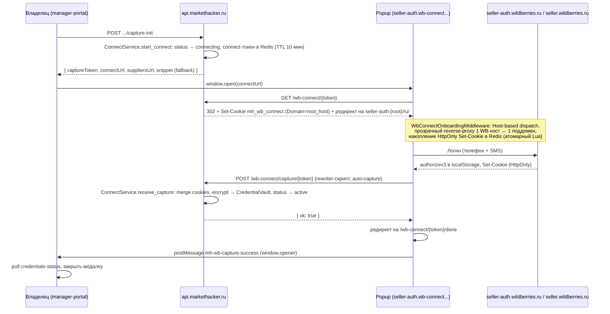

# WB Gateway & Guided Connect

Полное описание reverse-proxy к `seller.wildberries.ru`, реализованного в MarketHacker как два независимых модуля: **`wb_connect`** (первичная привязка кабинета — Guided Connect) и **`wb_gateway`** (проксирование уже подключённого кабинета).

> Редизайн (2026): полностью заменяет прежний модуль `modules/proxy` (`portal_router`, `onboarding_subdomain_*`, opaque Redis-сессия `mh_portal_token`). Ключевые изменения — короткоживущая audience-scoped JWT-сессия с мгновенным Redis-отзывом вместо opaque-токена, единый default-deny `AccessPolicy` вместо частичных проверок, `MarketplaceCredentialVault` с optimistic-concurrency вместо append-лога credentials, явный `CabinetStatus` вместо разрозненных `is_active`/наличия credentials, строго типизированная (не JS) конфигурация инжекта.

---

## Назначение

WB Gateway позволяет менеджерам работать в личном кабинете Wildberries **через безопасный прокси-сервер** без получения прямого доступа к учётным данным продавца.

| Проблема | Решение |
|----------|---------|
| Менеджер не должен знать API-ключ или cookies владельца | Credentials хранятся на сервере в `MarketplaceCredentialVault` (AES-256-GCM), менеджер их не видит |
| WB SPA требует живую сессию (JWT + cookies) | Владелец делает однократный Guided Connect (popup) — сервер пассивно перехватывает `authorizev3` и HttpOnly cookies во время реального логина |
| WB использует HttpOnly-cookies (`wbx-validation-key`) | Во время Guided Connect прокси накапливает HttpOnly cookies server-side (Redis); cookie **не попадает в браузер менеджера** |
| Менеджер не должен переключать компанию / выходить из WB | Селектор профиля заменён статическим текстом; модалка «Профиль» заблокирована |
| WB SPA пытается выйти из сессии и редиректить на auth | JS-инжект блокирует logoff и auth-редиректы |
| Доступ к разделам кабинета должен быть гранулярным | `AccessPolicy` — default-deny ACL: каждый `/ns/*`-путь резолвится в `section_key`, всё неизвестное отклоняется по умолчанию |

---

## Компоненты

```
team.markethacker.ru          wb-proxy.markethacker.ru       wb-connect.markethacker.ru + *.wb-connect.markethacker.ru
(manager-portal)               (WB Gateway)                    (Guided Connect: meta-эндпоинты + onboarding-поддомены)
       │                              │                                    │
       │  POST /wb-gateway/handshake  │                                    │
       ├──────────────────────►  api.markethacker.ru:8000                  │
       │                              │  GET /api/v1/wb-gateway/*          │
       │                              │◄──────────────────────────         │
       │  callback_url redirect       │                                    │
       │◄─────────────────────        │                                    │
       │                              │                                    │
  browser открывает                   │                                    │
  wb-proxy.markethacker.ru (новая вкладка, window.open)                    │
       │──────────────────────────────►                                    │
                                 Caddy rewrite → /api/v1/wb-gateway{uri}    │
                                 API → seller.wildberries.ru                │
```

Модули полностью разделены — разная маршрутизация, разная модель сессии, разные Caddy-домены:

- **`wb_gateway`** (уже привязанный кабинет) — все WB-хосты свёрнуты в ОДИН origin (`wb-proxy.markethacker.ru`) через path-префиксы (`/__auth__/`, `/__supply__/` и т.д.), сессия — JWT в cookie `mh_gw_session`.
- **`wb_connect`** (Guided Connect / привязка нового кабинета) — КАЖДЫЙ реальный WB-хост живёт на своём ПОДДОМЕНЕ домена `wb-connect.markethacker.ru`, маршрутизация по заголовку `Host`, сессия — opaque-токен в Redis + cookie `mh_wb_connect`. См. [Guided Connect](#guided-connect).

| Компонент | Технология | Модуль | Описание |
|-----------|------------|--------|----------|
| `wb-proxy.markethacker.ru` | Caddy → FastAPI | `wb_gateway` | Публичный домен прокси уже подключённого кабинета |
| `api/router.py` | FastAPI | `wb_gateway` | `handshake`, `auth/callback`, `session` (logout), `{path:path}` reverse proxy |
| `application/gateway_service.py` | Python | `wb_gateway` | Оркестрация: handshake, проксирование, section enforcement |
| `application/session_service.py` | Python | `wb_gateway` | `GatewaySessionService` — JWT-сессия с Redis revocation-list |
| `infrastructure/session_store.py` | Redis | `wb_gateway` | SET активных `jti` на кабинет — O(1) массовый отзыв |
| `infrastructure/wb_upstream_client.py` | httpx | `wb_gateway` | HTTP-клиент к `seller.wildberries.ru` через path-префиксы, retry для idempotent GET |
| `infrastructure/handshake_callback_store.py` | Redis | `wb_gateway` | Одноразовый callback-токен (обмен JWT на cookie после редиректа) |
| `infrastructure/section_cache.py` | Redis | `wb_gateway` | Кэш посчитанных `sections` на время жизни gateway-сессии |
| `application/injection_engine.py` | Python | `wb_gateway` | Сборка JS auth/guard/badge-скриптов на основе секций + типобезопасной admin-конфигурации |
| `domain/access_policy.py` | Python | `wb_gateway` | `AccessPolicy` — default-deny ACL: каталог `/ns/*` → `section_key` |
| `wb-connect.markethacker.ru` + поддомены | Caddy → FastAPI | `wb_connect` | Публичный домен Guided Connect (meta-эндпоинты + onboarding-прокси) |
| `api/router.py` | FastAPI | `wb_connect` | `capture-init`, `select-supplier` (аутентифицировано, owner-only) |
| `api/public_router.py` | FastAPI | `wb_connect` | `{token}`, `{token}/done`, `{token}/suppliers`, `capture/{token}` (публичные, opaque-токен) |
| `api/onboarding_middleware.py` | ASGI middleware | `wb_connect` | `WbConnectOnboardingMiddleware` — Host-based dispatch на onboarding-поддомены, CORS preflight, connect-token guard |
| `application/connect_service.py` | Python | `wb_connect` | `ConnectService` — state machine привязки (`CabinetStatus`), `receive_capture`, `select_supplier` |
| `application/onboarding_proxy_service.py` | Python | `wb_connect` | Проксирование + накопление cookies/suppliers в Redis во время onboarding |
| `infrastructure/onboarding_client.py` | httpx | `wb_connect` | Прозрачный reverse-proxy 1 WB-хост ↔ 1 onboarding-поддомен |
| `infrastructure/capture_store.py` | Redis | `wb_connect` | Connect-токен + атомарное (Lua) накопление cookies/suppliers |
| `domain/portal_inject.py`, `domain/portal_inject_config.py`, `domain/wb_menu_groups.py`, `domain/wb_hosts.py`, `domain/portal_auth.py`, `domain/portal_cookies.py` | Python | `marketplace_accounts` (общие) | JS-скрипты инжекта, типобезопасная admin-конфигурация, 6 групп меню, host↔prefix маппинг, парсинг credentials, cookie-хелперы — используются ОБОИМИ модулями |
| `domain/models.py::MarketplaceCredentialVault` | SQLAlchemy | `marketplace_accounts` | Один активный ряд credentials на кабинет, optimistic concurrency (`version`) |

---

## Полный флоу открытия кабинета (wb_gateway)

```mermaid
sequenceDiagram
    participant M as Менеджер (браузер)
    participant MP as manager-portal
    participant API as api.markethacker.ru
    participant Caddy as wb-proxy.markethacker.ru (Caddy)
    participant WB as seller.wildberries.ru

    M->>MP: Нажать "Открыть кабинет WB" (window.open в новой вкладке)
    MP->>API: POST /api/v1/wb-gateway/handshake { accountId }
    API->>API: assert active session (vault) + resolve_member_sections
    API->>API: GatewaySessionService.create_session → JWT (jti в Redis SET), одноразовый callback_token
    API-->>MP: { callbackUrl, portalUrl, sections }

    M->>Caddy: GET /auth/callback?token=xxx (новая вкладка)
    Caddy->>API: GET /api/v1/wb-gateway/auth/callback?token=xxx
    API->>API: consume_handshake_callback (одноразовый)
    API-->>M: 302 → / (Set-Cookie: mh_gw_session; HttpOnly; SameSite=None; Secure)

    M->>Caddy: GET /
    Caddy->>API: GET /api/v1/wb-gateway/ (Cookie: mh_gw_session=...)
    API->>API: GatewaySessionService.verify (JWT signature + exp + sismember jti)
    API->>WB: GET https://seller.wildberries.ru/ (authorizev3 + credentials из vault)
    WB-->>API: HTML
    API->>API: InjectionEngine.inject (auth bootstrap + guard + badge)
    API-->>M: HTML с inject-скриптами
```

**Почему новая вкладка, а не iframe:** `X-Frame-Options: DENY` выставляется глобально `SecurityHeadersMiddleware` для ВСЕХ ответов платформы и намеренно не имеет исключения для gateway — кабинет открывается через `window.open` с ДРУГОГО домена (`team.markethacker.ru` → `wb-proxy.markethacker.ru`). Это делает cookie сессии cross-site по происхождению, поэтому она выставляется с `SameSite=None` — а значит критична явная проверка `Origin`/`Referer` на мутирующих запросах (см. [CSRF-защита](#csrf-защита-mh_gw_session) ниже).

---

## Модель сессии WB Gateway

Короткоживущий подписанный JWT (не opaque Redis-токен) в httponly cookie `mh_gw_session`:

| Поле claim | Значение |
|---|---|
| `sub` | `user_id` |
| `org_id` | Организация (для аудита/логов) |
| `account_id` | Кабинет — токен **audience-scoped**: не может быть использован ни для какого другого кабинета, даже если у того же пользователя есть доступ к нескольким |
| `jti` | Уникальный id сессии — используется для отзыва |
| `exp` | `wb_gateway_session_ttl_minutes` (30 мин по умолчанию) |

Проверка (`GatewaySessionService.verify`) — две независимые проверки:
1. Подпись + `exp` JWT (`jose.jwt.decode`).
2. `SISMEMBER wb_gateway:account_sessions:{account_id} {jti}` в Redis — членство в множестве является ДОПОЛНИТЕЛЬНЫМ условием поверх `exp`.
3. **Sliding renewal:** при успешной активности (прокси-запрос), когда до `exp` осталось меньше половины TTL, gateway выпускает новый JWT и ставит обновлённый `Set-Cookie: mh_gw_session` — кабинет не «отваливается» ровно через 30 минут при живой вкладке.

**Мгновенный отзыв (`revoke_all_sessions_for_account`)** — одна атомарная `DEL` над Redis SET, O(1) независимо от числа активных вкладок/устройств. Вызывается при: повторном Guided Connect, удалении кабинета, отзыве прав пользователя владельцем, переводе кабинета в `revoked`/`expired`. Раньше (`proxy_sessions.revoke_all_sessions_for_account`) использовался `SCAN` по всему keyspace Redis — не масштабировался и блокировал event loop Redis на время сканирования.

### CSRF-защита `mh_gw_session`

Cookie `SameSite=None` означает, что браузер приложит её к запросу с ЛЮБОГО origin, включая посторонний вредоносный сайт. `is_allowed_gateway_csrf_origin` (`wb_gateway/domain/csrf_origin.py`) сверяет `Origin`/`Referer` мутирующих запросов (не GET/HEAD/OPTIONS) с:

- `Settings.wb_gateway_origin` — fetch/XHR из вкладки кабинета на wb-proxy;
- `chrome-extension://<id>` / `moz-extension://<id>` из `CORS_ORIGINS`, runtime platform settings и/или `WB_GATEWAY_TRUSTED_EXTENSION_ORIGINS` — запросы из browser extension (Origin этого типа нельзя подделать с обычных сайтов).

`https://team.markethacker.ru` и прочие HTTPS-origin из CORS **не** whitelisted здесь — иначе CSRF с cookie из manager-portal.

## Аутентификация extension к wb-proxy

Browser extension **не** использует отдельный Bearer-токен к wb-proxy.
Рабочий путь для менеджера — вкладка кабинета с httpOnly cookie `mh_gw_session`
после `handshake` + `auth/callback` (как в manager-portal).

Ранее в документации описывался `gatewaySessionToken` / `Authorization: Bearer` —
этот контракт **не реализован** и не планируется для extension: секреты WB
остаются только server-side в vault, ACL enforced на gateway.

Extension может вызывать **платформенные** API MarketHacker с обычным access JWT;
проксирование seller-кабинета идёт через browser-сессию `mh_gw_session`.

---

## Прокси для кабинетов WB

По умолчанию запросы к Wildberries идут с IP нашего сервера.

Чтобы снизить риск ограничений при росте числа кабинетов, в админке
(Команда → **Прокси кабинетов**) включают пул прокси:

1. При создании кабинета ему назначается наименее загруженный прокси
   (пока не достигнут лимит кабинетов на адресе).
2. Назначение сохраняется и не меняется при повторном подключении кабинета.
3. Несколько кабинетов могут делить один прокси — до лимита на адресе.
   Когда все места заняты, создание нового кабинета отклоняется.
4. Gateway, Guided Connect и обновление токена (`slide-v3`) ходят через тот же прокси.
5. HTTP-клиенты переиспользуют соединения (keep-alive) на каждый адрес прокси.

Настройки хранятся в `platform_settings.wb_egress`. API админки:
`GET/PUT /api/v1/admin/wb-egress`.

Лучше брать прокси с IP домашнего/офисного провайдера (ISP), не «датацентровые».

Метрики: `mh_wb_gateway_requests_total`, `mh_wb_gateway_upstream_latency_seconds`,
`mh_wb_gateway_upstream_errors_total`, `mh_wb_gateway_rate_limited_total`.

---

## Guided Connect

Владелец привязывает кабинет **без DevTools**: popup с логином WB через onboarding-прокси на **поддоменах** — каждый реальный WB-хост проксируется через СВОЙ поддомен домена `wb-connect.markethacker.ru`, а не через path-префикс единого origin (как в `wb_gateway`). Браузер тогда нативно изолирует cookies/localStorage по origin и корректно резолвит root-relative пути ровно так же, как на настоящем WB — сервер ничего не подставляет и не угадывает, а лишь пассивно перехватывает нужные данные.



| Шаг | Endpoint / действие | Описание |
|-----|---------------------|----------|
| 1 | `POST .../marketplace-accounts/{account_id}/capture-init` | Owner-only. Статус кабинета → `connecting` (кроме уже `active` — повторный connect не рвёт текущий трафик). Одноразовый `captureToken` в Redis (TTL `wb_connect_session_ttl_seconds`, 10 мин) |
| 2 | `GET /wb-connect/{token}` | Cookie `mh_wb_connect` (`Domain=wb_onboarding_cookie_domain`), редирект на `seller-auth.{root_host}/ru/` |
| 3 | `WbConnectOnboardingMiddleware` | Host-based dispatch: каждый WB-хост ↔ свой поддомен, копит `Set-Cookie` и suppliers в Redis |
| 4 | `POST /wb-connect/capture/{token}` | Auto-capture rewriter-скрипт: JWT + cookies + накопленные HttpOnly → `ConnectService.receive_capture` |
| 5 | `GET /wb-connect/{token}/suppliers` | Manager-portal: список организаций WB, обнаруженных во время connect (для `select-supplier`) |
| 6 | `GET .../marketplace-accounts/{account_id}/credentials-status` | Manager-portal poll: `status`, `hasActiveSession`, `lastVerifiedAt` |

**Маппинг поддоменов:** `{label}.wb_onboarding_root_host` ↔ реальный WB-хост, где `label` — первая DNS-метка реального хоста (`seller-auth`, `seller-services`, ...), `wb_onboarding_root_host` выводится из `WB_CONNECT_PUBLIC_BASE_URL` (см. `Settings.wb_onboarding_root_host` / `wb_hosts.py::onboarding_proxy_host`).

**Cookies guided connect:**

| Cookie | Domain / Path | Назначение |
|--------|------|------------|
| `mh_wb_connect` | `Domain=wb_onboarding_cookie_domain`, `Path=/` | Опознаёт активную connect-сессию перед проксированием (см. `WbConnectOnboardingMiddleware`); реальный связывающий токен хранится в Redis (`capture_store`), cookie сама по себе не несёт credentials |
| `mh_gw_session` | `Path=/` (dedicated subdomain в проде) | JWT-сессия WB Gateway после handshake |

> ⚠️ **Локальная разработка:** `WB_CONNECT_PUBLIC_BASE_URL`/`WB_PORTAL_PUBLIC_BASE_URL` НЕ должны указывать на голый `localhost` (без точки в hostname) — браузеры (Chrome, Firefox) молча отбрасывают `Set-Cookie` с `Domain`, состоящим из одного лейбла без точки (`localhost` трактуется как public suffix), из-за чего `mh_wb_connect` никогда не долетает до onboarding-поддоменов и guided connect падает с «Guided connect session expired or not found». Используйте домен вида `mh.localhost` (спецдомен из RFC 6761 — резолвится в `127.0.0.1` без правки `/etc/hosts`, но содержит точку, поэтому `Domain=mh.localhost` браузеры принимают). См. `backend/.env.example`.

После успешного `receive_capture` connect-токен потребляется атомарно (`consume_connect_session` — Lua GETDEL, устраняет TOCTOU при гонке двух конкурентных запросов с одним токеном). Список `suppliers` живёт по собственному TTL независимо от основного токена — доступен manager-portal и ПОСЛЕ успешного capture, для шага выбора организации.

**CORS между onboarding-поддоменами:** реальный WB — набор независимых поддоменов, обращающихся друг к другу через CORS с `credentials: include` (например `seller-auth.` → `seller-services.` для публичных справочников типа кода стран). Прокси воспроизводит эту топологию поддоменами `wb-connect.markethacker.ru`, поэтому браузер требует preflight + `Access-Control-Allow-*`. `WbConnectOnboardingMiddleware` отвечает на `OPTIONS` сам (без проксирования на WB и без connect-token guard — preflight принципиально идёт без cookie) и добавляет `Access-Control-Allow-Origin`/`Access-Control-Allow-Credentials` ко всем ответам, если `Origin` запроса принадлежит `wb_onboarding_root_host`. Инжектируемый rewriter-скрипт (`build_onboarding_subdomain_rewriter_script`) дополнительно форсирует `credentials: 'include'` / `xhr.withCredentials = true` для fetch/XHR к onboarding-поддоменам.

Публичный эндпоинт `POST /wb-connect/capture/{token}` также принимает CORS-запросы от РЕАЛЬНОГО `seller.wildberries.ru` (не только от `wb_onboarding_root_host`) — это нужно для fallback-сниппета, вставляемого вручную в DevTools Console на настоящем сайте WB. `_capture_cors_origin` никогда не отражает произвольный `Origin` (в отличие от старой реализации с `CORS: *`) — допускаются только `WB_MAIN_HOST` и `wb_onboarding_root_host`(+поддомены).

**Manager-portal:** компонент `WbConnectModal` — popup без `noopener` (для `postMessage`), poll `credentials-status`, ручной сниппет в collapsible «DevTools» (fallback).

### Fallback: JS-сниппет (DevTools)

Если auto-capture на onboarding-поддомене не сработал (например, блокировщик), владелец может использовать сниппет из `capture-init`:

1. Открыть `seller.wildberries.ru` и войти.
2. Вставить сниппет в **DevTools Console**.
3. Сниппет читает `authorizev3` из `localStorage` и cookies из `document.cookie`.
4. Вручную скопировать `wbx-validation-key` из DevTools → Application → Cookies (`prompt`).
5. Отправить `{authorizev3, cookies}` на `POST /wb-connect/capture/{token}`.

### Жизненный цикл кабинета (`CabinetStatus`)

`MarketplaceAccount.status` — источник истины для `wb_gateway` (запрос к кабинету не в статусе `active` отклоняется на уровне `GatewayService`, а не через разрозненные проверки `is_active`/наличия credentials):

| Статус | Значение |
|---|---|
| `draft` | Создан, Guided Connect ещё не запускался |
| `connecting` | Guided Connect в процессе (capture-сессия активна) |
| `active` | Есть валидные credentials, `wb_gateway` обслуживает запросы |
| `expired` | Access-токен истёк и не удалось обновить (нужен повторный connect) |
| `revoked` | WB вернул невосстановимый 401/403 (validation-key отозван) |
| `archived` | Кабинет удалён пользователем (soft-delete, финальное состояние) |

Повторный Guided Connect поверх `active` (владелец нажал «обновить сессию» или переподключает на другой WB-аккаунт) НЕ переводит кабинет в `connecting` и не прерывает текущий проксируемый трафик — активные `wb_gateway`-сессии продолжают использовать старый vault до успешного завершения нового `receive_capture`.

### Хранение credentials: `MarketplaceCredentialVault`

Один активный ряд на кабинет (не append-лог, как раньше `MarketplaceCredential`), таблица `marketplace_credential_vault`:

| Поле | Назначение |
|---|---|
| `encrypted_payload` / `nonce` / `key_version` | AES-256-GCM ciphertext JSON-полезной нагрузки (см. ниже), nonce, версия ключа шифрования |
| `access_token_expires_at` | Расчётный срок жизни `authorizev3` из JWT claim `exp` (если есть). У актуальных WB JWT часто **нет** `exp` — тогда поле `NULL` |
| `last_verified_at` / `last_refreshed_at` | Для `credentials-status` в manager-portal; `last_refreshed_at` — якорь возраста токена при отсутствии `exp` |
| `version` | Optimistic concurrency — любое обновление выполняется как `UPDATE ... WHERE account_id = :id AND version = :v`; 0 affected rows означает конкурентную запись, вызывающий код обязан повторить операцию (`CredentialVaultRepository.compare_and_swap`). Устраняет и «осиротевшие» credentials от старой append-only модели, и race condition при параллельной привязке/выборе supplier из нескольких вкладок |

Расшифрованная полезная нагрузка:

```json
{
  "authorizev3": "eyJ...",
  "cookies": {
    "x-supplier-id": "123456",
    "wbx-validation-key": "abc...",
    "locale": "ru"
  },
  "local_storage": {
    "authorizev3": "eyJ...",
    "wb-eu-passport-v2.access-token": "eyJ...",
    "access-token": "eyJ..."
  }
}
```

Auth-ключи в `local_storage` (`authorizev3`, `wb-eu-passport-v2.access-token`, `access-token`) **всегда синхронизируются** с полем `authorizev3` при serialize/parse и после `slide-v3` (`sync_auth_local_storage`). Иначе HTML-inject мог бы перезаписать свежий JWT устаревшими LS-значениями с момента Guided Connect, и WB SPA уходила бы в redirect-loop на `seller-auth`.

### Проактивный refresh (`CredentialVaultService.ensure_fresh`)

Перед каждым проксируемым запросом gateway вызывает `ensure_fresh`:

1. Если есть `access_token_expires_at` и до него осталось меньше `wb_token_refresh_threshold_seconds` (300 с) → `POST …/auth/v2/auth/slide-v3` с vault cookies + текущим `authorizev3`.
2. Если `exp` в JWT нет (`access_token_expires_at IS NULL`) → refresh по возрасту записи: `last_refreshed_at` / `updated_at` старше `wb_token_max_age_seconds` (1800 с) минус порог.
3. Успешный refresh пишется в vault (CAS) вместе с синхронизированным `local_storage`.

Якорь долгоживущей сессии — HttpOnly `wbx-validation-key` (только server-side). Best-effort: сеть/WB недоступны → отдаём последнюю сохранённую сессию; явный 401/403 на SPA-шелл `/` переводит кабинет в `revoked`.

---

## URL-маршрутизация субдоменов WB (wb_gateway, post-connect)

> Этот раздел описывает маршрутизацию для **уже подключённого** кабинета (path-префиксы в одном origin). Guided Connect использует ДРУГУЮ схему — поддомены 1-в-1 на реальные WB-хосты, см. [Guided Connect](#guided-connect).

WB использует множество субдоменов. Маршрутизация — **конфигурационная**, без `if host == …`:

1. **Канонический host → стабильный префикс** (`WB_HOST_TO_PREFIX`): `cmp.wildberries.ru` → `/__cmp__/`, `seller-ads.wildberries.ru` → `/__ads__/`, …
2. **Aliases** (`WB_HOST_ALIASES_TO_PREFIX` + `WB_UPSTREAM_HOST_ALIASES`): `cmp.wb.ru` → тот же `__cmp__`, upstream = `cmp.wildberries.ru` (alias отдаёт 302 на канон).
3. **Dynamic fallback**: любой proxyable `*.wildberries.ru` / `*.wb.ru` / … без записи в карте → `/{hostname}/path` (тот же контракт, что клиентский `rewriteUrl` в inject). Новый WB-сервис начинает работать без правок логики; для стабильного префикса и onboarding-label — одна строка в `WB_HOST_TO_PREFIX` (+ Caddy SAN для Guided Connect).

| WB-субдомен | Прокси-префикс | Назначение |
|-------------|----------------|------------|
| `seller.wildberries.ru` | `/` | Основной кабинет продавца |
| `seller-auth.wildberries.ru` | `/__auth__/` | SSO / логин |
| `cmp.wildberries.ru` (`cmp.wb.ru` → alias) | `/__cmp__/` | ВБ.Продвижение / WB Media |
| `seller-ads.wildberries.ru` | `/__ads__/` | Ads BFF |
| `seller-supply.wildberries.ru` | `/__supply__/` | Поставки |
| `seller-communications.wildberries.ru` | `/__comm__/` | Отзывы / чаты |
| `seller-analytics.wildberries.ru` | `/__analytics__/` | Аналитика |
| `suppliers-portal-api.wildberries.ru` | `/__portalapi__/` | Portal API |
| `passport.wildberries.ru` | `/__passport__/` | Passport |
| … | см. `wb_hosts.py::WB_HOST_TO_PREFIX` | |

Хосты аналитики/трекинга/CDN (`WB_DIRECT_HOSTS`) и buyer/edu (`WB_EXTERNAL_HOSTS`: `www.wildberries.ru`, `pro-eng.wildberries.ru`, …) **не** переписываются в proxy URL. `antibot.wildberries.ru` проксируется, но JS-тело не подвергается строковой замене (`WB_NO_JS_REWRITE_HOSTS`).

### Location / nested SSO `redirect_url`

`encode_wb_url_to_proxy` переписывает не только абсолютный Location, но и query-параметры SSO (`redirect_url`, `returnUrl`, …). Иначе цепочка `cmp` → `seller-auth/?redirect_url=https://cmp.wildberries.ru/` уводила бы браузер с `wb-proxy` после логина.

### Root-relative ассеты helper-SPA (`/lk-assets/…`)

Отдельные приложения вроде CMP живут на своём origin и отдают HTML с **root-relative** путями (`<script src="/lk-assets/….js">`). За path-prefix `https://wb-proxy/__cmp__/` браузер резолвит их в `https://wb-proxy/lk-assets/…` (корень = seller) — бандл не тот / CSS 0 байт → **белый экран**. `<base href>` не помогает: path-absolute URL игнорируют base path.

Поэтому при проксировании HTML/CSS с helper-хоста (`proxy_path_prefix_for_host` ≠ пусто) сервер делает `rewrite_root_relative_urls`: `/lk-assets/x` → `/__cmp__/lk-assets/x`. Клиентский `rewriteUrl` на страницах под `/__prefix__/` делает то же для fetch/XHR/динамических `<script>`.

Отдельная проблема — React Router CMP с `basename: "/"` при реальном pathname `/__cmp__/`: маршруты не матчят → экран «Произошла ошибка». Как у Mandarin (`wb.mandarin-platform.ru/__cmp__/…`), сервер патчит JS helper-SPA (`rewrite_spa_basename`): `const Fm="/"` / `basename:"/"` → `basename: "/__cmp__"`. Pathname в адресной строке остаётся с префиксом; shim `Location.pathname` не нужен (и конфликтует с basename).

Меню «ВБ.Продвижение» после rewrite открывает `/__cmp__/` в **новой вкладке** (`window.open`), seller остаётся открытым — тот же UX, что у Mandarin.

### Клиентский inject: bootstrap + interceptor

В HTML (перед первым `<script>` WB) попадает только:

1. **Тонкий bootstrap** (`#mh-portal-auth`): `window.__MH_PROXY_CFG` (auth, host map, guard deny-lists, badge) + синхронная запись LS/cookies + отключение SW.
2. **Один interceptor** — `<script src="/__proxy__/interceptor.<hash>.js">` (свой asset gateway, не upstream). Там URL-rewrite, `fetch`/`XHR`/`window.open`, UI-guard и badge.

`/__proxy__/*` обрабатывается `GatewayService` до WB upstream (иммутабельный `Cache-Control`, ETag по хэшу файла). Произвольный JS из админки по-прежнему запрещён — только типизированный `portal_inject_config`.

### Rewrite в `rewrite_body`

Статические URL в HTML/JS/CSS переписываются универсальным regex (`rewrite_wb_urls_in_text`):
```
https://seller.wildberries.ru → https://wb-proxy.markethacker.ru
https://cmp.wildberries.ru → https://wb-proxy.markethacker.ru/__cmp__
https://brand-new.wildberries.ru/x → https://wb-proxy.markethacker.ru/brand-new.wildberries.ru/x
```

Единая сессия: vault cookies + `authorizev3` / `access-token` в LS инжектятся на **один** origin `wb-proxy` — отдельный SSO между «поддоменами» не нужен (в отличие от настоящего WB, где cookies `Domain=.wildberries.ru`).
---

## Default-deny ACL: `AccessPolicy`

Единая точка проверки прав для каждого проксируемого запроса (`wb_gateway/domain/access_policy.py`) — заменяет старую модель, где проверка была только для известных `/ns/*` префиксов, а всё остальное (неизвестные `/ns/*`, любые WB-субдомены helper-хостов) проходило БЕЗ проверки вообще.

- Пути **вне** `/ns/*` (статика SPA, ассеты) разрешены всем менеджерам с активным кабинетом — не содержат бизнес-данных.
- Пути `/ns/*` резолвятся через каталог `WB_PORTAL_ROUTES` (first-match по самому длинному префиксу) в `section_key`.
- **Неизвестный `/ns/*`-путь отклоняется по умолчанию** (403), если явно не добавлен в escape-hatch: `WB_GATEWAY_EXTRA_ALLOWED_NS_PREFIXES` (env) или `extra_allowed_ns_prefixes` в админке «Инжект WB-портала» (без редеплоя).
- Мутирующие методы (`POST`/`PUT`/`PATCH`/`DELETE`) дополнительно требуют `can_write` в разделе; часть маршрутов помечена `allow_write=False` (read-only навсегда).

| section_key | Раздел | Пример путей WB |
|-------------|--------|--------------|
| `growth` | Рост продаж | — |
| `products` | Товары и цены | `/ns/content-api/`, `/ns/card-api/`, `/ns/prices-api/`, `/ns/discounts-api/`, `/ns/warehouse-api/`, `/ns/stocks-api/`, `/ns/feedback-api/`, `/ns/questions-api/` |
| `shipments` | Поставки и заказы | `/ns/suppliers-api/`, `/ns/order-api/`, `/ns/marketplace-api/` |
| `analytics` | Аналитика | `/ns/content-analytics-api/`, `/ns/analytics-api/` |
| `promotion` | Продвижение | `/ns/advert-api/`, `/ns/promotion-api/`, `/ns/ads-api/` |
| `finances` | Финансы | `/ns/finance-api/`, `/ns/finances-api/` |

Даже если клиентский JS guard обойти, сервер не отдаст данные раздела, на который у пользователя нет `can_read` в `user_marketplace_section_access` — фильтрация происходит **до** проксирования запроса на WB, а не только визуально (двойной enforcement).

---

## JS-инжект (`InjectionEngine` → `portal_inject.py`)

`InjectionEngine.inject` (в `wb_gateway`) собирает и вставляет в каждый HTML-ответ WB **до трёх скриптов** перед первым `<script>` страницы, объединяя три независимых источника: реально доступные пользователю секции (`AccessPolicy`/`resolve_member_sections`), типобезопасную admin-конфигурацию (`portal_inject_config` — НЕ произвольный код) и runtime-данные запроса (токен, `account_id`, `display_name`).

| ID | Назначение |
|----|------------|
| `mh-portal-auth` | Auth bootstrap — токены, URL rewriter, перехват fetch/XHR |
| `mh-portal-guard` | Section guard — скрытие меню, блокировка API/навигации, замена профиля (можно отключить админом) |
| `mh-proxy-badge` | Метка «Работает через MH» (можно отключить/настроить админом) |

### 1. Auth bootstrap (`mh-portal-auth`)

**Pre-inject токенов (до WB-кода)** — в браузер попадают только `authorizev3` и `WBTokenV3`, **не** `x-supplier-id` и **не** `wbx-validation-key`. Сначала пишутся прочие LS-ключи с capture, затем auth-токены **поверх** (побеждают любые устаревшие значения тех же ключей):

```javascript
localStorage.setItem("wb-eu-passport-v2.access-token", token);
localStorage.setItem("access-token", token);
localStorage.setItem("authorizev3", token);
document.cookie = "WBTokenV3=" + token + "; path=/; max-age=86400; SameSite=Lax";
```

Секретные cookies добавляет сервер при проксировании запросов к WB (`WbUpstreamClient` берёт их только из vault).

**URL rewriter** — перехватывает все WB-URL и переписывает через прокси-префиксы: абсолютные URL, protocol-relative, корневые пути; login-пути `seller-auth.wildberries.ru` → корень прокси (`/`).

**Перехват fetch/XHR** — ставит заголовок `authorizev3` из inject-time `token` (источник истины — vault, не potentially-stale LS), блокирует logoff (`200`), конвертирует `401` на `/ns/abac/`/`/ns/validate` → `204`.

**Перехват навигации** — `window.location.assign/replace`, `history.pushState/replaceState` → `rewriteUrl`; блокирует logoff-URL.

**Защита localStorage** — `setInterval` каждые 500ms **всегда** записывает auth-ключи inject-time токеном (не только если ключ пуст): иначе expired JWT остаётся в LS и SPA уходит в redirect-loop.

**Service Worker** — unregister + запрет `register`, noop `sw.js` на gateway. Cache Storage WB (`root__<ver>__requests-cache` для StaleWhileRevalidate suppliers) **не очищается** на каждый HTML: wipe вызывал `onUpdateCache` → `location.reload()` → снова wipe → бесконечный цикл. HTML-shell защищён `Cache-Control: no-store` на ответах с inject.

**Анти-loop `location.reload`** — debounce: не чаще одного раза в 60 с (WB вызывает reload из `onUpdateCache` / сравнения selected supplier).

**Блокировка кнопки выхода** — click-interceptor блокирует клики на «Выйти»/`logout`.

### 2. Section guard (`mh-portal-guard`)

Собирается из `denied_portal_prefixes(user_sections)` (`AccessPolicy`) + `menu_denied_paths`/`menu_denied_chips` (`wb_menu_groups.py`, 6 групп меню) + admin-настроек `extra_denied_path_prefixes`/`extra_denied_menu_chips`.

- **Скрытие меню:** CSS скрывает chip-элементы меню WB по `data-testid="menu.{chip-id}-chips-component"`. `MutationObserver` отслеживает динамическую отрисовку SPA.
- **Блокировка API и навигации:** перехват `fetch`/`XMLHttpRequest` — запрещённые пути возвращают `403`; при загрузке запрещённого URL — замена body на «Доступ ограничен».
- **Замена селектора профиля:** кнопка выбора компании в шапке WB заменяется статическим текстом с `display_name` кабинета MarketHacker. Модальное окно «Профиль» (переключение компаний, настройки, документы) скрывается и блокируется.

### 3. MH badge (`mh-proxy-badge`)

Настраиваемая метка (текст, hex-цвет, вкл/выкл через админ-панель). `pointer-events: none` — не мешает работе с UI WB.

### Кастомизация через админ-панель: строго типизированная конфигурация

Конфигурация хранится в `platform_settings.wb_portal_inject` (`portal_inject_config.py`) и редактируется в **Админ-панель → Team → Инжект WB**.

> **Редизайн безопасности:** раньше админ мог выбрать режим `override`/`append` и вставить ПРОИЗВОЛЬНЫЙ JavaScript, который затем выполнялся в контексте прокси для КАЖДОГО менеджера КАЖДОЙ организации на платформе — компрометация одной учётной записи суперадмина превращалась в возможность внедрить произвольный код на десятки организаций одновременно. Новая конфигурация — это ТОЛЬКО данные, ни одно поле не интерпретируется как исполняемый код.

| Поле | Тип | Валидация |
|---|---|---|
| `badge_enabled` / `guard_ui_enabled` | bool | — |
| `badge_text` | string | ≤ 60 символов |
| `badge_color` | string | hex-цвет `#RRGGBB` |
| `extra_denied_menu_chips` | list[string] | `[a-zA-Z0-9_-]{1,64}`, ≤ 50 элементов |
| `extra_denied_path_prefixes` | list[string] | начинается с `/`, ≤ 200 символов, ≤ 50 элементов |
| `extra_allowed_ns_prefixes` | list[string] | начинается с `/ns/`, ≤ 200 символов, ≤ 50 элементов — escape-hatch для default-deny ACL |

`normalize_wb_portal_inject_config` — best-effort нормализация при чтении (никогда не бросает исключений), `validate_wb_portal_inject_config` — строгая валидация при сохранении из админ-панели (бросает `ValidationError`). API: `GET/PUT /api/v1/admin/wb-portal-inject`. Изменения применяются без перезапуска API (runtime cache платформенных настроек).

### Locale cookies

`locale` и `external-locale` **всегда принудительно `ru`** — server-side при запросах к WB (`FORCED_LOCALE_SET_COOKIE_HEADERS`), client-side в auth bootstrap, `Set-Cookie` в ответах прокси браузеру.

---

## Set-Cookie relay

WB устанавливает новые значения cookies в ответах (обновление `wbx-validation-key`, `WBTokenV3` и т.д.).

**Проблема:** WB ставит их как `HttpOnly; Secure; Domain=wildberries.ru` — браузер их не сохранит для нашего домена.

**Решение:**
1. `WbUpstreamClient` собирает `Set-Cookie` из ответов WB.
2. `_clean_set_cookie_header` (`wb_gateway/api/router.py`) очищает каждую куку: убирает `Domain`, `SameSite=None` → `SameSite=Lax`.
3. `should_relay_set_cookie_to_browser` (`portal_auth.py`) фильтрует: `SERVER_ONLY_COOKIE_KEYS` (например `wbx-validation-key`) никогда не улетают в браузер менеджера — только на сервер, в vault.
4. Очищенные preference-`Set-Cookie` (`locale` / `external-locale`) добавляются в ответ браузеру.
5. Upstream Cookie для WB в обычном gateway-режиме собирается **только из vault** (`merge_upstream_cookies` игнорирует browser Cookie для auth-ключей).

### Фильтрация списка организаций (suppliers)

Кабинет MH привязан к одному `x-supplier-id`. Ответ `/ns/suppliers/suppliers-portal-core/suppliers` может содержать несколько юрлиц одного WB-аккаунта; полный список заставляет SPA сравнивать selected supplier с cookie/кэшем и при расхождении вызывать `location.reload()` (`Suppliers are not equal` / `onUpdateCache`).

`GatewayService` после upstream-ответа оставляет в JSON-RPC только поставщика из vault (`filter_suppliers_jsonrpc_body_to_bound`) — состояние SPA стабильно под один кабинет. Селектор профиля по-прежнему заменён статическим текстом.

---

## Надёжность: таймауты, retry, cancellation

`WbUpstreamClient` (`wb_gateway/infrastructure/wb_upstream_client.py`):

- Явные connect/read/write таймауты (`wb_upstream_timeout()`), не полагается на дефолты httpx.
- **Единственный безопасный сценарий retry** — идемпотентный `GET`, упавший на уровне соединения (до отправки запроса упстриму). Read timeout/ошибка после отправки НЕ ретраятся — WB мог уже начать обрабатывать запрос, повтор мутирующего запроса рискует дублированием побочных эффектов.
- Отмена клиентского соединения (`request.is_disconnected`) прокидывается в апстрим-запрос — не тратит ресурсы на ответ, который уже некому доставить; `ClientDisconnect` при чтении тела запроса возвращает `499`.
- Ошибки апстрима (`WbUpstreamError`) логируются полностью (structlog, включая correlation id), клиенту отдаётся безопасное сообщение без внутренних деталей.

---

## Production-конфигурация

### Backend `.env`

```env
WB_PORTAL_PUBLIC_BASE_URL=https://wb-proxy.markethacker.ru
WB_CONNECT_PUBLIC_BASE_URL=https://wb-connect.markethacker.ru/api/v1/wb-connect
# Опционально (дефолты в settings.py):
# WB_TOKEN_REFRESH_THRESHOLD_SECONDS=300
# WB_TOKEN_MAX_AGE_SECONDS=1800
# WB_GATEWAY_SESSION_TTL_MINUTES=30
# WB_GATEWAY_MAX_CONCURRENT_PER_ACCOUNT=25
# WB_GATEWAY_PROXY_RATE_LIMIT=120/minute
# Прокси кабинетов: Админка → Команда → Прокси кабинетов
```

> ⚠️ `WB_CONNECT_PUBLIC_BASE_URL` **обязан** включать путь `/api/v1/wb-connect` — в отличие от `wb-proxy`, Caddy-блок `wb-connect` НЕ делает rewrite (см. `caddy/Caddyfile`), путь передаётся как есть. Без него guided connect URL'ы будут вести на несуществующий `/connect/...` вместо `/api/v1/wb-connect/connect/...`.

Path и `Secure` для cookies **выводятся автоматически** из `WB_PORTAL_PUBLIC_BASE_URL` (`effective_wb_portal_cookie_path`, `effective_wb_portal_cookie_secure`):
- dedicated subdomain (`https://wb-proxy...`) → `Path=/`, `Secure=true`
- dev на API-префиксе (`.../api/v1/wb-gateway`) → `Path=/api/v1/wb-gateway`

### Caddy (`caddy/Caddyfile`)

```caddy
wb-proxy.markethacker.ru {
    encode gzip zstd
    import security_headers

    handle {
        rewrite * /api/v1/wb-gateway{uri}
        reverse_proxy 127.0.0.1:8000 {
            import api_upstream
        }
    }
}

# WB Connect: путь ОБЯЗАТЕЛЕН в WB_CONNECT_PUBLIC_BASE_URL — этот блок НЕ
# делает rewrite (в отличие от wb-proxy выше), т.к. onboarding-поддомены
# ниже требуют путь 1-в-1 как есть.
wb-connect.markethacker.ru,
seller.wb-connect.markethacker.ru,
seller-auth.wb-connect.markethacker.ru,
... (полный список поддоменов — см. caddy/Caddyfile) {
    encode gzip zstd
    import security_headers
    reverse_proxy 127.0.0.1:8000 {
        import api_upstream
    }
}
```

`{uri}` сохраняет путь + query string для `wb-proxy`. Onboarding-поддомены `wb-connect` перечислены явно (не wildcard-сертификат) — Caddy получает обычные сертификаты через HTTP-01 без DNS-плагина провайдера; DNS-запись при этом одна wildcard-`A`/`AAAA` (`*.wb-connect.markethacker.ru`), новых DNS-записей при появлении нового WB-хоста не требуется — только правка списка в Caddyfile + редеплой.

### CORS

```env
CORS_ORIGINS=["https://team.markethacker.ru","https://admin.markethacker.ru","chrome-extension://<extension_id>"]
# Опционально — только CSRF wb-gateway:
# WB_GATEWAY_TRUSTED_EXTENSION_ORIGINS=["chrome-extension://<other_id>"]
```

`wb-proxy.markethacker.ru`/`wb-connect.markethacker.ru` НЕ добавляются в общий `CORS_ORIGINS` — их кросс-доменные сценарии (guided connect onboarding CORS, gateway CSRF) обрабатываются отдельными механизмами (`_onboarding_cors_headers`, `_capture_cors_origin`, `is_allowed_gateway_csrf_origin`), а не общим CORS middleware API. В CSRF allowlist из `CORS_ORIGINS` попадают только `chrome-extension://` / `moz-extension://`.

---

## Ограничения и известные особенности

| Проблема | Статус |
|----------|--------|
| `wbx-validation-key` HttpOnly — нельзя захватить через JS | Guided Connect: server-side накопление; fallback — DevTools prompt |
| Секретные cookies в браузере менеджера | `SERVER_ONLY_COOKIE_KEYS` — не инжектятся и не relay'ятся из браузера |
| Stale `mh_wb_connect` после capture | Токен потребляется атомарно (Lua GETDEL); cookie сбрасывается в ответе `done`/`capture` |
| WB Service Worker кэширует HTML | SW unregister + noop `sw.js`; HTML — `Cache-Control: no-store` |
| Wipe Cache Storage на каждый HTML | **Запрещён**: ломал `root__*__requests-cache` → `onUpdateCache` → infinite `location.reload` |
| WB `onUpdateCache` / «Suppliers are not equal» → reload | Debounce `location.reload` (60 с); suppliers JSON-RPC фильтруется до bound `x-supplier-id` |
| WB JWT без claim `exp` | `ensure_fresh` обновляет по возрасту vault (`wb_token_max_age_seconds`) + sync LS |
| Устаревший `local_storage` после `slide-v3` | `sync_auth_local_storage`; inject пишет auth-ключи после extraLs и restore каждые 500ms |
| `Domain=localhost` (голый, без точки) молча отбрасывается браузером | dev-домен `mh.localhost` (см. предупреждение выше) |
| Cross-subdomain fetch/XHR без cookie (default `credentials: 'same-origin'`) | Rewriter форсирует `credentials: 'include'` / `withCredentials` к onboarding-поддоменам |
| CORS preflight (`OPTIONS`) не несёт cookie | Middleware отвечает на preflight сам, без connect-token guard |
| WB SPA обновляет токен через `slide-v3` | Gateway: `CredentialVaultService.ensure_fresh`; onboarding bootstrap — на seller portal |
| WB возвращает `401` на ABAC/validate без `wbx-validation-key` | Конвертируется в `204`, чтобы WB не инициировал logoff |
| Селектор профиля WB (смена компании, выход) | Заменён статическим текстом; модалка заблокирована |
| Неизвестные `/ns/*` пути | Отклоняются по умолчанию (403) — `AccessPolicy`; escape-hatch: env `WB_GATEWAY_EXTRA_ALLOWED_NS_PREFIXES` + админка `extra_allowed_ns_prefixes` |
| Race condition при параллельной привязке/выборе supplier (несколько вкладок) | `MarketplaceCredentialVault.version` — optimistic concurrency, повтор операции при конфликте |
| `X-Frame-Options: DENY` глобально на все ответы платформы | Не мешает: кабинет открывается через `window.open` в новой вкладке, не в iframe |

---

## Связанные файлы

| Файл | Назначение |
|------|------------|
| `backend/src/markethacker/modules/wb_gateway/application/egress_service.py` | Назначение и выбор прокси для кабинета |
| `backend/src/markethacker/modules/wb_gateway/infrastructure/upstream_http_pool.py` | Общий httpx-пул с keep-alive |
| `backend/src/markethacker/modules/wb_gateway/infrastructure/concurrency.py` | Лимит одновременных запросов на кабинет |
| `backend/src/markethacker/modules/wb_gateway/infrastructure/metrics.py` | Метрики Prometheus по gateway |
| `backend/src/markethacker/modules/wb_gateway/api/router.py` | Handshake, auth callback, logout, reverse proxy, CSRF-проверка |
| `backend/src/markethacker/modules/wb_gateway/application/gateway_service.py` | Оркестрация: handshake, проксирование, section enforcement |
| `backend/src/markethacker/modules/wb_gateway/application/session_service.py` | JWT-сессия с Redis revocation |
| `backend/src/markethacker/modules/wb_gateway/application/injection_engine.py` | Сборка JS-инжекта |
| `backend/src/markethacker/modules/wb_gateway/domain/access_policy.py` | Default-deny ACL `/ns/*` → `section_key` |
| `backend/src/markethacker/modules/wb_gateway/infrastructure/wb_upstream_client.py` | HTTP-клиент к WB, retry/cancellation |
| `backend/src/markethacker/modules/wb_gateway/infrastructure/session_store.py` | Redis SET активных `jti` на кабинет |
| `backend/src/markethacker/modules/wb_connect/api/router.py` | `capture-init`, `select-supplier` (owner-only) |
| `backend/src/markethacker/modules/wb_connect/api/public_router.py` | `{token}`, `{token}/done`, `{token}/suppliers`, `capture/{token}` |
| `backend/src/markethacker/modules/wb_connect/api/onboarding_middleware.py` | `WbConnectOnboardingMiddleware` — Host-based dispatch |
| `backend/src/markethacker/modules/wb_connect/application/connect_service.py` | State machine привязки кабинета |
| `backend/src/markethacker/modules/wb_connect/application/onboarding_proxy_service.py` | Проксирование во время onboarding |
| `backend/src/markethacker/modules/wb_connect/infrastructure/capture_store.py` | Redis: connect-токен + атомарное накопление cookies/suppliers |
| `backend/src/markethacker/modules/marketplace_accounts/domain/models.py` | `MarketplaceAccount` (`CabinetStatus`), `MarketplaceCredentialVault` |
| `backend/src/markethacker/modules/marketplace_accounts/application/credential_vault_service.py` | Шифрование/расшифровка, `ensure_fresh` / `slide-v3`, optimistic concurrency |
| `backend/src/markethacker/modules/marketplace_accounts/domain/portal_inject.py` | JS bootstrap + guard + badge + onboarding rewriter (общий для обоих модулей) |
| `backend/src/markethacker/modules/marketplace_accounts/domain/portal_inject_config.py` | Типобезопасная admin-конфигурация инжекта |
| `backend/src/markethacker/modules/marketplace_accounts/domain/wb_hosts.py` | Маппинг субдоменов: path-префиксы (`wb_gateway`) + поддомены (`wb_connect`) |
| `backend/src/markethacker/modules/marketplace_accounts/domain/portal_auth.py` | Парсинг/сериализация credentials, `sync_auth_local_storage`, `filter_suppliers_jsonrpc_body_to_bound`, `SERVER_ONLY_COOKIE_KEYS` |
| `backend/src/markethacker/config/settings.py` | `wb_gateway_origin`, onboarding hosts, `wb_token_refresh_threshold_seconds`, `wb_token_max_age_seconds`, TTL-сессий |
| `caddy/Caddyfile` | Reverse proxy конфигурация: `wb-proxy`, `wb-connect` + поддомены |
| `backend/src/markethacker/modules/marketplace_accounts/domain/wb_menu_groups.py` | 6 групп меню WB, chip-id, path prefixes |
| `manager-portal/src/components/wb-connect-modal.tsx` | UI Guided Connect (popup, poll, fallback snippet) |
| `manager-portal/src/app/(manager)/accounts/[id]/page.tsx` | Карточка кабинета, section grants, менеджеры |
